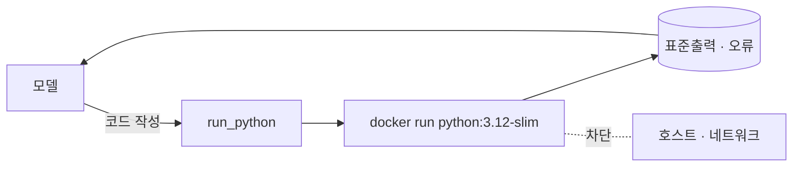

# 코드 샌드박스 에이전트 — 모델이 짠 코드를 Docker에서 실행

약 50줄짜리 [LangGraph](https://github.com/langchain-ai/langgraph) ReAct
에이전트로, `run_python` 도구 하나를 답니다. 실제 계산이 필요한 일 — "30번째
피보나치 수는?" — 을 주면 모델이 파이썬을 작성하고, 도구가 그 코드를 **일회용 Docker
컨테이너 안에서** 실행하며(네트워크 없음·CPU/메모리 제한·자동 삭제), 에이전트는 그
출력을 읽고 답합니다. 코드는 호스트에서 절대 돌지 않습니다. 모델은 LiteLLM으로
라우팅되므로 **같은 코드**가 **Anthropic Claude**·**OpenAI**·**Google AI
Studio**(Gemini)에서 그대로 동작합니다 — 코드가 아니라 `.env`의 `MODEL`만 바꾸면
됩니다.

## 설정

```bash
cd samples/docker_1
cp .env.sample .env
# .env 편집: MODEL과 해당 제공자 키 설정
```

`MODEL`이 제공자를 고릅니다:

| 제공자            | `MODEL` 예시              | `.env` 키           |
| ----------------- | ------------------------- | ------------------- |
| Anthropic Claude  | `claude-opus-4-8`         | `ANTHROPIC_API_KEY` |
| OpenAI            | `gpt-4o`                  | `OPENAI_API_KEY`    |
| Google AI Studio  | `gemini/gemini-2.5-flash` | `GEMINI_API_KEY`    |

`.env`는 gitignore 대상이라 `.env.sample`만 커밋됩니다. 샌드박스용 API 키는 없습니다 —
도구가 로컬 Docker이기 때문입니다.

## 실행

Docker가 있어야 합니다. 샌드박스 이미지를 한 번 미리 받아 둡니다:

```bash
docker pull python:3.12-slim
```

**호스트에서**(가장 간단 — 에이전트가 호스트의 Docker를 호출):

```bash
pip install -r requirements.txt
python app.py "30번째 피보나치 수는? 코드로 계산해줘"
```

**또는 에이전트 자체를 컨테이너로**(Docker-out-of-Docker — 호스트 소켓을 마운트해
형제 샌드박스 컨테이너를 띄움):

```bash
docker build -t aas-code-sandbox .
docker run --rm --env-file .env \
  -v /var/run/docker.sock:/var/run/docker.sock \
  aas-code-sandbox "30번째 피보나치 수는? 코드로 계산해줘"
```

소켓을 마운트하면 에이전트 *안에서* 부르는 `docker run`이 **호스트**의 Docker 데몬과
통신하므로, 각 샌드박스는 중첩이 아니라 호스트의 **형제** 컨테이너로 뜹니다. 이것이
Docker-out-of-Docker(DooD) 패턴으로, 이 저장소가 도는 데브컨테이너가 에이전트에게
다룰 수 있는 Docker를 내주는 방식과 같습니다.

## 어떻게 동작하나



`run_python`은 코드를 프로세스 안에서 `exec`하지 않고, `docker run`으로 새 컨테이너에
흘려보냅니다. 실제 격리는 플래그들이 합니다:

| 플래그                | 막는 것                                          |
| --------------------- | ------------------------------------------------ |
| `--rm`                | 실행이 끝나면 컨테이너를 버림                     |
| `--network none`      | 네트워크 차단 — 무엇도 밖으로 내보낼 수 없음      |
| `--memory 256m`       | 메모리 폭주가 호스트를 무너뜨리지 못함            |
| `--cpus 1`            | CPU 상한 — 무한 루프가 머신을 독점하지 못함       |
| `--pids-limit 128`    | 포크 폭탄 방어                                    |
| `--user 65534:65534`  | root가 아닌 `nobody`로 실행                       |
| `timeout=30`          | 폭주 코드를 끊는 벽시계 차단기                    |

**샌드박싱** 개념의 *코드 실행* 역할을 그대로 구현한 셈입니다 — 모델은 제안하고,
샌드박스는 가둡니다.
