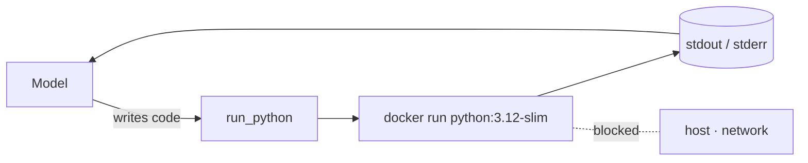

# Code-sandbox agent — run model-written code in Docker

A ~50-line [LangGraph](https://github.com/langchain-ai/langgraph) ReAct agent
with a single `run_python` tool. Give it a task that needs real computation —
"what's the 30th Fibonacci number?" — and the model writes Python, the tool runs
it **inside a throwaway Docker container** (no network, capped CPU/memory,
auto-removed), and the agent reads the output and answers. The code never runs
on the host. The model is routed through LiteLLM, so the **same code** works
with **Anthropic Claude**, **OpenAI**, or **Google AI Studio (Gemini)** — change
`MODEL` in `.env`, never the code.

## Configure

```bash
cd samples/docker_1
cp .env.sample .env
# edit .env: set MODEL and the matching provider key
```

`MODEL` picks the provider:

| Provider          | `MODEL` example           | Key in `.env`       |
| ----------------- | ------------------------- | ------------------- |
| Anthropic Claude  | `claude-opus-4-8`         | `ANTHROPIC_API_KEY` |
| OpenAI            | `gpt-4o`                  | `OPENAI_API_KEY`    |
| Google AI Studio  | `gemini/gemini-2.5-flash` | `GEMINI_API_KEY`    |

`.env` is gitignored — only `.env.sample` is committed. No sandbox API key: the
tool is local Docker.

## Run with Docker

You need Docker available. Pre-pull the sandbox image once:

```bash
docker pull python:3.12-slim
```

Run the agent itself in a container — Docker-out-of-Docker, mounting the host
socket so the agent can spawn sibling sandbox containers:

```bash
docker build -t aas-code-sandbox .
docker run --rm --env-file .env \
  -v /var/run/docker.sock:/var/run/docker.sock \
  aas-code-sandbox "What is the 30th Fibonacci number? Use code."
```

The mounted socket means the `docker run` *inside* the agent talks to the **host's**
Docker daemon, so each sandbox is a **sibling** container on the host, not a nested
one. That's the Docker-out-of-Docker (DooD) pattern — the same way a dev container
(like the one this repo runs in) hands an agent a Docker it can drive.

## Run with Docker (in a devcontainer with DooD)

Under nested Docker-outside-of-Docker the foreground `docker run` may print nothing
after the first moment — run detached and follow the logs; the daemon captures all
of it:

```bash
docker logs -f "$(docker run -d --env-file .env \
  -v /var/run/docker.sock:/var/run/docker.sock \
  aas-code-sandbox "What is the 30th Fibonacci number? Use code.")"
```

## Run locally

The agent shells out to your host's Docker directly:

```bash
pip install -r requirements.txt
python app.py "What is the 30th Fibonacci number? Use code."
```

## How it works



`run_python` doesn't `exec` the code in-process — it pipes it to a fresh
container via `docker run`, with the isolation flags doing the real work:

| Flag                  | What it stops                                   |
| --------------------- | ----------------------------------------------- |
| `--rm`                | container is thrown away when the run ends       |
| `--network none`      | no network — nothing can be exfiltrated          |
| `--memory 256m`       | a memory blowup can't take the host down         |
| `--cpus 1`            | caps CPU so a busy loop can't hog the machine    |
| `--pids-limit 128`    | guards against fork bombs                        |
| `--user 65534:65534`  | runs as `nobody`, not root                       |
| `timeout=30`          | wall-clock kill switch for runaway code          |

This is the *code execution* role from the **Sandboxing** concept made concrete:
the model proposes, the sandbox disposes.

---

## Example run

> The model writes the code and phrases the answer itself, so the wording can vary
> slightly run to run. One run with `gemini/gemini-2.5-flash`:

```text
The 30th Fibonacci number is 832040.
```
