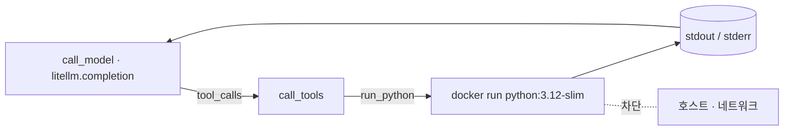

# 코드 샌드박스 에이전트, LangChain 없이 — LiteLLM + LangGraph 직접 구성

`docker_1`과 같은 에이전트 — `run_python` 도구 하나를 단 ReAct 루프로, 모델이
짠 코드를 **일회용 Docker 컨테이너 안에서** 실행합니다 — 인데, 에이전트
의존성이 딱 둘뿐입니다: 모델 라우팅의
[litellm](https://github.com/BerriAI/litellm)과 루프 런타임의
[langgraph](https://github.com/langchain-ai/langgraph). LangChain 접착이
없으므로 도구 스키마는 손으로 쓴 JSON이고, 도구 호출도 직접 디스패치하며,
상태는 OpenAI 형식의 평범한 dict 리스트입니다. 모델은 여전히 LiteLLM으로
라우팅되므로 **같은 코드**가 **Anthropic Claude**·**OpenAI**·**Google AI
Studio**(Gemini)에서 그대로 동작합니다 — 코드가 아니라 `.env`의 `MODEL`만
바꾸면 됩니다.

## 설정

```bash
cd samples/docker_2
cp .env.sample .env
# .env 편집: MODEL과 해당 제공자 키 설정
```

`MODEL`이 제공자를 고릅니다:

| 제공자            | `MODEL` 예시              | `.env` 키           |
| ----------------- | ------------------------- | ------------------- |
| Anthropic Claude  | `claude-opus-4-8`         | `ANTHROPIC_API_KEY` |
| OpenAI            | `gpt-4o`                  | `OPENAI_API_KEY`    |
| Google AI Studio  | `gemini/gemini-2.5-flash` | `GEMINI_API_KEY`    |

`.env`는 gitignore 대상이라 `.env.sample`만 커밋됩니다. 샌드박스용 API 키는 없습니다 —
도구가 로컬 Docker이기 때문입니다.

## Docker로 실행

Docker가 필요합니다. 샌드박스 이미지를 한 번 미리 받아 두세요:

```bash
docker pull python:3.12-slim
```

에이전트 자체를 컨테이너에서 돌립니다 — 호스트 소켓을 마운트해 에이전트가
형제 샌드박스 컨테이너를 띄우는 Docker-out-of-Docker 방식입니다:

```bash
docker build -t aas-code-sandbox-direct .
docker run --rm --env-file .env \
  -v /var/run/docker.sock:/var/run/docker.sock \
  aas-code-sandbox-direct "What is the 30th Fibonacci number? Use code."
```

## 로컬에서 실행

에이전트가 호스트의 Docker를 직접 호출합니다:

```bash
pip install -r requirements.txt
python app.py "What is the 30th Fibonacci number? Use code."
```

## 동작 방식



그래프는 `StateGraph`로 명시적으로 구성합니다. `model` 노드가 손으로 쓴
`RUN_PYTHON` JSON 스키마와 함께 `litellm.completion`을 한 번 호출하고,
`tools` 노드가 `tool_calls`를 파싱해 디스패치하며, 조건부 엣지가 모델이 도구
요청 없이 답할 때까지 루프를 돕니다.

LangChain 버전이 감춰 주던 것이 여기서는 전부 표면에 드러납니다:

| `docker_1`(LangChain)                | 여기                                        |
| ------------------------------------ | ------------------------------------------- |
| `@tool` + docstring → 스키마          | 손으로 쓴 `RUN_PYTHON` JSON 스키마           |
| 프리빌트 루프가 호출 파싱·디스패치     | `call_tools`가 직접 파싱·디스패치            |
| LangChain 메시지 타입 + 리듀서        | 평범한 OpenAI 형식 dict를 직접 이어 붙임      |
| `create_agent(model, tools=[…])`     | `StateGraph` 노드 + 조건부 엣지              |

샌드박스 자체는 동일합니다 — `run_python`이 같은 격리 플래그(`--network
none`, 메모리/CPU/pids 상한, 비-root, `--rm`, 30초 타임아웃)로 코드를 `docker
run`에 흘려보냅니다. 샌드박스는 어느 프레임워크가 불렀는지 신경 쓰지 않습니다.

---

## 실행 예

> 코드 작성과 답변 표현은 모델이 하므로 실행마다 문구가 조금씩 다를 수 있습니다.
> `claude-opus-4-8`로 한 번 실행한 결과:

```text
The 30th Fibonacci number is 832040.
```
