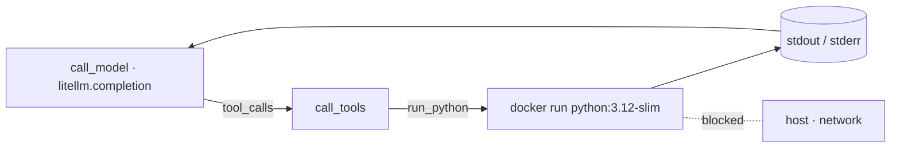

# Code-sandbox agent, no LangChain — LiteLLM + LangGraph wired by hand

The same agent as `docker_1` — a ReAct loop with a single `run_python` tool
that executes model-written code **inside a throwaway Docker container** — but
with only two agent dependencies: [litellm](https://github.com/BerriAI/litellm)
for model routing and [langgraph](https://github.com/langchain-ai/langgraph)
for the loop runtime. No LangChain glue: the tool schema is hand-written JSON,
tool calls are dispatched by hand, and the state is a plain list of
OpenAI-format message dicts. The model is still routed through LiteLLM, so the
**same code** works with **Anthropic Claude**, **OpenAI**, or **Google AI
Studio (Gemini)** — change `MODEL` in `.env`, never the code.

## Configure

```bash
cd samples/docker_2
cp .env.sample .env
# edit .env: set MODEL and the matching provider key
```

`MODEL` picks the provider:

| Provider          | `MODEL` example           | Key in `.env`       |
| ----------------- | ------------------------- | ------------------- |
| Anthropic Claude  | `claude-opus-4-8`         | `ANTHROPIC_API_KEY` |
| OpenAI            | `gpt-4o`                  | `OPENAI_API_KEY`    |
| Google AI Studio  | `gemini/gemini-2.5-flash` | `GEMINI_API_KEY`    |

`.env` is gitignored — only `.env.sample` is committed. No sandbox API key: the
tool is local Docker.

## Run with Docker

You need Docker available. Pre-pull the sandbox image once:

```bash
docker pull python:3.12-slim
```

Run the agent itself in a container — Docker-out-of-Docker, mounting the host
socket so the agent can spawn sibling sandbox containers:

```bash
docker build -t aas-code-sandbox-direct .
docker run --rm --env-file .env \
  -v /var/run/docker.sock:/var/run/docker.sock \
  aas-code-sandbox-direct "What is the 30th Fibonacci number? Use code."
```

## Run locally

The agent shells out to your host's Docker directly:

```bash
pip install -r requirements.txt
python app.py "What is the 30th Fibonacci number? Use code."
```

## How it works



The graph is wired explicitly with `StateGraph`: a `model` node makes one
`litellm.completion` call with the hand-written `RUN_PYTHON` JSON schema, a
`tools` node parses `tool_calls` and dispatches them, and a conditional edge
loops until the model answers without requesting a tool.

Everything the LangChain version hides is on the surface here:

| In `docker_1` (LangChain)             | Here                                          |
| ------------------------------------- | --------------------------------------------- |
| `@tool` + docstring → schema           | `RUN_PYTHON` JSON schema, written by hand      |
| prebuilt loop parses/dispatches calls  | `call_tools` parses and dispatches by hand     |
| LangChain message types + reducer      | plain OpenAI-format dicts, appended manually   |
| `create_agent(model, tools=[…])`       | `StateGraph` nodes + conditional edge          |

The sandbox itself is identical — `run_python` pipes the code to `docker run`
with the same isolation flags (`--network none`, memory/CPU/pids caps,
non-root, `--rm`, a 30s timeout). The sandbox doesn't care which framework
called it.

---

## Example run

> The model writes the code and phrases the answer itself, so the wording can vary
> slightly run to run. One run with `claude-opus-4-8`:

```text
The 30th Fibonacci number is 832040.
```
