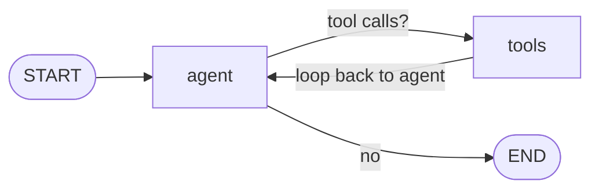

# LangGraph — 그래프를 처음부터 구성하기

[langgraph_1](../langgraph_1)이 미리 만들어진 `create_agent`를 쓰는 것과 달리, 이
예제는 [LangGraph](https://www.langchain.com/langgraph) `StateGraph` API로 ReAct
루프를 **직접** 배선합니다 — `agent` 노드, `tools` 노드, 그리고 모델이 도구 요청을
멈출 때까지 반복하는 조건부 엣지로 구성하고, 각 단계를 **스트리밍**해서 추론 과정을
지켜볼 수 있습니다.

모델은 [LiteLLM](https://docs.litellm.ai/)을 통해 라우팅되므로 같은 코드가
**Anthropic Claude**, **OpenAI**, **Google AI Studio (Gemini)** 에서 모두
동작합니다 — `.env`의 `MODEL`만 바꾸면 됩니다.

## 그래프



`stream_mode="values"`는 각 노드 실행 후 전체 상태를 내보내므로, 실행하면 최종 답이
나올 때까지 `agent → tools → agent → …` 순서로 출력됩니다.

## 설정

```bash
cd samples/langgraph_2
cp .env.sample .env
# .env 편집: MODEL과 해당 제공자의 키를 설정
```

`MODEL`이 제공자를 결정합니다:

| 제공자            | `MODEL` 예시              | `.env`의 키          |
| ----------------- | ------------------------- | ------------------- |
| Anthropic Claude  | `claude-opus-4-8`         | `ANTHROPIC_API_KEY` |
| OpenAI            | `gpt-4o`                  | `OPENAI_API_KEY`    |
| Google AI Studio  | `gemini/gemini-2.5-flash` | `GEMINI_API_KEY`    |

`.env`는 gitignore 처리되어 있고, `.env.sample`만 커밋됩니다.

## Docker로 실행

```bash
cd samples/langgraph_2
docker build -t aas-langgraph2 .
docker run --rm --env-file .env aas-langgraph2 \
  "How many times does the letter r appear in strawberry? Show it uppercased."
```

## Docker로 실행 (DooD를 쓰는 devcontainer에서)

호스트 Docker 데몬과 통신하는 dev container(Docker-outside-of-Docker)에서는 위의
포그라운드 `docker run`이 아무것도 출력하지 않고 exit 0으로 끝납니다 — 컨테이너
stdio에 클라이언트가 attach된 상태에서 `litellm`을 import하는 순간 프로세스가 강제
종료되기 때문입니다(OOM이 **아니며**, 플래그·`setsid`·컨테이너 내부 리다이렉트로도
피할 수 없습니다). **detached**로 실행하고 로그를 따라가세요:

```bash
cd samples/langgraph_2
docker build -t aas-langgraph2 .
docker logs -f "$(docker run -d --env-file .env aas-langgraph2 \
  "How many times does the letter r appear in strawberry? Show it uppercased.")"
```

## 로컬에서 실행

```bash
cd samples/langgraph_2
pip install -r requirements.txt
python app.py "How many times does the letter r appear in strawberry? Show it uppercased."
```

`python-dotenv`가 `.env`를 자동으로 불러옵니다. 키는 다음에서 발급받으세요:
[Anthropic](https://console.anthropic.com/),
[OpenAI](https://platform.openai.com/api-keys),
[Google AI Studio](https://aistudio.google.com/apikey).
