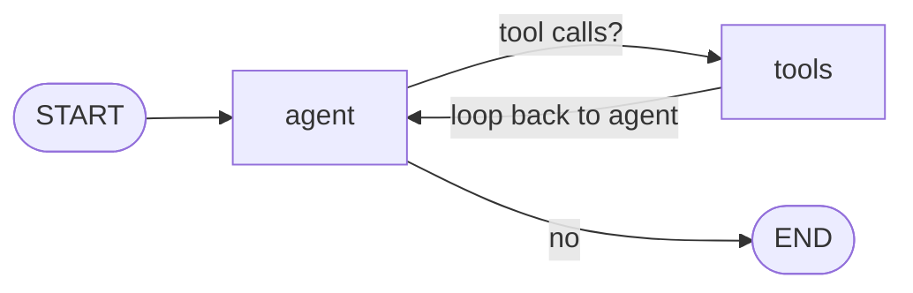

# LangGraph — building the graph from scratch

Where [langgraph_1](../langgraph_1) uses the prebuilt `create_agent`, this
example wires the ReAct loop **by hand** with the [LangGraph](https://www.langchain.com/langgraph)
`StateGraph` API — an `agent` node, a `tools` node, and a conditional edge that
loops until the model stops requesting tools — then **streams** each step so you
can watch the reasoning unfold.

The model is routed through [LiteLLM](https://docs.litellm.ai/), so the same
code works with **Anthropic Claude**, **OpenAI**, or **Google AI Studio
(Gemini)** — just change `MODEL` in `.env`.

## The graph



`stream_mode="values"` emits the full state after every node, so the run prints
`agent → tools → agent → …` until the final answer.

## Configure

```bash
cd samples/langgraph_2
cp .env.sample .env
# edit .env: set MODEL and the matching provider key
```

`MODEL` picks the provider:

| Provider          | `MODEL` example           | Key in `.env`       |
| ----------------- | ------------------------- | ------------------- |
| Anthropic Claude  | `claude-opus-4-8`         | `ANTHROPIC_API_KEY` |
| OpenAI            | `gpt-4o`                  | `OPENAI_API_KEY`    |
| Google AI Studio  | `gemini/gemini-2.5-flash` | `GEMINI_API_KEY`    |

`.env` is gitignored — only `.env.sample` is committed.

## Run with Docker

```bash
cd samples/langgraph_2
docker build -t aas-langgraph2 .
docker run --rm --env-file .env aas-langgraph2 \
  "How many times does the letter r appear in strawberry? Show it uppercased."
```

## Run with Docker (in a devcontainer with DooD)

In a dev container that talks to the host Docker daemon (Docker-outside-of-Docker),
the foreground `docker run` above prints nothing and exits 0 — the process is
hard-killed as `litellm` is imported while a client is attached to the
container's stdio (it is **not** an OOM, and no flag, `setsid`, or in-container
redirect avoids it). Run **detached** and follow the logs instead:

```bash
cd samples/langgraph_2
docker build -t aas-langgraph2 .
docker logs -f "$(docker run -d --env-file .env aas-langgraph2 \
  "How many times does the letter r appear in strawberry? Show it uppercased.")"
```

## Run locally

```bash
cd samples/langgraph_2
pip install -r requirements.txt
python app.py "How many times does the letter r appear in strawberry? Show it uppercased."
```

`python-dotenv` loads `.env` automatically. Get keys from
[Anthropic](https://console.anthropic.com/),
[OpenAI](https://platform.openai.com/api-keys), or
[Google AI Studio](https://aistudio.google.com/apikey).
