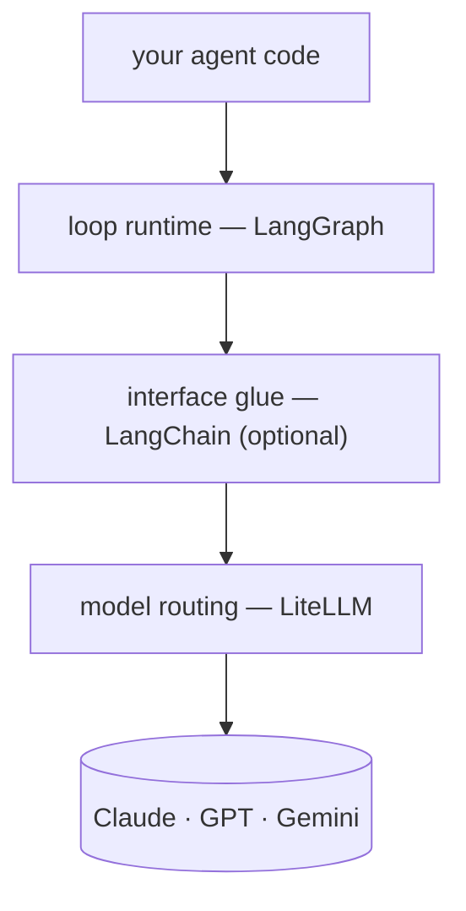

The [[code-sandbox-agent|code-sandbox]], [[web-scraping-agent|web-scraping]], and [[web-search-fx-agent|web-search]] tutorial agents are all built from the same two lines.

```python
model = ChatLiteLLM(model=os.environ.get("MODEL", "claude-opus-4-8"), temperature=0)
agent = create_agent(model, tools=[run_python])
```

But look at the imports: `create_agent` comes from `langchain.agents`, and `ChatLiteLLM` from `langchain_litellm`. 
The articles keep calling these [[LangGraph]] agents — so why is the code all [[LangChain]]? 
Fair question, and the answer is "different layers". This article peels them apart, then compares what changes when you wire the same loop without LangChain.

## The three layers \{#three-layers}

One agent packs three orthogonal decisions.

- **Model routing** — does this request go to Claude, GPT, or Gemini? That's [[LiteLLM]]'s job.
- **Loop runtime** — how long does reason → tool call → observe keep spinning? That's [[LangGraph]]'s job.
- **Interface glue** — the standard types and prebuilts connecting the two. That's LangChain, and it's the only *optional* layer.



The confusion comes from where `create_agent` lives. 
It's imported from `langchain`, but the function **compiles and returns a LangGraph state graph**. 
That's why the tutorial samples list `langgraph` in `requirements.txt`, and why `agent.invoke({"messages": […]})` is LangGraph's message-state API. 
So "a LangGraph [[ReAct]] loop" is accurate — LangChain is the wrapper that builds that loop in one line.

## Option A — the LangChain glue: create_agent \{#with-langchain}

What the tutorials use. This is the entire wiring.

```python
from langchain.agents import create_agent
from langchain_core.tools import tool
from langchain_litellm import ChatLiteLLM

@tool
def run_python(code: str) -> str:
    """Run a snippet of Python and return its stdout/stderr."""
    ...

model = ChatLiteLLM(model=os.environ.get("MODEL", "claude-opus-4-8"), temperature=0)
agent = create_agent(model, tools=[run_python])
result = agent.invoke({"messages": [{"role": "user", "content": question}]})
```

You get real things for free:

- `@tool` **derives the tool schema** from the function signature and docstring
- The prebuilt loop **parses, dispatches, and returns** the model's tool_calls
- Message-state management (the `add_messages` reducer) and standard message types

## Option B — no LangChain: litellm + StateGraph \{#without-langchain}

The same loop wired with just the two libraries. 
The tool schema is declared as JSON by hand, and the state is a plain list of dicts.

```python
import json
import os

import litellm
from langgraph.graph import END, START, StateGraph
from typing_extensions import TypedDict

RUN_PYTHON = {
    "type": "function",
    "function": {
        "name": "run_python",
        "description": "Run a snippet of Python and return its stdout/stderr.",
        "parameters": {
            "type": "object",
            "properties": {"code": {"type": "string"}},
            "required": ["code"],
        },
    },
}

def run_python(code: str) -> str:  # a plain function — no decorator
    ...

class State(TypedDict):
    messages: list  # plain OpenAI-format dicts

def call_model(state: State) -> State:
    resp = litellm.completion(
        model=os.environ.get("MODEL", "claude-opus-4-8"),
        messages=state["messages"],
        tools=[RUN_PYTHON],
    )
    msg = resp.choices[0].message
    return {"messages": state["messages"] + [msg.model_dump()]}

def call_tools(state: State) -> State:
    results = [
        {
            "role": "tool",
            "tool_call_id": c["id"],
            "content": run_python(json.loads(c["function"]["arguments"])["code"]),
        }
        for c in state["messages"][-1]["tool_calls"]
    ]
    return {"messages": state["messages"] + results}

def route(state: State) -> str:
    return "tools" if state["messages"][-1].get("tool_calls") else "end"

graph = StateGraph(State)
graph.add_node("model", call_model)
graph.add_node("tools", call_tools)
graph.add_edge(START, "model")
graph.add_conditional_edges("model", route, {"tools": "tools", "end": END})
graph.add_edge("tools", "model")
agent = graph.compile()

result = agent.invoke({"messages": [{"role": "user", "content": question}]})
```

Everything option A hid is now on the surface:

- **Schemas by hand** — a JSON declaration instead of the docstring auto-conversion
- **Dispatch by hand** — pull the name and arguments out of `tool_calls`, parse them, and hand results back tagged with `tool_call_id`
- **Raw state** — plain dict lists that nodes append to, instead of LangChain message types and the `add_messages` reducer
- In exchange, **every step is transparent** — there's no magic left in the loop; everything that moves is your code

Routing is still [[LiteLLM]]'s job, so switching providers via the `MODEL` env var works unchanged — and the graph, checkpoints, and streaming are [[LangGraph]]'s, so those work unchanged too.  
For this approach completed as a working agent, see [[code-sandbox-agent-direct|Code-sandbox agent, hand-wired]].

## What you gain and lose \{#tradeoffs}

| | Option A — create_agent | Option B — wired by hand |
| --- | --- | --- |
| Wiring code | two lines | ~50 lines |
| Tool definition | `@tool` + docstring auto-conversion | hand-written JSON schema |
| tool_calls handling | parsed and dispatched by the prebuilt | parsed and dispatched by you |
| Message state | LangChain message types + reducer | plain dict list |
| Provider switching | `MODEL` env var | `MODEL` env var — identical |
| Dependencies | langchain, langchain-litellm, langgraph, litellm | just langgraph and litellm |
| Loop transparency | prebuilt internals are a black box | every step is your code |

## Which to choose \{#which-to-choose}

- For **prototypes, tutorials, and code where the tool is the point**, take option A. Two lines of wiring keep the focus on what matters — tool design, isolation, prompts — which is why every tutorial in this catalog uses it.
- To **learn the loop itself or control it precisely** — per-step logging, custom stop conditions, message shaping — option B is better. You trade wiring code for two fewer dependencies and full visibility.
- There's also a **middle ground**: the second example on the [[LangGraph]] catalog page (langgraph_2) hand-wires the graph with `StateGraph` but reuses LangChain parts (`ChatLiteLLM`, `ToolNode`) — a transparent loop with the glue kept for free.

Either way, routing is LiteLLM and the runtime is LangGraph — two separate tools solving two separate problems from the start. 
The only thing that changes is whether LangChain fills the gap between them, or your code does.
