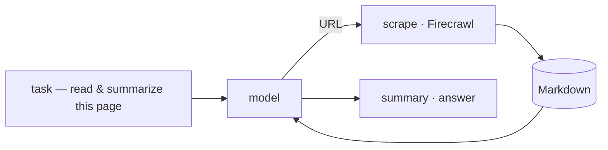
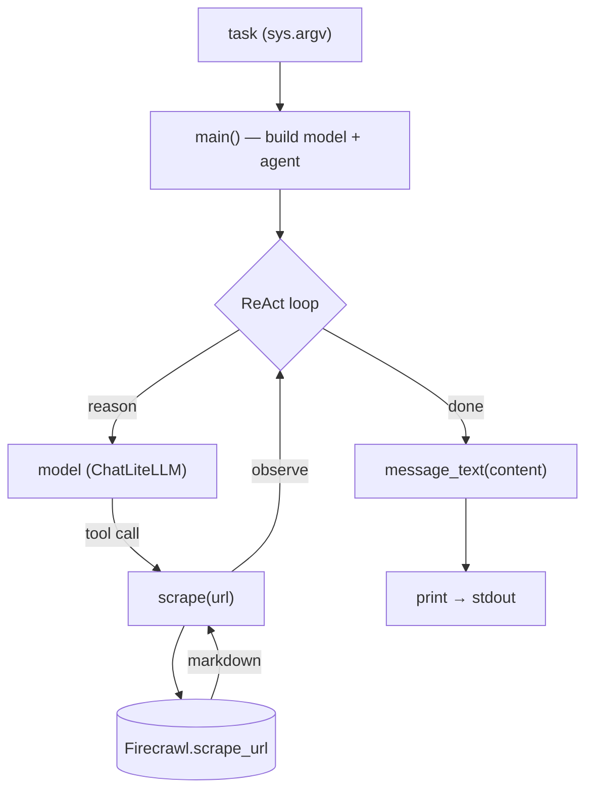

import SampleProject from '../../../components/SampleProject.astro';

The [[Tools]] concept's *scraping & crawling* uses "a docs page to Markdown" as an example. 
If search finds *where* to look, scraping reads that whole page in. 
Here we turn that example into a working agent.

## What we're building \{#what-were-building}

An agent that, given a task with a URL, fetches the page as Markdown through [[Firecrawl]], reads it, and answers or summarizes.



Where search only *points* at a source, scraping lays the page's actual body out in front of the model.

## Reading the code \{#reading-the-code}

### The overall structure \{#overall-structure}

The whole flow in `app.py` splits into three functions — `main()` wires the model and the agent, `scrape()` is the tool the model calls, and `message_text()` cleans up the final answer.



### The detailed structure \{#detailed-structure}

#### `scrape(url)` — the tool \{#scrape}

- One `@tool`-wrapped function — the model reads its docstring to decide *when* to read a page
- Calls Firecrawl with `_firecrawl.scrape_url(url, formats=["markdown"])`
- Pulls `markdown` whether the SDK returns an object or a dict (absorbs version drift)
- Caps the result at the first 6,000 chars so a long page doesn't blow up the prompt

```python
@tool
def scrape(url: str) -> str:
    """Fetch a web page and return its content as clean Markdown.

    Use this to read what's actually behind a URL — docs, articles, anything the
    model can't see on its own. Pass a single absolute URL.
    """
    res = _firecrawl.scrape_url(url, formats=["markdown"])
    md = getattr(res, "markdown", None)
    if md is None and isinstance(res, dict):  # older SDKs return a dict
        md = res.get("markdown") or res.get("data", {}).get("markdown")
    # Cap the length so a long page doesn't blow up the prompt.
    return (md or "")[:6000] or "No content."
```

#### `message_text(content)` — cleaning the output \{#message-text}

- A reply's `content` isn't uniformly shaped — cloud models return a string, some local models a list of blocks like `[{type: "text", …}, …]`
- For a list, it keeps only the text of `type == "text"` blocks
- For a string, it passes straight through
- So any provider prints as one clean line

```python
def message_text(content) -> str:
    """Flatten an assistant message's content to plain text (cloud models return a
    string; some local models return a list of blocks)."""
    if isinstance(content, list):
        return "".join(
            part.get("text", "")
            for part in content
            if isinstance(part, dict) and part.get("type") == "text"
        )
    return content
```

#### `main()` — the wiring \{#main}

- Builds `ChatLiteLLM` from `MODEL` and assembles the ReAct loop with `create_agent(model, tools=[scrape])`
- `ChatLiteLLM` wraps *LiteLLM* as a LangChain model — LiteLLM does provider routing, `ChatLiteLLM` is the interface `create_agent` expects
- `agent.invoke({"messages": […]})` runs reason→call-tool→observe
- When it finishes, the last message's `content` is cleaned by `message_text()` and printed

```python
def main() -> None:
    question = " ".join(sys.argv[1:]) or "https://docs.firecrawl.dev 를 읽고 핵심 기능 3가지만 요약해줘"

    # MODEL chooses the provider (claude-opus-4-8 / gpt-4o / gemini/gemini-2.5-flash).
    model = ChatLiteLLM(model=os.environ.get("MODEL", "claude-opus-4-8"), temperature=0)
    agent = create_agent(model, tools=[scrape])

    result = agent.invoke({"messages": [{"role": "user", "content": question}]})
    print(message_text(result["messages"][-1].content))
```

The import says `langchain`, but what `create_agent` returns is a LangGraph graph.  
What the same loop looks like wired with just LiteLLM + LangGraph — no glue layer — is covered in [[litellm-langgraph-vs-langchain|a separate comparison]].

## The implementation \{#the-implementation}

A [[LangGraph]] [[ReAct]] loop with a single `scrape` tool. 
The model is routed through [[LiteLLM]], so the same code runs on Claude, OpenAI, or Gemini.

<SampleProject folder="firecrawl_1" />

## The key parts \{#the-key-parts}

- **A tool is a function** — one `@tool`-wrapped `scrape(url)` is all it takes to read a page.
- **Search and scraping differ** — search finds *where* to look; scraping reads *that page* in.
- **The result becomes evidence** — Firecrawl's Markdown feeds back into reasoning, so the model answers from the page's real contents, not a guess.
- **The provider is swappable** — change `MODEL` in `.env` to run the same code on a different model.

Swap the tool for search (Tavily) in the same loop and you get [[web-search-fx-agent|asking today's FX rate]]; swap it for browser automation and you pull in a different kind of "now" data. 
The full set of tool kinds is in the [[Tools]] concept.
