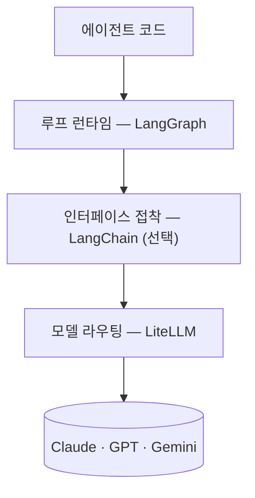

[[code-sandbox-agent|코드 샌드박스]]·[[web-scraping-agent|웹 스크래핑]]·[[web-search-fx-agent|웹 검색]] 튜토리얼의 에이전트는 전부 같은 두 줄로 만들어집니다.

```python
model = ChatLiteLLM(model=os.environ.get("MODEL", "claude-opus-4-8"), temperature=0)
agent = create_agent(model, tools=[run_python])
```

그런데 임포트를 보면 `create_agent`는 `langchain.agents`에서, `ChatLiteLLM`은 `langchain_litellm`에서 옵니다.  
글에서는 [[LangGraph]] 에이전트라고 해 놓고 코드는 [[LangChain]] 아닌가? — 맞는 의문이고, 답은 "계층이 다르다"입니다.  
이 글에서는 그 계층을 벗겨 보고, LangChain 없이 같은 루프를 직접 구성하면 무엇이 달라지는지 비교합니다.

## 세 계층 \{#three-layers}

에이전트 하나에는 서로 직교하는 세 가지 결정이 들어 있습니다.

- **모델 라우팅** — 이 요청을 Claude로 보낼까, GPT로, Gemini로? [[LiteLLM]]이 맡습니다.
- **루프 런타임** — 추론 → 도구 호출 → 관찰을 언제까지 돌릴까? [[LangGraph]]가 맡습니다.
- **인터페이스 접착** — 위 둘을 잇는 표준 타입과 프리빌트. LangChain이 맡는데, 이 계층만 *선택*입니다.



헷갈림의 근원은 `create_agent`의 소속입니다.  
임포트는 `langchain`이지만, 이 함수는 **내부에서 LangGraph 상태 그래프를 컴파일해 돌려줍니다**.  
튜토리얼 샘플의 `requirements.txt`에 `langgraph`가 들어 있는 이유이고, `agent.invoke({"messages": […]})`가 LangGraph의 메시지 상태 API인 이유입니다.  
즉 "LangGraph [[ReAct]] 루프"라는 설명은 사실이고, LangChain은 그 루프를 한 줄로 만들어 주는 포장지입니다.

## 방법 A — LangChain 접착: create_agent \{#with-langchain}

튜토리얼들이 쓰는 방식입니다. 연결 코드는 이게 전부입니다.

```python
from langchain.agents import create_agent
from langchain_core.tools import tool
from langchain_litellm import ChatLiteLLM

@tool
def run_python(code: str) -> str:
    """Run a snippet of Python and return its stdout/stderr."""
    ...

model = ChatLiteLLM(model=os.environ.get("MODEL", "claude-opus-4-8"), temperature=0)
agent = create_agent(model, tools=[run_python])
result = agent.invoke({"messages": [{"role": "user", "content": question}]})
```

공짜로 얻는 것들이 있습니다.

- `@tool` 데코레이터가 함수 시그니처·docstring에서 **도구 스키마를 자동 생성**
- 모델이 돌려준 tool_calls의 **파싱·디스패치·결과 회수**를 프리빌트 루프가 처리
- 메시지 상태 관리(`add_messages` 리듀서)와 표준 메시지 타입

## 방법 B — LangChain 없이: litellm + StateGraph \{#without-langchain}

같은 루프를 두 라이브러리만으로 직접 구성하면 이렇게 됩니다.  
도구 스키마는 JSON으로 직접 선언하고, 상태는 평범한 dict 리스트입니다.

```python
import json
import os

import litellm
from langgraph.graph import END, START, StateGraph
from typing_extensions import TypedDict

RUN_PYTHON = {
    "type": "function",
    "function": {
        "name": "run_python",
        "description": "Run a snippet of Python and return its stdout/stderr.",
        "parameters": {
            "type": "object",
            "properties": {"code": {"type": "string"}},
            "required": ["code"],
        },
    },
}

def run_python(code: str) -> str:  # 그냥 함수 — 데코레이터 없음
    ...

class State(TypedDict):
    messages: list  # OpenAI 형식의 평범한 dict 리스트

def call_model(state: State) -> State:
    resp = litellm.completion(
        model=os.environ.get("MODEL", "claude-opus-4-8"),
        messages=state["messages"],
        tools=[RUN_PYTHON],
    )
    msg = resp.choices[0].message
    return {"messages": state["messages"] + [msg.model_dump()]}

def call_tools(state: State) -> State:
    results = [
        {
            "role": "tool",
            "tool_call_id": c["id"],
            "content": run_python(json.loads(c["function"]["arguments"])["code"]),
        }
        for c in state["messages"][-1]["tool_calls"]
    ]
    return {"messages": state["messages"] + results}

def route(state: State) -> str:
    return "tools" if state["messages"][-1].get("tool_calls") else "end"

graph = StateGraph(State)
graph.add_node("model", call_model)
graph.add_node("tools", call_tools)
graph.add_edge(START, "model")
graph.add_conditional_edges("model", route, {"tools": "tools", "end": END})
graph.add_edge("tools", "model")
agent = graph.compile()

result = agent.invoke({"messages": [{"role": "user", "content": question}]})
```

방법 A가 감춰 주던 일이 전부 표면에 드러납니다.

- **도구 스키마를 손으로** — docstring 자동 변환 대신 JSON 스키마를 직접 선언
- **디스패치를 손으로** — `tool_calls`에서 이름·인자를 꺼내 파싱하고, `tool_call_id`를 달아 결과를 되돌려 주는 것까지 직접
- **상태도 날것으로** — LangChain 메시지 타입과 `add_messages` 리듀서 대신, dict 리스트를 노드가 직접 이어 붙임
- 대신 **모든 단계가 투명** — 루프에 마법이 없어서, 어디서 무엇이 오가는지 코드에 다 보임

라우팅은 여전히 [[LiteLLM]] 몫이라 `MODEL` 환경변수 하나로 공급자를 바꾸는 것은 그대로고, 그래프·체크포인트·스트리밍 같은 런타임 기능도 [[LangGraph]] 것이라 그대로입니다.  
이 방식을 실제로 돌아가는 에이전트로 완성한 튜토리얼이 [[code-sandbox-agent-direct|코드 샌드박스 에이전트 — 직접 구성]]입니다.

## 무엇을 얻고 잃나 \{#tradeoffs}

| | 방법 A — create_agent | 방법 B — 직접 구성 |
| --- | --- | --- |
| 연결 코드 | 두 줄 | 약 50줄 |
| 도구 정의 | `@tool` + docstring 자동 변환 | JSON 스키마 직접 선언 |
| tool_calls 처리 | 프리빌트가 파싱·디스패치 | 직접 파싱·디스패치 |
| 메시지 상태 | LangChain 메시지 타입 + 리듀서 | 평범한 dict 리스트 |
| 공급자 전환 | `MODEL` 환경변수 | `MODEL` 환경변수 — 동일 |
| 의존성 | langchain·langchain-litellm·langgraph·litellm | langgraph·litellm 둘뿐 |
| 루프 투명성 | 프리빌트 내부는 블랙박스 | 전 단계가 내 코드 |

## 언제 무엇을 \{#which-to-choose}

- **프로토타입·튜토리얼·도구가 주인공인 코드**라면 방법 A입니다. 연결 코드가 두 줄이라 본론(도구 설계, 격리, 프롬프트)에 집중할 수 있고, 이 카탈로그의 튜토리얼들이 전부 이 방식을 쓰는 이유입니다.
- **루프 자체를 배우거나 세밀하게 제어**하려면 — 단계별 로깅, 커스텀 종료 조건, 메시지 가공 — 방법 B가 낫습니다. 의존성 둘을 덜어내는 값으로 연결 코드를 떠안는 거래입니다.
- **중간 지점**도 있습니다. [[LangGraph]] 카탈로그 페이지의 두 번째 예제(langgraph_2)는 그래프는 `StateGraph`로 직접 구성하되 모델·도구는 LangChain 부품(`ChatLiteLLM`·`ToolNode`)을 재사용합니다 — 루프는 투명하게, 접착은 공짜로 가져가는 절충입니다.

어느 쪽이든 라우팅은 LiteLLM, 런타임은 LangGraph — 두 도구는 처음부터 별개의 문제를 푸는 별개의 계층입니다.  
갈리는 것은 그 사이를 LangChain에게 맡길지, 내 코드로 채울지뿐입니다.
