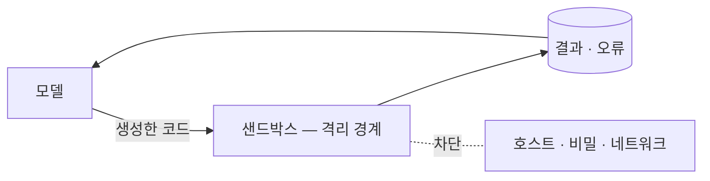
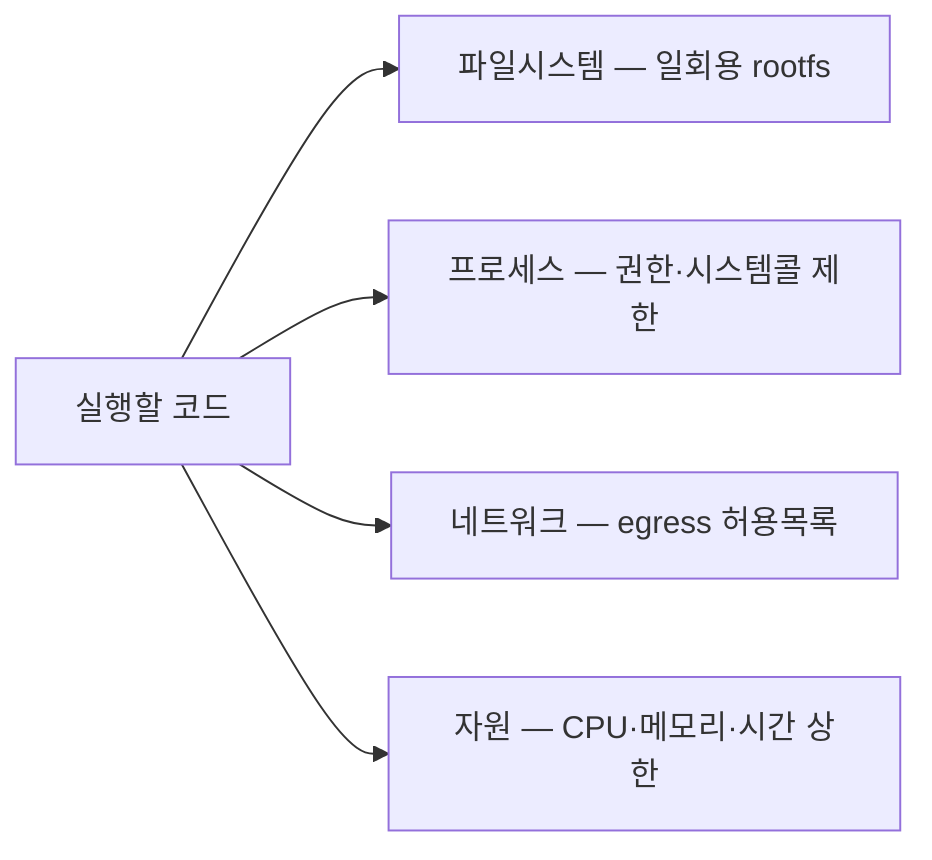

import Tools from "@awesome-ai-stack/core/components/ConceptTools.astro";

## 무엇인가 \{#what-it-is}

샌드박스는 신뢰할 수 없는 코드를 바깥과 끊어진 일회용 환경에서 실행하는 격리막입니다.  
에이전트는 모델이 즉석에서 짠 코드, 서드파티 도구, MCP 서버처럼 *무엇을 할지 미리 알 수 없는* 것을 돌립니다.  
샌드박싱은 그것이 호스트 파일·비밀·네트워크에 닿지 못하게 가두고, 그 안에서만 동작하게 만드는 일입니다.

이것은 [[하네스 엔지니어링]]의 *코드 샌드박스* 역할을 한 겹 더 깊이 들여다본 개념입니다.  
하네스는 모델 둘레에 감싸는 여러 장치 중, "실행을 가둔다"는 한 축을 다룹니다.

## 왜 중요한가 \{#why-it-matters}

모델의 출력은 신뢰 경계 *바깥*입니다.  
에이전트가 스스로 코드를 돌리고 도구를 부를수록, "잘못되면 무엇이 망가지나"는 모델이 얼마나 똑똑한지가 아니라 격리를 어떻게 설계했는지에 달립니다. 
아래 위험들은 더 큰 모델로 사라지지 않습니다 — 구조의 문제이기 때문입니다.

| 격리가 없으면                                        | 샌드박스로 막는 것                                |
| ---------------------------------------------------- | ------------------------------------------------- |
| **파괴적 명령** — `rm -rf`, `DROP TABLE`가 그대로 실행 | 일회용 환경이라 호스트·실데이터를 건드리지 못함   |
| **비밀 유출** — 환경변수·키를 읽어 밖으로 전송        | 비밀을 아예 주입하지 않고, 나가는 길을 막음        |
| **자원 폭주** — 무한 루프·메모리 폭발로 호스트 마비   | CPU·메모리·실행 시간에 상한을 둠                   |
| **임의 네트워크** — 데이터 반출·내부망 탐색(SSRF)     | 네트워크 기본 차단, 필요한 도메인만 허용           |
| **인젝션의 번짐** — 프롬프트 인젝션이 도구·셸로 확산  | 권한을 최소화해 사고의 폭발 반경을 줄임            |

각 행은 더 똑똑한 모델이 아니라, 실행을 가두는 한 겹으로 풀립니다.  
입력 쪽 방어는 가드레일의 몫이라면, 샌드박싱은 *실행* 쪽의 마지막 방벽입니다.

## 무엇을 격리하나 \{#what-to-isolate}

격리는 켜고 끄는 한 스위치가 아니라 여러 층입니다.  
한 층만 막고 나머지를 열어 두면 그 틈으로 새어 나갑니다.

- **파일시스템** — 일회용 rootfs를 주고, 호스트 디렉터리 마운트를 막음
- **프로세스·커널** — 권한을 분리하고, 위험한 시스템콜을 제한
- **네트워크** — 기본은 차단하고, 꼭 필요한 도메인만 허용목록으로 열기(egress allowlist)
- **자원** — CPU·메모리·실행 시간에 상한을 둬 폭주를 끊음
- **비밀** — 키·토큰을 샌드박스 안에 두지 않음

## 격리를 구현하는 방식 \{#how-isolation-is-implemented}

같은 목표를 격리 강도와 운영 부담이 다른 방식으로 이룹니다.  
위로 갈수록 가볍고, 아래로 갈수록 강하게 가둡니다.

| 방식                              | 격리 강도 | 기동 속도 | 적합한 자리                              |
| --------------------------------- | --------- | --------- | ---------------------------------------- |
| **컨테이너** (Docker 등)          | 중간      | 빠름      | 대부분의 코드 실행, 자체 호스팅           |
| **마이크로VM·샌드박스 커널** (Firecracker, gVisor) | 강함 | 빠름 | 신뢰 낮은 코드, 멀티테넌트 실행          |
| **관리형 샌드박스** (E2B, Modal, Daytona) | 강함  | 즉시      | 에이전트가 즉석에서 띄우고 버리는 실행    |

- 컨테이너는 커널을 호스트와 공유하므로 격리가 중간 수준이지만, 가볍고 어디서나 돌아가 대부분의 코드 실행에는 충분합니다.  
- 더 낮은 신뢰의 코드를 여럿 돌려야 하면 *마이크로VM*(Firecracker)이나 *샌드박스 커널*(gVisor)로 커널까지 갈라 격리를 끌어올립니다.  
- 직접 운영하는 부담을 지우고 싶다면 *관리형 샌드박스*가 이 모든 걸 API 한 줄 뒤로 숨겨, 에이전트가 호출 한 번으로 새 환경을 띄우고 끝나면 버립니다.

<Tools slugs={["e2b", "modal", "daytona", "docker"]} />

## 에이전트에서 어디에 나타나나 \{#where-it-shows-up}

샌드박싱은 코드 실행 한 곳에만 있지 않습니다.  
에이전트가 바깥과 닿는 거의 모든 지점에 같은 격리가 필요합니다.

- **코드 실행 도구**
  - 모델이 짠 코드를 돌려 계산·검증
  - [[도구]] 개념의 *코드 실행*과 같은 도구
  - 부수효과를 막으면서 코드가 실제로 도는지도 확인
- **컴퓨터·브라우저 사용**
  - 화면을 직접 조작하는 에이전트를 격리된 VM 안에서 돌림
- **도구·MCP 서버 격리**
  - 서드파티 도구와 MCP 서버를 분리 실행해, 한 도구의 사고가 전체로 번지지 않게 함
- **에이전트 런타임**
  - 에이전트 자체를 컨테이너로 묶어 배포하고, 인스턴스마다 경계를 둠

## 기억할 원칙 \{#principles-to-keep-in-mind}

- **권한을 최소화한다** — 기본은 아무것도 못 하게 두고, 꼭 필요한 것만 연다.
- **비밀은 샌드박스 밖에 둔다** — 키를 넣지 말고, 필요한 호출은 바깥 프록시로 위임합니다.
- **나가는 네트워크는 허용목록으로** — egress를 기본 차단하면 데이터 반출의 길이 막힙니다.
- **일회용·시간제한으로 돌린다** — 매 실행마다 새 환경을 띄우고, 오래 살지 못하게 합니다.
- **뚫린다고 가정한다** — 샌드박스도 새어 나갈 수 있다는 전제로, 폭발 반경 자체를 줄여둡니다.
