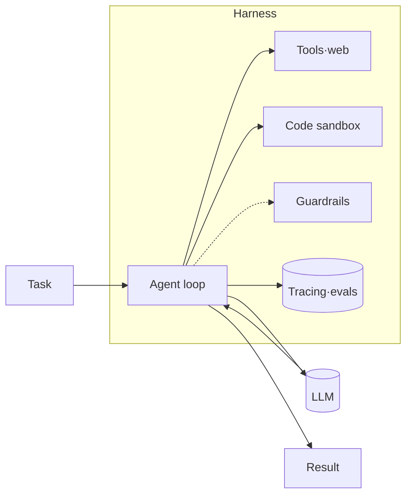
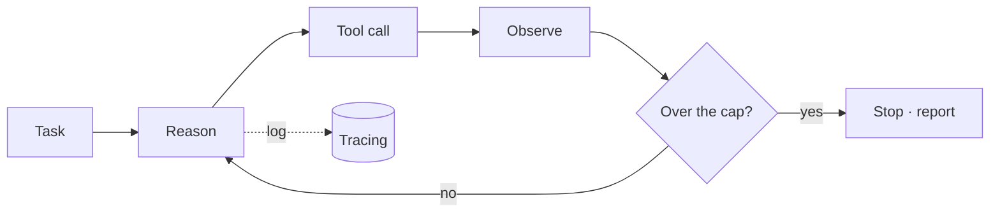

import Slide from '@awesome-ai-stack/core/components/Slide.astro';

<Slide class="cover">

# Harness engineering

Wrapping an LLM in scaffolding so it runs reliably in production

*awesome-ai-stack · concept slides*

</Slide>

<Slide>

## What it is

A single LLM call is smart but unstable on its own. The same prompt passes yesterday and misses today.

The model is **one part**; the harness is **everything else** that makes it trustworthy.

</Slide>

<Slide>

## From prompt to harness

:::cols
### Prompt engineering
Polishing the wording

clever prompt → LLM → output

*chasing a smarter sentence*

---

### Harness engineering
Designing the surroundings

task → loop·tools·sandbox·guardrails·evals ↔ LLM → **reliable output**

*designed on the premise the model can be wrong*
:::

</Slide>

<Slide>

## Why it matters

The gap between demo and production is mostly the **harness, not the model**. These problems don't yield to a bigger model — they're structural.

| Common failure | Fixed by the harness |
| --- | --- |
| **Runaway loop** — endless retries | a bounded agent loop |
| **Dangerous side effects** — deleting files, arbitrary requests | code sandbox |
| **Unsafe / off-topic output** | guardrails |
| **Confident wrong answers** | evaluation · tracing |
| **"It worked yesterday"** — silent quality drift | observability |

</Slide>

<Slide>

## Capabilities — model · tools

:::cols
### Model — the reasoning engine
Keep it **swappable** by cost/latency/quality

- direct: claude · openai · gemini
- gateway: litellm · openrouter

When one model dies or slows, fail over to another.

---

### Tools · web access
Define what the agent can *actually* do

- app calls · search · fresh data
- browser control

Today's real data comes in **through tools**.
:::

</Slide>

<Slide>

## Safety layers — guarding against failure

:::cols
### 🧪 Code sandbox
Runs model code in isolation — even `rm -rf ~` stays inside the sandbox

*e2b*

### 🛡 Guardrails
Validates input/output **at runtime** — blocks injection, masks PII

*guardrails-ai · nemo-guardrails*

---

### 📊 Evaluation
Scores quality with metrics/tests — catches confident wrong answers against a source

*deepeval · ragas · opik*

### 🔭 Observability
Traces every step·token·cost — catches regressions first

*langfuse · langsmith · arize-phoenix*
:::

</Slide>

<Slide>

## Orchestration — the spine that drives the cycle

The loop calls **reason → act → observe** in order, decides at each gate whether to stop, retry, or pass, and records every step to tracing.

*langgraph · openai-agents-sdk · crewai · agno*

</Slide>

<Slide>

## How to approach it

Don't build it all at once. Add one layer at a time, **in the order risk appears**.

1. **Loop + model** first — the simplest reason→act loop
2. Running code? add a **sandbox** — isolate side effects
3. Output reaching users? add **guardrails** — check before it lands
4. Iterating? add **evals + tracing** — you can't improve what you can't measure

</Slide>

<Slide class="center">

## Principles to keep in mind

**Start small, grow by measuring**

**When in doubt, block** · default to blocking, not passing

**Keep the model swappable**

**Cap the loop**

</Slide>
