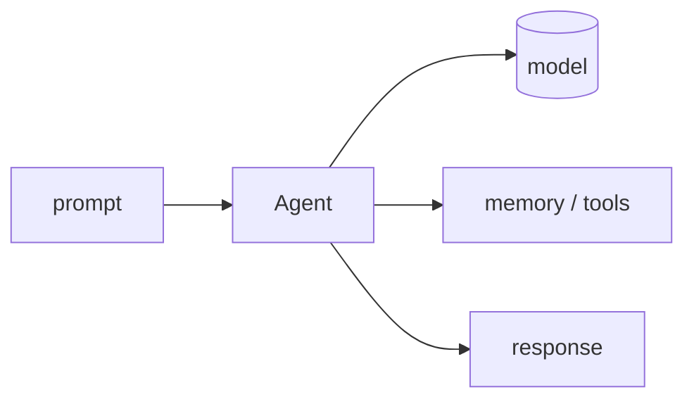

## Overview

Agno (formerly Phidata) is a high-performance Python framework for building agents with memory, knowledge, and tools, plus **AgentOS** — a runtime for serving and scaling them in production.  
It is model-agnostic and emphasizes speed and keeping your data inside your own infrastructure.

The **Code samples** tab shows a single agent backed by Claude.

## When to use it

Choose Agno when you want a fast, batteries-included agent abstraction and an in-house runtime (AgentOS) to deploy multi-agent systems without sending data to a third-party platform.
