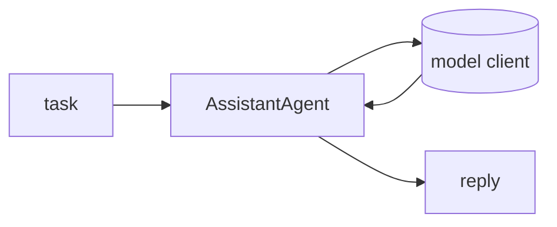

## Overview

AutoGen is Microsoft's framework for building multi-agent systems as conversations between agents — an event-driven core with a higher-level AgentChat API.  
As of 2025 it is in **maintenance mode**: existing projects keep working, but Microsoft directs new development to the consolidated Microsoft Agent Framework (Semantic Kernel + AutoGen).

The **Code samples** tab shows a single-agent AgentChat run.

## When to use it

Reasonable for existing AutoGen codebases and for its conversation-centric multi-agent patterns. 
For new projects, weigh the Microsoft Agent Framework or an actively developed alternative such as CrewAI or LangGraph.
