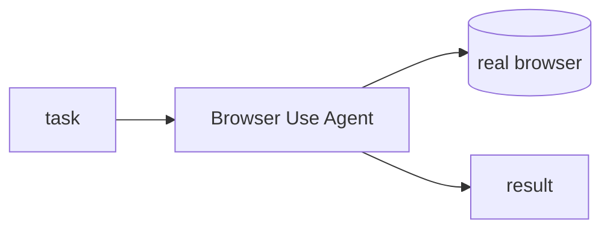

## Overview

Browser Use lets an LLM agent drive a real browser to finish web tasks end to end.  
You describe the goal in plain English, and the agent navigates, clicks, types, and extracts data from live pages.

The **Code samples** tab shows running a task with an LLM-driven agent.

## When to use it

Choose Browser Use when an agent has to interact with a site that offers no clean API. 
It shines for scraping behind logins, filling forms, and multi-step flows a human would click through.
