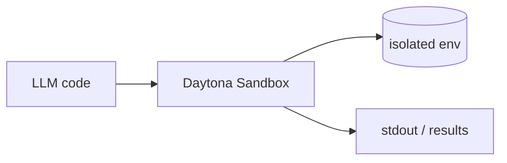

## Overview

Daytona is infrastructure purpose-built for running AI-generated code. 
Each sandbox is a fully isolated environment — its own kernel, filesystem, and network stack — that boots in well under a second, so an agent can create one per task, run code, and discard it.

It exposes Python and TypeScript SDKs for spinning sandboxes up and down, with state and filesystem access inside. 
The core is open (AGPL-3.0) and there's a hosted offering for teams that don't want to run it themselves.

## When to use it

Choose Daytona when an agent runs many short-lived, untrusted code executions and you want strong per-task isolation with sub-second startup — a code interpreter, a data-analysis step, or an autonomous coding agent's workspace.
