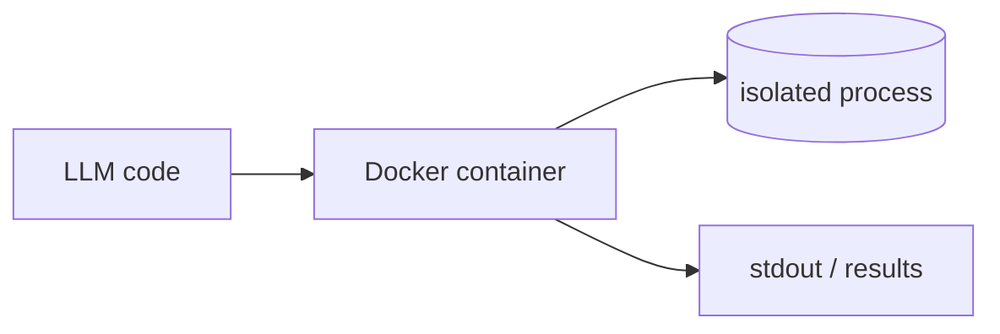

## Overview

Docker is the container runtime that most self-hosted agent sandboxes are built on. 
A container packages code with its dependencies and runs it isolated from the host — so when you need a sandbox of your own rather than a managed service, a throwaway container is the usual building block.

It shares the host kernel, so isolation is medium — pair it with resource limits, a dropped-privilege user, and a blocked network for untrusted code. 
The engine is open (Apache-2.0); Docker Desktop and Hub add paid tiers for orgs.

## When to use it

Reach for Docker when you want to run agent code on your own infrastructure instead of a hosted sandbox — local development, CI, or a self-managed runtime. 
It's also what sits under the "Docker-out-of-Docker" pattern this very project uses to give agents a container to work in.
