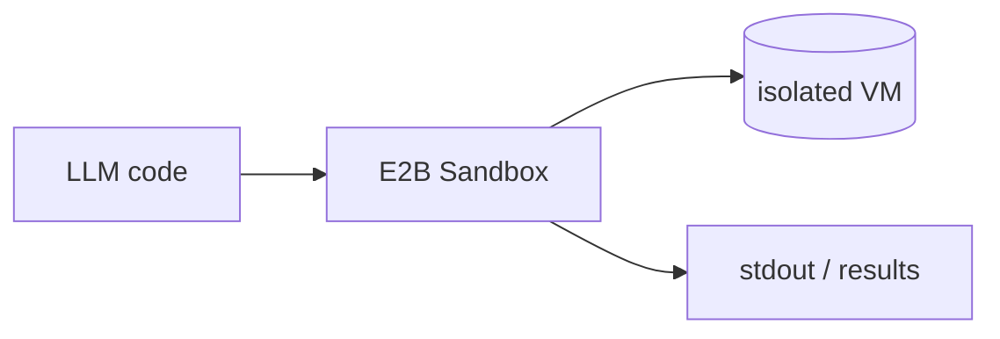

## Overview

E2B gives AI agents secure, isolated cloud sandboxes for running model-generated code.  
Each sandbox is a fast-booting VM, so an agent can execute arbitrary Python, inspect the output, and keep state across calls without ever touching the host.

The **Code samples** tab shows spinning up a sandbox and running code in it.

## When to use it

Choose E2B when an agent needs to run code it generated — data analysis, scripts, or tool calls — in a throwaway environment that is isolated from your infrastructure. 
The open SDK lets you start locally, and hosted sandboxes scale the same code in the cloud.
