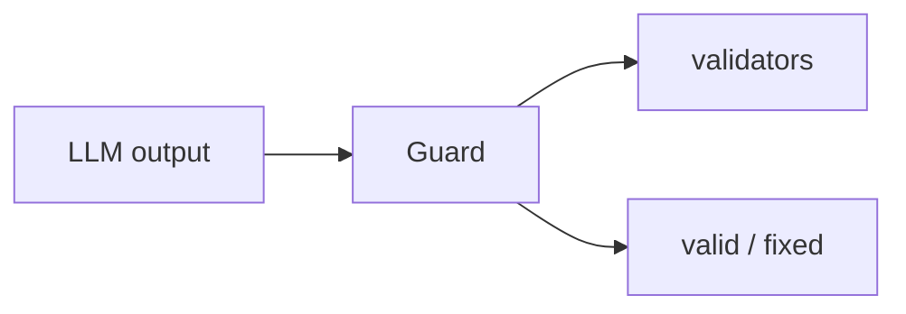

## Overview

Guardrails AI is a Python framework that validates and structures LLM input and output using composable validators pulled from the Guardrails Hub.  
You build a `Guard` from one or more validators — PII, jailbreak, format, factuality — and it intercepts the model's text to pass, fix, or reject it.

The **Code samples** tab shows building a Guard from a Hub validator and checking output.

## When to use it

Choose Guardrails AI when LLM I/O must obey concrete rules — strip PII, enforce a schema, block jailbreaks — and you want to mix and match ready-made validators from the Hub rather than hand-roll checks.
