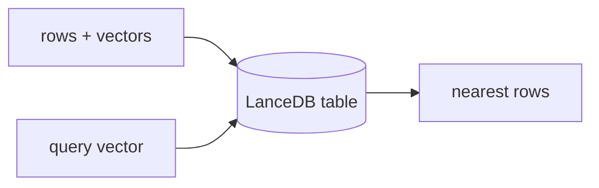

## Overview

LanceDB is an open-source, embedded vector database built on the Lance columnar format — it runs in-process and writes to local files or object storage, with no server to operate.  
It is multimodal and fast, and scales from a laptop to LanceDB Cloud without changing the API.

The **Code samples** tab shows the fully embedded flow.

## When to use it

Choose LanceDB when you want a zero-ops, local-first vector store embedded in your app — ideal for desktop tools, notebooks, and edge deployments, with a cloud option when you outgrow local files.
