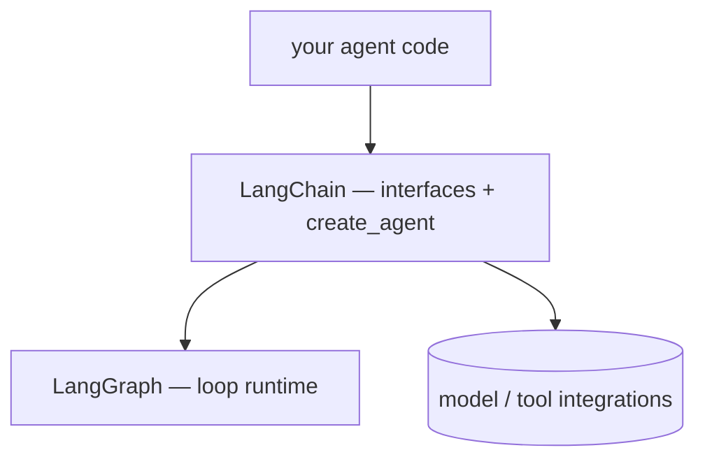

## Overview

LangChain is the framework the rest of the family plugs into: **standard interfaces** for chat models, messages, and tools, plus a large catalog of provider and vector-store integrations.  
Since 1.0 the package is deliberately slim — the agent runtime lives in [[LangGraph]], observability in [[LangSmith]], and LangChain supplies the glue: `create_agent` builds a production-ready ReAct agent and returns it as a compiled LangGraph graph.

The tutorials in this catalog use exactly that pair — `ChatLiteLLM` for provider routing and `create_agent` for the loop.  
Whether you even need the glue layer is a fair question: [[litellm-langgraph-vs-langchain|Dropping LangChain]] wires the same loop with just LiteLLM + LangGraph and compares the tradeoffs.

## When to use it

Reach for LangChain when you want a working tool-calling agent in minutes, model-vendor portability through one interface, and the integration catalog — and drop to LangGraph's graph API when the loop itself needs custom shape.
