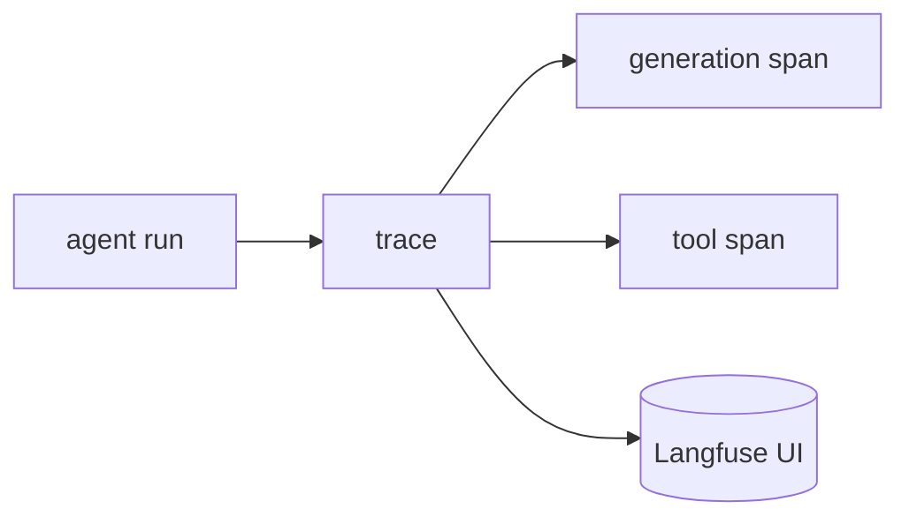

## Overview

Agents fail in ways that are hard to see from logs alone.  
Langfuse records each run as a **trace** of nested spans (model calls, tool calls, retrievals) so you can inspect latency, cost, and the exact prompts/outputs at every step — then attach scores and evals on top.

The **Code samples** tab shows the TypeScript SDK and the Python decorator — pick from the selector to compare.

## When to use it

Add Langfuse early when you need to debug multi-step agent runs, compare prompt versions, or track cost and quality in production.
