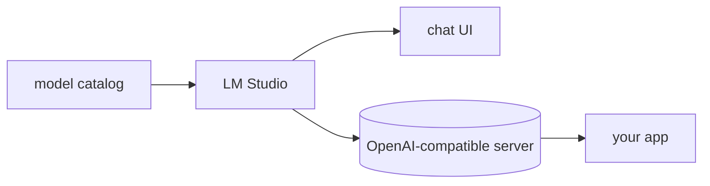

## Overview

LM Studio is a desktop application (macOS, Windows, Linux) for discovering, downloading, and running local LLMs in GGUF and MLX formats, with a chat UI and a built-in server.  
The server is OpenAI-compatible, so your existing code — or LiteLLM — can point at `localhost` instead of a cloud provider. 
It is free for personal and commercial use.

The **Code samples** tab shows calling the local server.

## When to use it

Choose LM Studio when you want the easiest way to run models locally with a GUI — browsing, downloading, and serving — rather than a CLI runtime like Ollama or a GPU serving engine like vLLM.
