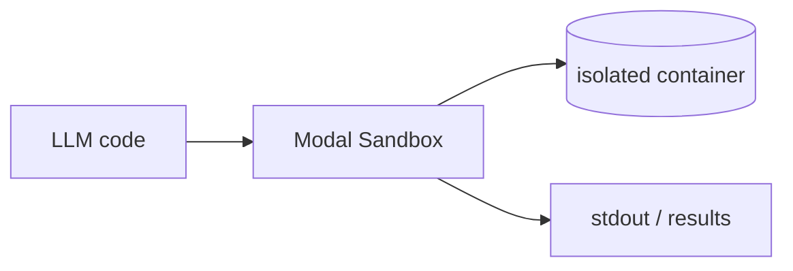

## Overview

Modal is a serverless platform for running code in the cloud without managing servers. 
For agents, **Modal Sandboxes** spin up an isolated container on demand, run arbitrary model-generated code inside it, and stream back the output — the host is never exposed.

You define the environment in Python (image, resources, timeout); Modal schedules it on its infrastructure and bills per second of compute. 
The SDK is open (Apache-2.0); the hosted runtime is the paid service.

## When to use it

Reach for Modal when an agent needs to execute untrusted code, but you also want the same primitive to scale to heavier jobs — GPU workloads, batch runs, or hosting a tool as a serverless function — behind one Python SDK, without operating sandboxes yourself.
