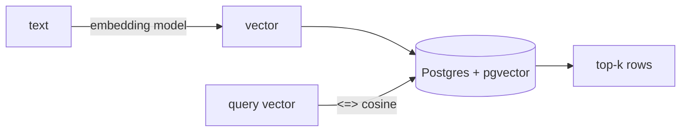

## Overview

`pgvector` adds a `vector` column type and similarity operators to PostgreSQL.  
If your stack already runs Postgres, it is the lowest-friction way to give an agent long-term memory or RAG retrieval — no extra service to operate.

The **Code samples** tab shows the schema/query and the index — pick from the selector to compare.

## When to use it

Choose pgvector when you want vector search co-located with your relational data and prefer operating one database instead of adding a dedicated vector store.
