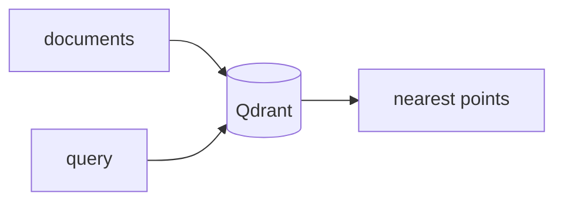

## Overview

Qdrant is a fast, open-source vector database written in Rust, built for similarity search at scale.  
It stores embeddings with JSON payloads and rich filtering, making it a common retrieval and long-term-memory layer for RAG and agents.

The **Code samples** tab shows the built-in embedder and a bring-your-own-vectors flow — pick from the selector to compare.

## When to use it

Choose Qdrant when you want a dedicated vector store with strong performance and payload filtering — self-hosted with Docker or on Qdrant Cloud.
