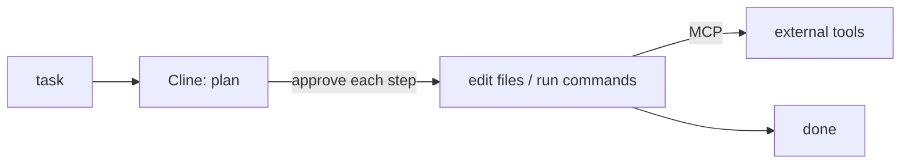

## 개요

Cline(이전 이름 Claude Dev)은 에디터를 에이전트형 작업 공간으로 바꾸는 VS Code 확장입니다.  
먼저 계획을 제안하고, 각 단계마다 사용자의 승인을 받아 파일을 생성·편집하고 터미널 명령을 실행하며, Model Context Protocol(MCP)을 통해 외부 도구를 사용할 수 있습니다.  
API 키는 직접 준비합니다.

**코드 샘플** 탭에는 설치와 MCP 서버 설정 예시가 있습니다 — 선택기에서 비교해 보세요.

## 언제 쓰면 좋은가

별도 앱이나 CI형 러너가 아니라, 휴먼 인 더 루프 승인과 MCP 도구 접근을 갖춘 자율 에이전트를 **에디터 안에서** 쓰고 싶을 때 Cline을 선택하세요.
