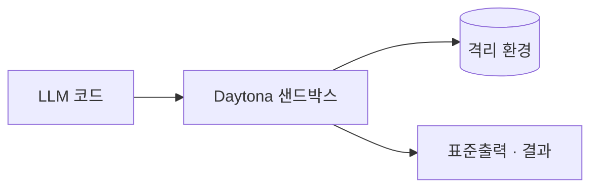

## 개요

Daytona는 AI가 생성한 코드 실행에 특화된 인프라입니다. 
각 샌드박스는 자체 커널· 파일시스템·네트워크 스택을 가진 완전 격리 환경이고 1초 안에 뜨므로, 에이전트가 작업마다 하나씩 만들어 코드를 돌리고 버릴 수 있습니다.

샌드박스를 띄우고 내리는 파이썬·타입스크립트 SDK를 제공하며, 그 안에서 상태와 파일시스템에 접근합니다. 
코어는 오픈(AGPL-3.0)이고, 직접 운영하기 싫은 팀을 위한 호스팅 서비스도 있습니다.

## 언제 쓰나

에이전트가 수명이 짧고 신뢰할 수 없는 코드 실행을 자주 하면서, 작업별 강한 격리와 1초 미만 기동이 필요할 때 — 코드 인터프리터, 데이터 분석 단계, 자율 코딩 에이전트의 작업 공간 — Daytona를 고릅니다.
