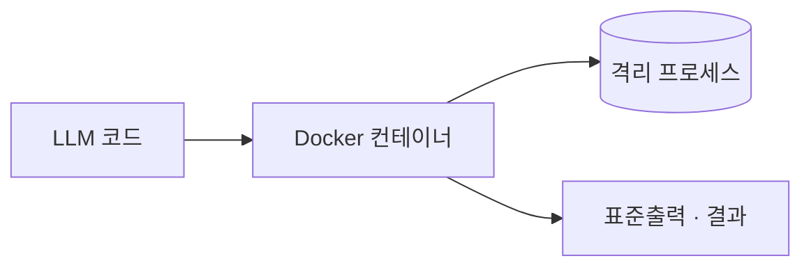

## 개요

Docker는 자체 호스팅 에이전트 샌드박스 대부분이 올라타는 컨테이너 런타임입니다. 
컨테이너는 코드를 의존성과 함께 묶어 호스트와 격리해 실행하므로, 관리형 서비스 대신 직접 만든 샌드박스가 필요할 때 일회용 컨테이너가 보통의 기본 단위가 됩니다.

호스트 커널을 공유하므로 격리는 중간 수준입니다 — 신뢰할 수 없는 코드라면 자원 제한, 권한을 낮춘 사용자, 네트워크 차단을 함께 겁니다. 
엔진은 오픈(Apache-2.0)이고, Docker Desktop·Hub는 조직용 유료 요금제를 더합니다.

## 언제 쓰나

호스팅 샌드박스 대신 내 인프라에서 에이전트 코드를 돌리고 싶을 때 — 로컬 개발, CI, 자체 운영 런타임 — Docker를 고릅니다. 
이 프로젝트가 에이전트에게 작업용 컨테이너를 내주려고 쓰는 "Docker-out-of-Docker(DooD)" 패턴의 바탕이기도 합니다.
