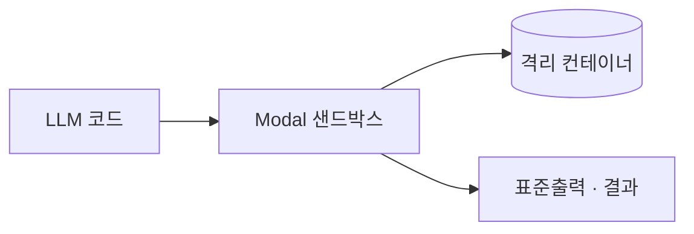

## 개요

Modal은 서버를 직접 관리하지 않고 클라우드에서 코드를 돌리는 서버리스 플랫폼입니다. 
에이전트 관점에서는 **Modal 샌드박스**가 격리된 컨테이너를 즉석에서 띄워 모델이 만든 임의의 코드를 그 안에서 실행하고 결과만 돌려줍니다 — 호스트는 노출되지 않습니다.

환경(이미지·자원·타임아웃)을 파이썬으로 정의하면 Modal이 자사 인프라에 스케줄링하고 실행한 컴퓨트 시간만큼 과금합니다. 
SDK는 오픈(Apache-2.0)이고, 호스팅 런타임이 유료 서비스입니다.

## 언제 쓰나

신뢰할 수 없는 코드를 실행해야 하면서, 같은 도구로 GPU 작업·배치 실행·서버리스 함수로 도구 호스팅 같은 더 무거운 일까지 확장하고 싶을 때 — 그것도 샌드박스를 직접 운영하지 않고 하나의 파이썬 SDK 뒤에서 — Modal을 고릅니다.
