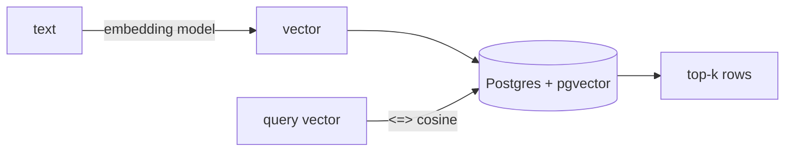

## 개요

`pgvector`는 PostgreSQL에 `vector` 컬럼 타입과 유사도 연산자를 추가합니다.  
이미 Postgres를 운영 중이라면, 에이전트에 장기 기억이나 RAG 검색을 붙이는 가장 마찰 없는 방법입니다 — 추가로 운영할 서비스가 없습니다.

**코드 샘플** 탭에는 스키마·조회와 인덱스 예시가 있습니다 — 선택기에서 비교해 보세요.

## 언제 쓰면 좋은가

벡터 검색을 관계형 데이터와 같은 곳에 두고 싶고, 전용 벡터 스토어를 추가하기 보다 하나의 데이터베이스만 운영하고 싶을 때 pgvector를 선택하세요.
