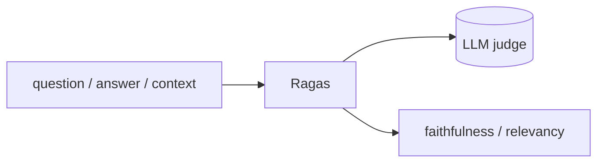

## 개요

Ragas는 RAG 파이프라인과 LLM 애플리케이션을 평가하는 오픈소스 프레임워크로, 충실도(faithfulness)·답 관련성·컨텍스트 정밀도 같은 레퍼런스 없는 지표를 제공합니다.  
"이 RAG 시스템이 실제로 잘 동작하나?"를, CI에서 추적하고 변경 간 비교할 수 있는 수치로 바꿔줍니다.

**코드 샘플** 탭에서 최소 RAG 평가를 보여줍니다.

## 언제 쓰면 좋은가

검색 품질이 중요하고 RAG 파이프라인에 대한 객관적·반복 가능한 지표를 원할 때 — 회귀를 잡고 리트리버·청킹·프롬프트를 비교하기 위해 Ragas를 고르세요.
