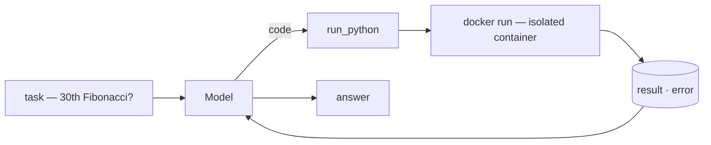
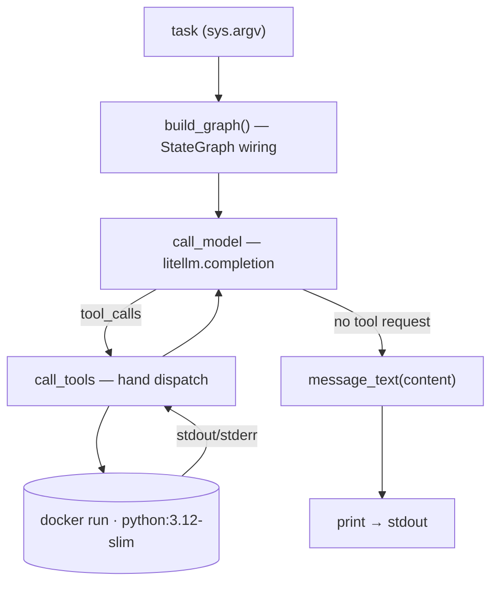

import SampleProject from '../../../components/SampleProject.astro';

In [[code-sandbox-agent|the code-sandbox agent]] we built the loop with two lines of `create_agent`.  
This post rebuilds the **same agent** without [[LangChain]].  
The only dependencies are [[LiteLLM]] (model routing) and [[LangGraph]] (the loop runtime).  

Why this composition works at all is covered layer by layer in [[litellm-langgraph-vs-langchain|Dropping LangChain]];  
here we turn that "option B" into a working agent.

## What we're building \{#what-were-building}

The behavior is exactly the original's.

1. Given a task that needs computation, the model writes Python, 
2. the `run_python` tool runs it in an isolated Docker container and hands back the output, 
3. and the model reads that and answers.



Only the wiring changes.

- Four dependencies (langchain, langchain-litellm, langgraph, litellm) become **two** (langgraph, litellm)
- A **hand-written JSON schema** instead of the `@tool` decorator
- **`StateGraph` nodes + a conditional edge** instead of the prebuilt loop
- The sandbox (`docker run` + isolation flags) doesn't change **by a single character**

## Reading the code \{#reading-the-code}

### The overall structure \{#overall-structure}

`app.py` boils down to two nodes and one edge.
- `call_model()` calls the model through LiteLLM,
- when the model requests tools, `call_tools()` dispatches them by hand,
- and `route()` loops between the two until there's no tool request.



### The detailed structure \{#detailed-structure}

#### `RUN_PYTHON` — the hand-written tool schema \{#tool-schema}

With LangChain, `@tool` derived the schema from the function signature and docstring.  
Here the schema is your code.  
The `description` inherits the docstring's job: it's what the model reads to decide *when* to reach for code.

```python
RUN_PYTHON = {
    "type": "function",
    "function": {
        "name": "run_python",
        "description": (
            "Run a snippet of Python and return its stdout/stderr. "
            "The code executes in an isolated, throwaway Docker container — "
            "no network, capped memory/CPU — so it can't touch the host. "
            "Use print() to surface results, and stick to the standard library."
        ),
        "parameters": {
            "type": "object",
            "properties": {
                "code": {"type": "string", "description": "Python source to run."}
            },
            "required": ["code"],
        },
    },
}
```

The `run_python()` function itself is [[code-sandbox-agent#run-python|identical to the original's]] — it pipes code into a flag-guarded `docker run`, and the sandbox doesn't care which framework called it.

#### `call_model` — the model node \{#call-model}


- **Calls `litellm.completion` directly** — no `ChatLiteLLM` adapter; routing is still the one `MODEL` env var
- Passes the schema along on every call via `tools=[RUN_PYTHON]`
- Appends the reply as a dict to the state list — no message types, no reducer

```python
def call_model(state: State) -> State:
    """Agent node: one LiteLLM call with the conversation so far + the tool."""
    resp = litellm.completion(
        model=os.environ.get("MODEL", "claude-opus-4-8"),
        messages=state["messages"],
        tools=[RUN_PYTHON],
        temperature=0,
    )
    msg = resp.choices[0].message.model_dump()
    # Drop null fields (e.g. function_call) so the resent message stays clean.
    msg = {k: v for k, v in msg.items() if v is not None}
    return {"messages": state["messages"] + [msg]}
```

#### `call_tools` — the tool node, dispatched by hand \{#call-tools}


Everything the prebuilt did for us gathers here.

- **Pulls the name and arguments out of `tool_calls`** and JSON-parses them
- Picks the function by name — more tools means more branches here
- Hands each result back tagged with `tool_call_id` — the key the model uses to match answers to requests

```python
def call_tools(state: State) -> State:
    """Tool node: dispatch every requested call by hand and tag each result
    with its tool_call_id so the model can match answers to requests."""
    results = []
    for call in state["messages"][-1]["tool_calls"]:
        args = json.loads(call["function"]["arguments"] or "{}")
        if call["function"]["name"] == "run_python":
            output = run_python(args.get("code", ""))
        else:
            output = f"Error: unknown tool {call['function']['name']}"
        results.append({"role": "tool", "tool_call_id": call["id"], "content": output})
    return {"messages": state["messages"] + results}
```

#### `route` and the graph wiring \{#the-graph}


- The state is a `TypedDict` with a single `messages` list
- `route()` sends the flow to the tools when the last message has `tool_calls`, and to the end when it doesn't
- The graph `create_agent` used to build internally is compiled right here — the whole shape of the ReAct loop fits in ten visible lines

```python
class State(TypedDict):
    # Plain OpenAI-format message dicts — no message classes, no reducer.
    messages: list

def route(state: State) -> str:
    """Conditional edge: run tools if the model asked for them, otherwise stop."""
    return "tools" if state["messages"][-1].get("tool_calls") else "end"

def build_graph():
    """Wire the ReAct loop explicitly: model -> (tools -> model)* -> end."""
    graph = StateGraph(State)
    graph.add_node("model", call_model)
    graph.add_node("tools", call_tools)
    graph.add_edge(START, "model")
    graph.add_conditional_edges("model", route, {"tools": "tools", "end": END})
    graph.add_edge("tools", "model")  # after running tools, think again
    return graph.compile()
```

`main()` is five or six lines that feed the graph a question and print the last message.  
The `agent.invoke({"messages": […]})` call looks exactly like the original's. 
Same LangGraph runtime, after all.

## The implementation \{#the-implementation}

The full code, wired with just LiteLLM + LangGraph.  
The sandbox isolation flags, the Dockerfile, and how to run it are identical to the original post.

<SampleProject folder="docker_2" />

## The key parts \{#the-key-parts}

- **The schema is the docs**
  - The `description` field does what `@tool`'s docstring did.
  - You now write the manual the model reads, yourself.
- **The dispatch is your code**
  - Name branching, argument parsing, and `tool_call_id` matching all sit in plain sight — easy to slot in logging or custom policy.
- **The state is just a list**
  - Plain OpenAI-format dicts appended together, so you can print the conversation at any point as-is.
- **The sandbox is framework-agnostic**
  - `run_python` and its isolation flags are unchanged — the isolation comes from the [Sandboxing](../../concept/sandboxing/) design, not from the wiring.

To weigh the two versions side by side,  
see [[litellm-langgraph-vs-langchain|Dropping LangChain]]; for the two-line `create_agent` build, see [[code-sandbox-agent|the original tutorial]].
