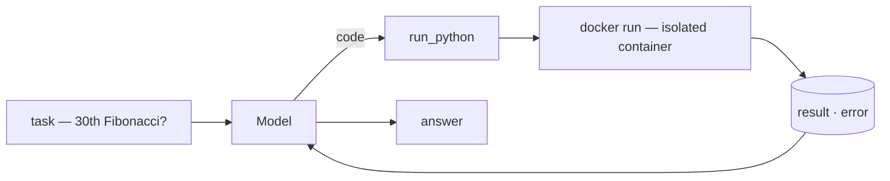
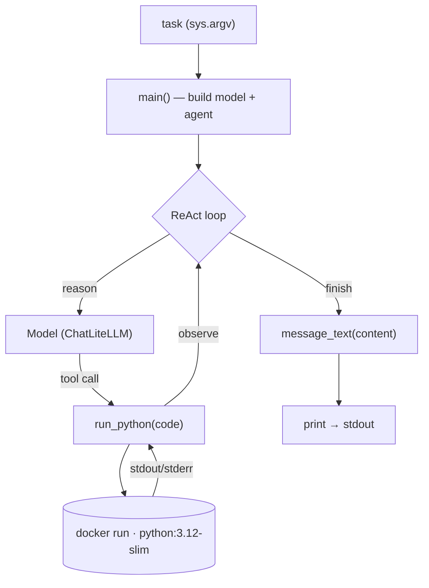

import SampleProject from '../../../components/SampleProject.astro';

The [Sandboxing](../../concept/sandboxing/) concept makes the case that model-written code is *outside* the trust boundary and belongs in a throwaway, isolated environment.  
Here we turn that *code execution* role into a working agent.  

The tool never `exec`s the code — it pipes it into a fresh Docker container every time.

## What we're building \{#what-were-building}

1. Given a task that needs computation, the model writes Python, 
2. the `run_python` tool runs it in an isolated Docker container and hands back the output, 
3. and the model reads that and answers.



The code never runs on the host.
- `--network none` cuts the network, 
- `--memory` / `--cpus` / `--pids-limit` cap memory/CPU/process count, 
- `--rm` throws the container away when it exits.

## Reading the code \{#reading-the-code}

### The overall structure \{#overall-structure}

`app.py` splits into three functions.
- `main()` wires up the model and agent,
- `run_python()` is the tool the model calls,
- `message_text()` cleans up the final answer.



### The detailed structure \{#detailed-structure}

#### `run_python(code)` — the tool \{#run-python}


- A single `@tool`-wrapped function
  - its docstring tells the model *when* to reach for code
- Doesn't run the code in-process; pipes it to `docker run` via `subprocess`
  - `python -` reads the program from stdin
- The isolation is in the flags
  - `--network none` (no network),
  - `--memory` / `--cpus` / `--pids-limit` (resource caps),
  - `--user 65534` (non-root),
  - `--rm` (throwaway)
- `timeout=30` kills runaway code; output is truncated to the first 4,000 chars

```python
@tool
def run_python(code: str) -> str:
    """Run a snippet of Python and return its stdout/stderr. …"""
    proc = subprocess.run(
        [
            "docker", "run", "--rm", "-i",
            "--network", "none",      # no network: nothing leaves the box
            "--memory", "256m",       # memory cap
            "--cpus", "1",            # cpu cap
            "--pids-limit", "128",    # process cap (fork-bomb guard)
            "--user", "65534:65534",  # run as nobody, not root
            SANDBOX_IMAGE,
            "python", "-",            # read the program from stdin
        ],
        input=code,
        capture_output=True,
        text=True,
        timeout=30,                   # wall-clock guard
    )
    out = (proc.stdout or "") + (proc.stderr or "")
    return out.strip()[:4000] or "(no output)"
```

*Excerpt — error handling omitted; the full code is in the [Implementation](#the-implementation) section.*

#### `message_text(content)` — tidying output \{#message-text}


- A model's `content` varies
  - a string from cloud models, a list of blocks from some local ones
- Join the `type == "text"` blocks if it's a list; leave a string as-is

```python
def message_text(content) -> str:
    """Flatten an assistant message's content to plain text."""
    if isinstance(content, list):
        return "".join(
            part.get("text", "")
            for part in content
            if isinstance(part, dict) and part.get("type") == "text"
        )
    return content
```

#### `main()` — wiring \{#main}


- Build `ChatLiteLLM` from `MODEL` and a ReAct loop with `create_agent(model, tools=[run_python])`
- `agent.invoke({"messages": […]})` runs reason → tool call → observe
- When it finishes, clean the last message with `message_text()` and print it

```python
def main() -> None:
    question = " ".join(sys.argv[1:]) or "What is the 30th Fibonacci number? Use code."

    # MODEL chooses the provider (claude-opus-4-8 / gpt-4o / gemini/gemini-2.5-flash).
    model = ChatLiteLLM(model=os.environ.get("MODEL", "claude-opus-4-8"), temperature=0)
    agent = create_agent(model, tools=[run_python])

    result = agent.invoke({"messages": [{"role": "user", "content": question}]})
    final = result["messages"][-1]
    answer = (message_text(final.content) or "").strip()
    print(answer or f"[no text in the final message] {final!r}")
```

The import says `langchain`, but what `create_agent` returns is a LangGraph graph.  
Why that glue layer exists — and what the same loop looks like wired with just LiteLLM + LangGraph — is covered in [[litellm-langgraph-vs-langchain|a separate comparison]].

## The implementation \{#the-implementation}

One `run_python` tool on a LangGraph ReAct loop.  
The tool's body is essentially a single `docker run`, and the safety comes from the flags hung off it.

<SampleProject folder="docker_1" />

## The key parts \{#the-key-parts}

- **The tool is the isolation boundary**
  - `run_python` pipes code to a fresh container instead of `exec`ing it,
  - so a mishap ends in a throwaway box, not on the host.
- **The isolation lives in the flags**
  - no network, resource caps, non-root, and ephemeral together shrink the blast radius.
- **Docker if you self-host, E2B / Modal if you don't**
  - the same role, run yourself (Docker) or delegated behind one API call.
- **Swap the provider**
  - change `MODEL` in `.env` and the same code runs on a different model.

Swap the tool for search and you get [asking today's FX rate](../web-search-fx-agent/); swap it for scraping and you get [a docs page to Markdown](../web-scraping-agent/).  
The same agent wired without LangChain — just LiteLLM + LangGraph — is in [[code-sandbox-agent-direct|the hand-wired edition]].  
Why and how to isolate is laid out in the [Sandboxing](../../concept/sandboxing/) concept.
