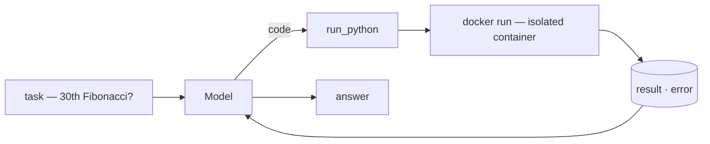
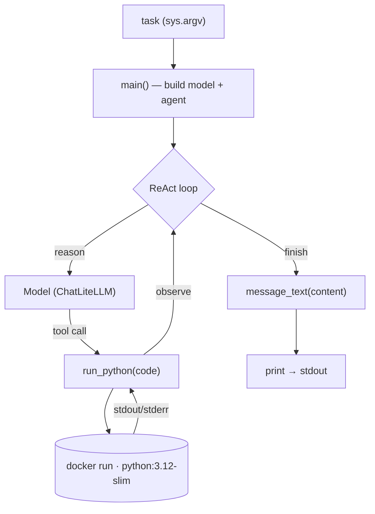

import SampleProject from '../../../components/SampleProject.astro';

The [Sandboxing](../../concept/sandboxing/) concept makes the case that
model-written code is *outside* the trust boundary and belongs in a throwaway,
isolated environment. Here we turn that *code execution* role into a working
agent — the tool never `exec`s the code, it pipes it into a fresh Docker
container every time.

## What we're building \{#what-were-building}

Given a task that needs computation, the model writes Python, the `run_python`
tool runs it in an isolated Docker container and hands back the output, and the
model reads that and answers.

The code never runs on the host. `--network none` cuts the network, caps bound
memory/CPU/process count, and `--rm` throws the container away when it exits.

## Reading the code \{#reading-the-code}

`app.py` splits into three functions — `main()` wires up the model and agent,
`run_python()` is the tool the model calls, and `message_text()` cleans up the
final answer.

**`run_python(code)` — the tool**

- A single `@tool`-wrapped function — its docstring tells the model *when* to reach for code
- It doesn't run the code in-process; it pipes it to `docker run` via `subprocess`, with `python -` reading the program from stdin
- The isolation is in the flags — `--network none` (no network), `--memory` / `--cpus` / `--pids-limit` (resource caps), `--user 65534` (non-root), `--rm` (throwaway)
- `timeout=30` kills runaway code; output is truncated to the first 4,000 chars

**`message_text(content)` — tidying output**

- A model's `content` varies — a string from cloud models, a list of blocks from some local ones
- Join the `type == "text"` blocks if it's a list; leave a string as-is

**`main()` — wiring**

- Build `ChatLiteLLM` from `MODEL` and a ReAct loop with `create_agent(model, tools=[run_python])`
- `agent.invoke({"messages": […]})` runs reason → tool call → observe
- When it finishes, clean the last message with `message_text()` and print it

## The implementation \{#the-implementation}

One `run_python` tool on a LangGraph ReAct loop. The tool's body is essentially a
single `docker run`, and the safety comes from the flags hung off it.

<SampleProject folder="docker_1" />

## The key parts \{#the-key-parts}

- **The tool is the isolation boundary** — `run_python` pipes code to a fresh container instead of `exec`ing it, so a mishap ends in a throwaway box, not on the host.
- **The isolation lives in the flags** — no network, resource caps, non-root, and ephemeral together shrink the blast radius.
- **Docker if you self-host, E2B / Modal if you don't** — the same role, run yourself (Docker) or delegated behind one API call.
- **Swap the provider** — change `MODEL` in `.env` and the same code runs on a different model.

Swap the tool for search and you get [asking today's FX rate](../web-search-fx-agent/);
swap it for scraping and you get [a docs page to Markdown](../web-scraping-agent/).
Why and how to isolate is laid out in the [Sandboxing](../../concept/sandboxing/) concept.
