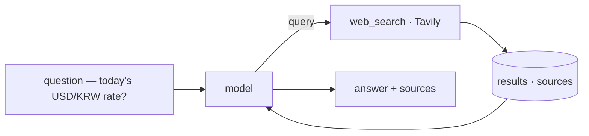

import SampleProject from '../../../components/SampleProject.astro';

The [Tools](../../concepts/agent-tools/) concept uses "asking today's FX rate"
as an example. A model's knowledge stops at its training cutoff, so a value
that changes daily — like an exchange rate — is out of reach; a *web-search
tool* is what bridges that gap. Here we turn that example into a working agent.

## What we're building

An agent that, given a question, decides on its own "I should search for this,"
queries the web through Tavily, reads the fresh results, and answers with the
rate and its sources.

Without the tool the model can only guess at a stale value; with one tool, the
answer is grounded in today's web.

## The implementation

A LangGraph ReAct loop with a single `web_search` tool. The model is routed
through LiteLLM, so the same code runs on Claude, OpenAI, or Gemini.

<SampleProject folder="tavily_1" />

## The key parts

- **A tool is a function** — the whole tool is one `@tool`-wrapped
  `web_search(query)`. Its docstring is the model's manual, so the model reads
  it to judge *when* to search.
- **The loop wires the calls** — `create_agent(model, tools=[web_search])` runs
  reason→call-tool→observe, deciding whether to call the tool and whether to
  call again after seeing the result.
- **The result becomes evidence** — Tavily's answer and sources feed back into
  reasoning, so the model answers with a looked-up value instead of a guess.
- **The provider is swappable** — change `MODEL` in `.env` to run the same code
  on a different model.

Swap the search tool for scraping (Firecrawl) or browser automation (Browser
Use) and the same loop pulls in a different kind of "now" data. The full set of
tool kinds is laid out in the [Tools](../../concepts/agent-tools/) concept.
