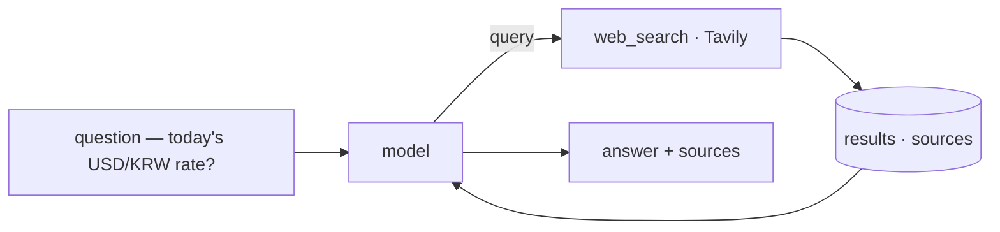
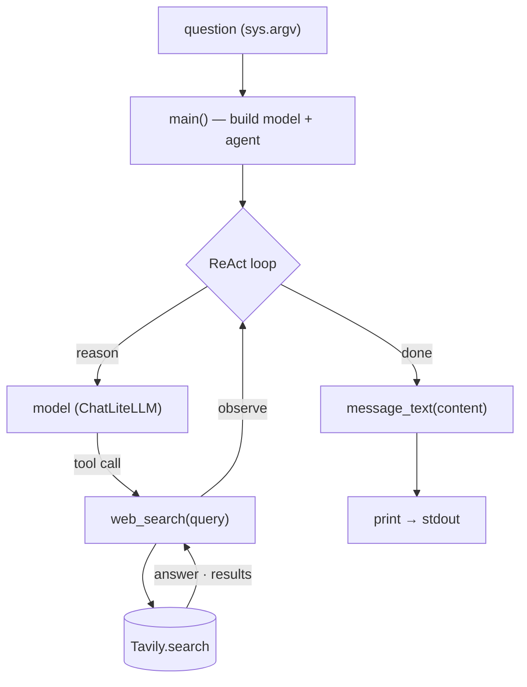

import SampleProject from '../../../components/SampleProject.astro';

The [Tools](../../concept/agent-tools/) concept uses "asking today's FX rate" as an example. 
A model's knowledge stops at its training cutoff, so a value that changes daily — like an exchange rate — is out of reach; a *web-search tool* is what bridges that gap. 
Here we turn that example into a working agent.

## What we're building \{#what-were-building}

An agent that, given a question, decides on its own "I should search for this," queries the web through Tavily, reads the fresh results, and answers with the rate and its sources.

Without the tool the model can only guess at a stale value; with one tool, the answer is grounded in today's web.

## Reading the code \{#reading-the-code}

The whole flow in `app.py` splits into three functions — `main()` wires the model and the agent, `web_search()` is the tool the model calls, and `message_text()` cleans up the final answer.

**`web_search(query)` — the tool**

- A single `@tool` decorator turns a plain Python function into a tool the model can call
- Its docstring is the model's manual — the model reads it to decide *when* to call
- Inside, `_tavily.search(query, include_answer=True, max_results=5)` hits Tavily
- The returned `answer` and `results` are folded into one block of text — the next reasoning step's input

**`message_text(content)` — cleaning the output**

- A reply's `content` isn't uniformly shaped — cloud models return a string, some local models a list of blocks like `[{type: "text", …}, …]`
- For a list, it keeps only the text of `type == "text"` blocks
- For a string, it passes straight through
- So any provider prints as one clean line

**`main()` — the wiring**

- Builds `ChatLiteLLM` from `MODEL` and assembles the ReAct loop with `create_agent(model, tools=[web_search])`
- `ChatLiteLLM` wraps *LiteLLM* as a LangChain model — LiteLLM does provider routing (which API), `ChatLiteLLM` is the interface `create_agent` expects
- `agent.invoke({"messages": […]})` runs reason→call-tool→observe
- When it finishes, the last message's `content` is cleaned by `message_text()` and printed
- Whether to call the tool — and whether to call again — is entirely the loop's decision

## The implementation \{#the-implementation}

A LangGraph ReAct loop with a single `web_search` tool. 
The model is routed through LiteLLM, so the same code runs on Claude, OpenAI, or Gemini.

<SampleProject folder="tavily_1" />

## The key parts \{#the-key-parts}

- **A tool is a function** — the whole tool is one `@tool`-wrapped
  `web_search(query)`. Its docstring is the model's manual, so the model reads
  it to judge *when* to search.
- **The loop wires the calls** — `create_agent(model, tools=[web_search])` runs
  reason→call-tool→observe, deciding whether to call the tool and whether to
  call again after seeing the result.
- **The result becomes evidence** — Tavily's answer and sources feed back into
  reasoning, so the model answers with a looked-up value instead of a guess.
- **The provider is swappable** — change `MODEL` in `.env` to run the same code
  on a different model.

Swap the tool for [scraping (Firecrawl)](../web-scraping-agent/) in the same loop and it reads a page in as Markdown; swap it for browser automation and it pulls in a different kind of "now" data. 
The full set of tool kinds is laid out in the [Tools](../../concept/agent-tools/) concept.
