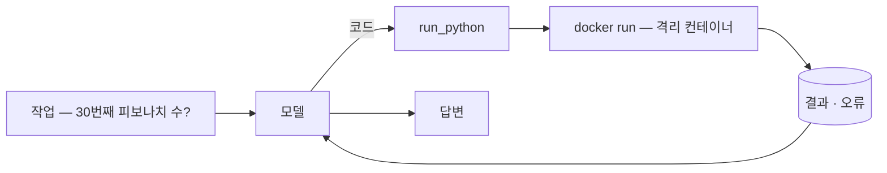
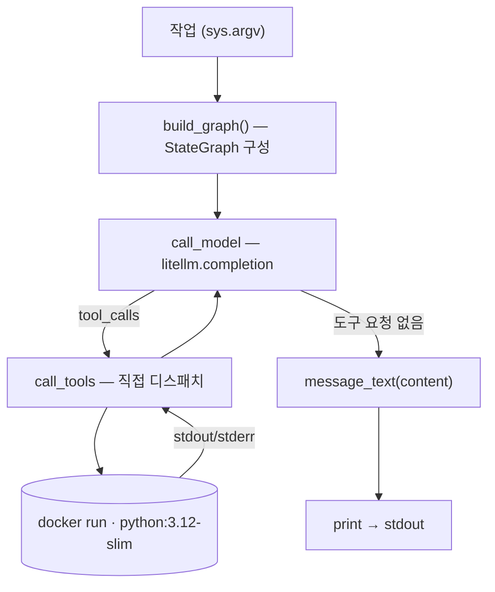

import SampleProject from '../../../components/SampleProject.astro';

[[code-sandbox-agent|코드 샌드박스 에이전트]]에서는 `create_agent` 두 줄로 루프를 만들었습니다.  
이 글은 **같은 에이전트**를 LangChain 없이 다시 만듭니다 — 의존성은 [[LiteLLM]](모델 라우팅)과 [[LangGraph]](루프 런타임) 둘뿐입니다.  

왜 이 구성이 가능한지는 [[litellm-langgraph-vs-langchain|LangChain 없이 만들면]]에서 계층별로 따져 봤고, 여기서는 그 "방법 B"를 실제로 돌아가는 에이전트로 완성합니다.

## 무엇을 만드나 \{#what-were-building}

동작은 원조 글과 완전히 같습니다.

1. 계산이 필요한 작업을 받으면 모델이 파이썬을 짜고, 
2. `run_python` 도구가 그 코드를 격리된 Docker 컨테이너에서 돌려 결과를 돌려주면, 
3. 모델이 그걸 읽고 답하는 에이전트입니다.



달라지는 것은 조립 방식뿐입니다.

- 의존성 넷(langchain·langchain-litellm·langgraph·litellm)이 **둘**(langgraph·litellm)로
- `@tool` 데코레이터 대신 **손으로 쓴 JSON 스키마**
- 프리빌트 루프 대신 **`StateGraph` 노드 + 조건부 엣지**
- 샌드박스(`docker run` + 격리 플래그)는 **한 글자도 안 바뀜**

## 코드 뜯어보기 \{#reading-the-code}

### 전체 구조 \{#overall-structure}

`app.py`는 노드 둘과 엣지 하나로 정리됩니다.
- `call_model()`이 LiteLLM으로 모델을 부르고, 
- 모델이 도구를 요청하면 `call_tools()`가 직접 디스패치하고, 
- `route()`가 도구 요청이 없을 때까지 둘 사이를 돌립니다.



### `RUN_PYTHON` — 손으로 쓴 도구 스키마 \{#tool-schema}

LangChain에서는 `@tool`이 함수 시그니처와 docstring에서 스키마를 만들어 줬습니다.  
여기서는 스키마가 곧 내 코드입니다 — `description`이 docstring의 역할을 그대로 이어받아, 모델이 *언제* 코드로 풀지 판단하는 근거가 됩니다.

```python
RUN_PYTHON = {
    "type": "function",
    "function": {
        "name": "run_python",
        "description": (
            "Run a snippet of Python and return its stdout/stderr. "
            "The code executes in an isolated, throwaway Docker container — "
            "no network, capped memory/CPU — so it can't touch the host. "
            "Use print() to surface results, and stick to the standard library."
        ),
        "parameters": {
            "type": "object",
            "properties": {
                "code": {"type": "string", "description": "Python source to run."}
            },
            "required": ["code"],
        },
    },
}
```

`run_python()` 함수 자체는 [원조 글의 그것](../../article/code-sandbox-agent/#run-python)과 동일합니다 — 격리 플래그를 단 `docker run`에 코드를 흘려보낼 뿐, 샌드박스는 어느 프레임워크가 불렀는지 신경 쓰지 않습니다.

### `call_model` — 모델 노드 \{#call-model}


- `ChatLiteLLM` 어댑터 없이 **`litellm.completion`을 직접 호출** — 라우팅은 여전히 `MODEL` 환경변수 하나
- 스키마를 `tools=[RUN_PYTHON]`으로 매번 함께 전달
- 응답 메시지를 dict로 바꿔 상태 리스트에 이어 붙임 — 메시지 타입도, 리듀서도 없음

```python
def call_model(state: State) -> State:
    """Agent node: one LiteLLM call with the conversation so far + the tool."""
    resp = litellm.completion(
        model=os.environ.get("MODEL", "claude-opus-4-8"),
        messages=state["messages"],
        tools=[RUN_PYTHON],
        temperature=0,
    )
    msg = resp.choices[0].message.model_dump()
    # Drop null fields (e.g. function_call) so the resent message stays clean.
    msg = {k: v for k, v in msg.items() if v is not None}
    return {"messages": state["messages"] + [msg]}
```

### `call_tools` — 도구 노드, 직접 디스패치 \{#call-tools}


프리빌트가 대신해 주던 일이 여기 다 모입니다.

- `tool_calls`에서 **이름과 인자를 직접 꺼내** JSON 파싱
- 이름으로 함수를 골라 실행 — 도구가 늘면 이 분기가 늘어남
- 결과를 `tool_call_id`와 함께 되돌려 줌 — 모델이 어느 요청의 답인지 맞추는 열쇠

```python
def call_tools(state: State) -> State:
    """Tool node: dispatch every requested call by hand and tag each result
    with its tool_call_id so the model can match answers to requests."""
    results = []
    for call in state["messages"][-1]["tool_calls"]:
        args = json.loads(call["function"]["arguments"] or "{}")
        if call["function"]["name"] == "run_python":
            output = run_python(args.get("code", ""))
        else:
            output = f"Error: unknown tool {call['function']['name']}"
        results.append({"role": "tool", "tool_call_id": call["id"], "content": output})
    return {"messages": state["messages"] + results}
```

### `route`와 그래프 구성 \{#the-graph}


- 상태는 `messages` 리스트 하나뿐인 `TypedDict`
- `route()`가 마지막 메시지에 `tool_calls`가 있으면 도구로, 없으면 종료로 보냄
- `create_agent`가 내부에서 만들어 주던 그래프를 여기서 직접 컴파일 — ReAct 루프의 전체 모양이 코드 열 줄에 다 보임

```python
class State(TypedDict):
    # Plain OpenAI-format message dicts — no message classes, no reducer.
    messages: list

def route(state: State) -> str:
    """Conditional edge: run tools if the model asked for them, otherwise stop."""
    return "tools" if state["messages"][-1].get("tool_calls") else "end"

def build_graph():
    """Wire the ReAct loop explicitly: model -> (tools -> model)* -> end."""
    graph = StateGraph(State)
    graph.add_node("model", call_model)
    graph.add_node("tools", call_tools)
    graph.add_edge(START, "model")
    graph.add_conditional_edges("model", route, {"tools": "tools", "end": END})
    graph.add_edge("tools", "model")  # after running tools, think again
    return graph.compile()
```

`main()`은 이 그래프에 질문을 넣고 마지막 메시지를 출력하는 대여섯 줄이 전부입니다 — `agent.invoke({"messages": […]})` 호출 모양은 원조 글과 똑같습니다. 같은 LangGraph 런타임이니까요.

## 구현 \{#the-implementation}

LiteLLM + LangGraph만으로 구성한 전체 코드입니다.  
샌드박스 격리 플래그·Dockerfile·실행 방법은 원조 글과 동일합니다.

<SampleProject folder="docker_2" />

## 핵심만 짚으면 \{#the-key-parts}

- **스키마가 곧 문서다**
  - `@tool`의 docstring이 하던 일을 `description` 필드가 합니다 — 모델이 읽는 도구 설명서를 이제 직접 씁니다.
- **디스패치는 내 코드다**
  - 이름 분기·인자 파싱·`tool_call_id` 매칭이 전부 보이는 곳에 있어, 로깅이나 커스텀 정책을 끼워 넣기 쉽습니다.
- **상태는 그냥 리스트다**
  - 메시지 타입 없이 OpenAI 형식 dict를 이어 붙일 뿐이라, 어느 시점의 대화든 그대로 찍어 볼 수 있습니다.
- **샌드박스는 프레임워크 무관**
  - `run_python`과 격리 플래그는 원조와 동일 — 격리는 연결 코드가 아니라 [샌드박싱](../../concept/sandboxing/) 설계에서 나옵니다.

두 버전을 나란히 놓고 무엇을 얻고 잃는지 따져보려면 [[litellm-langgraph-vs-langchain|LangChain 없이 만들면]]을, `create_agent` 두 줄 버전은 [[code-sandbox-agent|원조 튜토리얼]]을 보세요.
