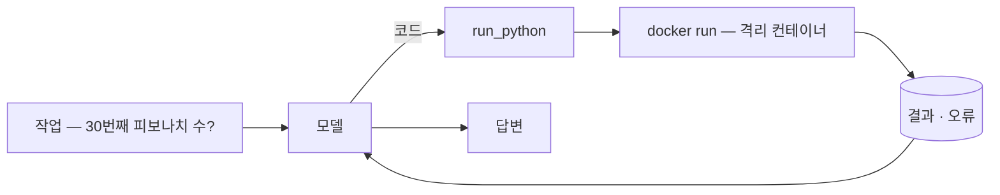
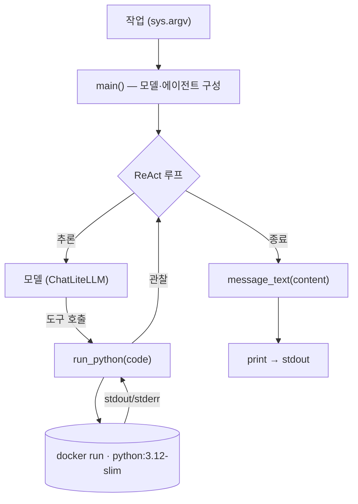

import SampleProject from '../../../components/SampleProject.astro';

[샌드박싱](../../concept/sandboxing/) 개념에서, 모델이 짠 코드는 신뢰 경계 *바깥*이라 일회용·격리 환경에서 돌려야 한다고 했습니다.  
이 글에서는 그 *코드 실행* 역할을 실제로 돌아가는 에이전트로 만들어 봅니다. 
도구가 코드를 `exec` 하지 않고, 매번 새 Docker 컨테이너에 흘려보냅니다.

## 무엇을 만드나 \{#what-were-building}

계산이 필요한 작업을 받으면 모델이 파이썬을 짜고, `run_python` 도구가 그 코드를 격리된 Docker 컨테이너에서 돌려 결과를 돌려주면, 모델이 그걸 읽고 답하는 에이전트입니다.

코드는 호스트에서 절대 돌지 않습니다.
- `--network none`으로 네트워크를 끊고, 메모리·CPU·프로세스 수에 상한을 두고,
- `--rm`으로 끝나면 컨테이너를 버립니다.

## 코드 뜯어보기 \{#reading-the-code}

`app.py`의 흐름은 함수 셋으로 나뉩니다.
- `main()`이 모델과 에이전트를 짜고, 
- 모델이 부르는 도구가 `run_python()`, 
- 마지막 답을 다듬는 게 `message_text()`입니다.

- **`run_python(code)` — 도구**
  - `@tool`로 감싼 함수 하나
    - 모델은 docstring을 보고 *언제* 코드로 풀지 판단
  - 코드를 프로세스 안에서 실행하지 않고, `subprocess`로 `docker run`에 흘려보냄
    - `python -`로 표준입력의 프로그램을 받음
  - 격리는 플래그가 함
    - `--network none`(네트워크 차단), 
    - `--memory`·`--cpus`·`--pids-limit`(자원 상한), 
    - `--user 65534`(비-root), 
    - `--rm`(일회용)
  - `timeout=30`으로 폭주 코드를 끊고, 출력은 앞부분 4,000자로 자름

- **`message_text(content)` — 출력 다듬기**
  - 모델 응답의 `content`는 모양이 제각각
    - 클라우드는 문자열, 일부 로컬 모델은 블록 리스트
  - 리스트면 `type == "text"` 블록만 이어붙이고, 문자열이면 그대로 둠

- **`main()` — 배선**
  - `MODEL`로 `ChatLiteLLM`을 만들고 `create_agent(model, tools=[run_python])`로 ReAct 루프 구성
  - `agent.invoke({"messages": […]})`가 추론→도구 호출→관찰을 돌림
  - 끝나면 마지막 메시지를 `message_text()`로 다듬어 출력

## 구현 \{#the-implementation}

LangGraph의 ReAct 루프에 `run_python` 도구 하나만 붙였습니다.  
도구의 본체는 사실상 `docker run` 한 줄이고, 안전성은 거기 붙은 플래그에서 나옵니다.

<SampleProject folder="docker_1" />

## 핵심만 짚으면 \{#the-key-parts}

- **도구가 곧 격리 경계다**
  - `run_python`은 코드를 `exec`하지 않고 새 컨테이너에 흘려보내, 
  - 사고가 나도 호스트가 아니라 일회용 박스에서 끝납니다.
- **격리는 플래그에 있다**
  - 네트워크 차단·자원 상한·비-root·일회용이 모여 폭발 반경을 줄입니다.
- **자체 호스팅이면 Docker, 관리형이면 E2B·Modal**
  - 같은 역할을 직접 운영하거나(Docker) API 한 줄로 위임합니다.
- **제공자는 갈아끼운다**
  - `.env`의 `MODEL`만 바꾸면 같은 코드로 다른 모델을 씁니다.

도구만 검색으로 바꾸면 [오늘의 환율 묻기](../web-search-fx-agent/), 스크래핑으로 바꾸면 [문서를 마크다운으로](../web-scraping-agent/)가 됩니다.  
격리를 왜·어떻게 하는지는 [샌드박싱](../../concept/sandboxing/) 개념에 정리해 두었습니다.
