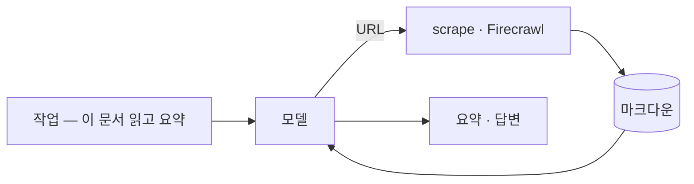
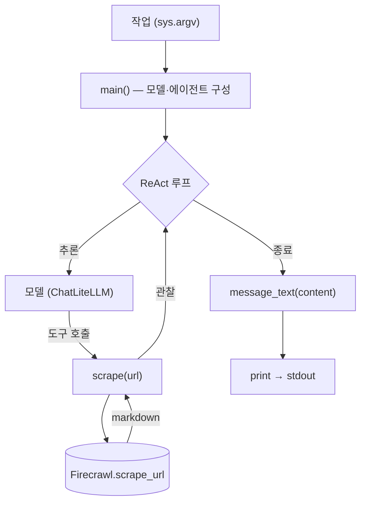

import SampleProject from '../../../components/SampleProject.astro';

[도구](../../concepts/agent-tools/) 개념의 *스크래핑·크롤링*에서 "문서 페이지를
마크다운으로"를 예로 들었습니다. 검색이 *어디를* 볼지 찾는 일이라면, 스크래핑은 그
페이지를 통째로 읽어 오는 일입니다. 이 글에서는 그 예시를 실제로 돌아가는 에이전트로
만들어 봅니다.

## 무엇을 만드나

URL이 담긴 작업을 받으면 모델이 Firecrawl로 그 페이지를 마크다운으로 가져오고,
내용을 읽어 요약·답변하는 에이전트입니다.

검색이 출처를 *가리키는* 데 그친다면, 스크래핑은 그 페이지의 본문 자체를 모델 앞에
펼쳐 놓습니다.

## 코드 뜯어보기

`app.py`의 전체 흐름은 함수 셋으로 나뉩니다 — `main()`이 모델과 에이전트를 짜고,
모델이 부르는 도구가 `scrape()`, 그리고 마지막 답을 다듬는 게 `message_text()`입니다.

**`scrape(url)` — 도구**

- `@tool`로 감싼 함수 하나 — 모델은 docstring을 보고 *언제* 페이지를 읽을지 판단
- `_firecrawl.scrape_url(url, formats=["markdown"])`로 Firecrawl 호출
- 반환이 객체든 딕셔너리든 `markdown`을 꺼내 사용 (SDK 버전 차이 흡수)
- 긴 페이지가 프롬프트를 넘치지 않게 앞부분 6,000자로 자름

**`message_text(content)` — 출력 다듬기**

- 모델 응답의 `content`는 모양이 제각각 — 클라우드는 문자열, 일부 로컬 모델은 `[{type: "text", …}, …]` 블록 리스트
- 리스트면 `type == "text"` 블록의 텍스트만 이어붙임
- 문자열이면 그대로 둠
- 그래서 어느 제공자든 깔끔한 한 줄로 출력

**`main()` — 배선**

- `MODEL`로 `ChatLiteLLM`을 만들고 `create_agent(model, tools=[scrape])`로 ReAct 루프 구성
- `ChatLiteLLM`은 *LiteLLM*을 LangChain 모델로 감싼 어댑터 — 라우팅(어느 API를 부를지)은 LiteLLM, 인터페이스 연결은 `ChatLiteLLM`
- `agent.invoke({"messages": […]})`가 추론→도구 호출→관찰을 돌림
- 끝나면 마지막 메시지의 `content`를 `message_text()`로 다듬어 출력

## 구현

LangGraph의 ReAct 루프에 `scrape` 도구 하나만 붙였습니다. 모델은 LiteLLM을 통해
라우팅되므로 같은 코드가 Claude·OpenAI·Gemini에서 모두 동작합니다.

<SampleProject folder="firecrawl_1" />

## 핵심만 짚으면

- **도구는 함수다** — `@tool`로 감싼 `scrape(url)` 하나가 페이지를 읽는 전부입니다.
- **검색과 스크래핑은 다르다** — 검색은 *어디를* 볼지 찾고, 스크래핑은 *그 페이지를* 읽어 옵니다.
- **결과는 근거가 된다** — Firecrawl이 돌려준 마크다운이 추론에 들어가, 링크 너머의 실제 내용으로 답합니다.
- **제공자는 갈아끼운다** — `.env`의 `MODEL`만 바꾸면 같은 코드로 다른 모델을 씁니다.

같은 루프에서 도구만 검색(Tavily)으로 바꾸면 [오늘의 환율 묻기](../web-search-fx-agent/)가
되고, 브라우저 자동화로 바꾸면 또 다른 "지금" 데이터를 끌어올 수 있습니다. 도구의
갈래는 [도구](../../concepts/agent-tools/) 개념에 정리해 두었습니다.
