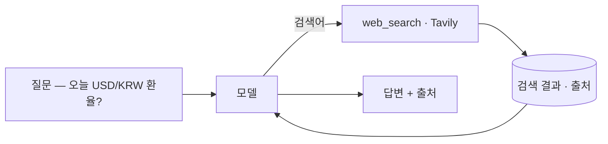
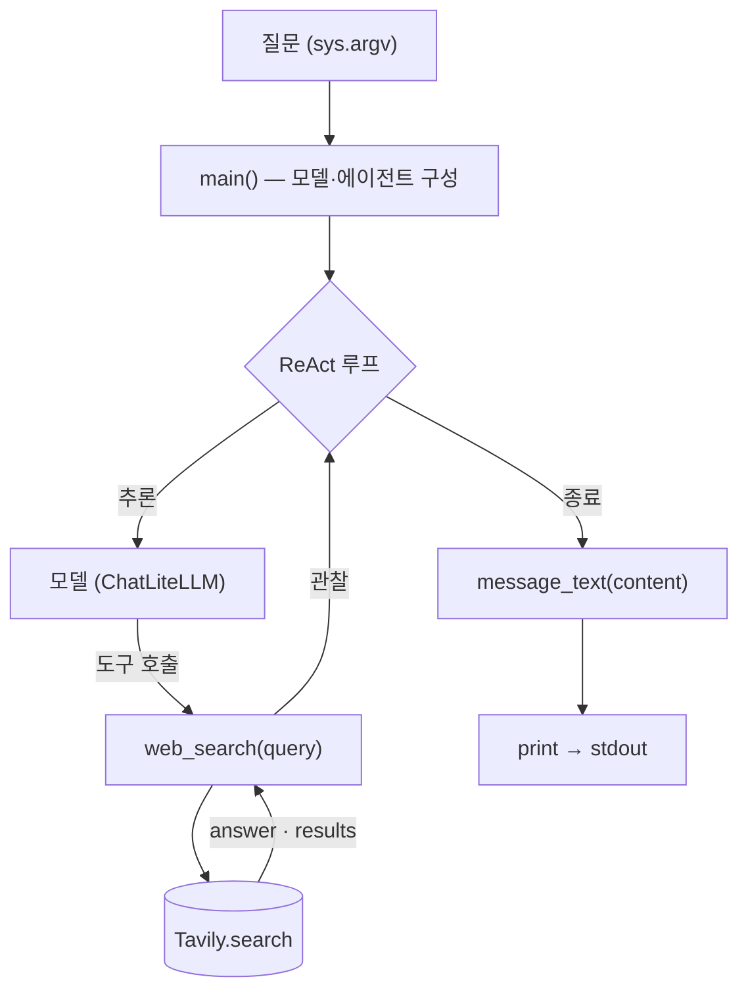

import SampleProject from '../../../components/SampleProject.astro';

[도구](../../concepts/agent-tools/) 개념에서 "오늘의 환율 묻기"를 예로 들었습니다.
모델의 지식은 학습 시점에 멈춰 있어 환율처럼 매일 바뀌는 값은 알 수 없고, 그 빈틈을
메우는 게 *웹 검색 도구*입니다. 이 글에서는 그 예시를 실제로 돌아가는 에이전트로
만들어 봅니다.

## 무엇을 만드나

질문을 받으면 모델이 스스로 "이건 검색해야겠다"고 판단해 Tavily로 웹을 검색하고,
최신 결과를 읽어 환율과 출처를 함께 답하는 에이전트입니다.

도구가 없으면 모델은 낡은 값을 추측할 뿐이지만, 도구 하나로 답이 오늘의 웹에
근거하게 됩니다.

## 코드 뜯어보기

`app.py`의 전체 흐름은 함수 셋으로 나뉩니다 — `main()`이 모델과 에이전트를 짜고,
모델이 부르는 도구가 `web_search()`, 그리고 마지막 답을 다듬는 게
`message_text()`입니다.

**`web_search(query)` — 도구**

- `@tool` 데코레이터 하나로 평범한 파이썬 함수가 모델이 부를 수 있는 도구가 됨
- docstring이 그대로 모델용 설명서 — 모델은 이걸 보고 *언제* 부를지 판단
- 내부에서 `_tavily.search(query, include_answer=True, max_results=5)`로 Tavily 호출
- 돌려받은 `answer`와 `results`를 한 덩이의 텍스트로 합쳐 반환 — 다음 추론의 입력

**`message_text(content)` — 출력 다듬기**

- 모델 응답의 `content`는 모양이 제각각 — 클라우드는 문자열, 일부 로컬 모델은 `[{type: "text", …}, …]` 블록 리스트
- 리스트면 `type == "text"` 블록의 텍스트만 이어붙임
- 문자열이면 그대로 둠
- 그래서 어느 제공자든 깔끔한 한 줄로 출력

**`main()` — 배선**

- `MODEL`로 `ChatLiteLLM`을 만들고 `create_agent(model, tools=[web_search])`로 ReAct 루프 구성
- `ChatLiteLLM`은 *LiteLLM*을 LangChain 모델로 감싼 어댑터 — 라우팅(어느 API를 부를지)은 LiteLLM, `create_agent`용 인터페이스 연결은 `ChatLiteLLM`
- `agent.invoke({"messages": […]})`가 추론→도구 호출→관찰을 돌림
- 끝나면 마지막 메시지의 `content`를 `message_text()`로 다듬어 출력
- 도구를 부를지·한 번 더 부를지는 전부 루프가 결정

## 구현

LangGraph의 ReAct 루프에 `web_search` 도구 하나만 붙였습니다. 모델은 LiteLLM을
통해 라우팅되므로 같은 코드가 Claude·OpenAI·Gemini에서 모두 동작합니다.

<SampleProject folder="tavily_1" />

## 핵심만 짚으면

- **도구는 함수다** — `@tool`로 감싼 `web_search(query)` 하나가 전부입니다. docstring이
  곧 모델용 설명서라, 모델은 이걸 보고 "언제 검색할지"를 판단합니다.
- **루프가 호출을 엮는다** — `create_agent(model, tools=[web_search])`가 추론→도구
  호출→관찰을 돌리며, 도구를 부를지·결과를 받고 한 번 더 부를지를 정합니다.
- **결과는 근거가 된다** — Tavily가 돌려준 답과 출처가 추론에 들어가, 환각 대신 조회한
  값으로 답합니다.
- **제공자는 갈아끼운다** — `.env`의 `MODEL`만 바꾸면 같은 코드로 다른 모델을 씁니다.

검색 도구를 스크래핑(Firecrawl)이나 브라우저 자동화(Browser Use)로 바꾸면 같은
루프로 다른 종류의 "지금" 데이터를 끌어올 수 있습니다. 도구의 갈래는
[도구](../../concepts/agent-tools/) 개념에 정리해 두었습니다.
