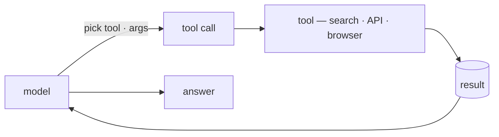
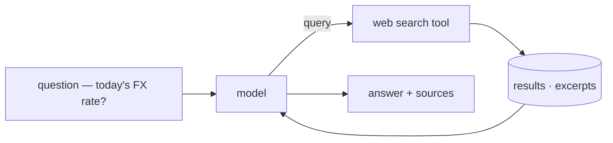
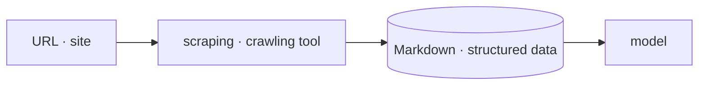
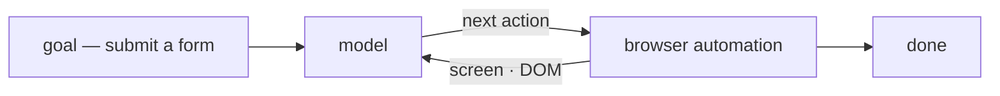
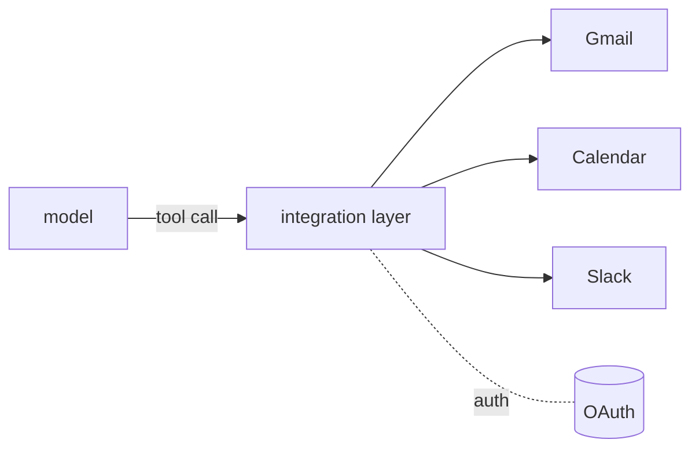
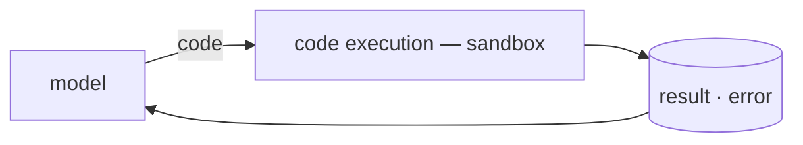

import Tools from 'stack-site-builder/components/ConceptTools.astro';
import ArticleLink from 'stack-site-builder/components/ArticleLink.astro';

## What it is \{#what-it-is}

A tool is a function that connects a model to the outside world. 
On its own a model only generates text; searching, reading a page, or booking a slot all happen only through a tool.

The flow is simple. 
The model is handed a list of available tools and each one's input schema, picks a tool when it needs one and fills in the arguments, calls it, and feeds the result back into its reasoning to decide what's next. 
That "pick a tool and fill the arguments" is what's commonly called **function calling**.

## Why it matters \{#why-it-matters}

A model's knowledge stops at its training cutoff, and a model can't *do* anything on its own. 
Tools bridge both gaps. They pull in current data and carry out real actions.

| Without tools | What a tool bridges |
| --- | --- |
| **Stale knowledge** — nothing past the training cutoff | [Web search](#web-search) to look up current facts and prices |
| **Unreadable pages** — no idea what's behind a link | [Scraping & crawling](#scraping-crawling) to pull the page content |
| **Unclickable UIs** — can't touch a screen with no API | [Browser automation](#browser-automation) to operate it like a person |
| **Out-of-reach apps** — no access to mail, calendar, SaaS | [App & API integration](#app-api-integration) to delegate auth and calls |
| **Unrunnable code** — no exact computation or verification | [Code execution](#code-execution) to run it in a sandbox |

Each row is solved by a line *out* to the world, not by a smarter model.
Which tool fills each spot is covered below.

## The kinds — and the tools that fill them \{#the-kinds-and-the-tools-that-fill-them}

Tools divide by what they connect to. 
Below are the common kinds and the catalog tools that fill each spot.

### Web search \{#web-search}

Finds web results for a question and returns them as usable excerpts and citations, not just links. 
Current facts and prices the model doesn't know go straight into its reasoning.

#### Example. Asking today's FX rate \{#example-asking-todays-fx-rate}

Anything the model's training doesn't have comes in through a search.

- Facts and news after the training cutoff
- Frequently changing values like prices and rates
- Augmenting RAG with external sources

<ArticleLink slug="web-search-fx-agent" />

<Tools slugs={["tavily", "exa"]} />

### Scraping & crawling \{#scraping-crawling}

Pulls a whole page or site and converts it into a format the model can read directly (Markdown and the like). 
If search finds *where* to look, scraping *reads that page in*.

#### Example. A docs page as Markdown \{#example-a-docs-page-as-markdown}

Turns a found page's content into something the model can read.

- Extracting the body of a found page
- Collecting JS-rendered dynamic pages
- Crawling a whole site to document it

<ArticleLink slug="web-scraping-agent" />

<Tools slugs={["firecrawl"]} />

### Browser automation \{#browser-automation}

Operates a screen with no API by clicking, typing, and navigating like a person. 
It handles work search and scraping can't reach — pages behind a login, form submissions.

#### Example. Submitting a form behind a login \{#example-submitting-a-form-behind-a-login}

Looks at the screen, decides the next action, and drives an API-less web app.

- Acting in a web app with no API
- Flows that need login or a session
- Deciding the next action from the screen

<Tools slugs={["browser-use", "stagehand"]} />

### App & API integration \{#app-api-integration}

Exposes external apps — mail, calendar, SaaS — as tools through a layer that handles auth and calls for you. 
Instead of wiring up OAuth and APIs for hundreds of apps by hand, an integration layer offers them as a standardized set of tools.

#### Example. Adding a calendar event \{#example-adding-a-calendar-event}

Calls many apps as tools from behind one integration layer.

- Sending and reading mail
- Operating a calendar, CRM, or issue tracker
- Delegating OAuth authentication

<Tools slugs={["composio"]} />

### Code execution \{#code-execution}

Runs model-written code in an isolated environment for exact computation, data processing, and verification. 
This isolated run is the same tool as the code sandbox role in *harness engineering* — it contains side effects while also confirming the code actually works.

#### Example. Computing with code \{#example-computing-with-code}

Runs the model's code in a sandbox and takes back the result.

- Exact numeric computation and data transforms
- Verifying that model-written code runs
- Generating charts or files

<Tools slugs={["e2b"]} />

## How tool calling works \{#how-tool-calling-works}

To call a tool reliably, the model has to be told *what* it can call and *in what shape*.

- **Schema** — each tool's name, description, and input shape are handed to the model, which reads the spec to judge which tool fits.
- **Filling arguments** — the model picks a tool and generates the input arguments as JSON; a malformed shape is caught by validation and retried.
- **Using the result** — the call's result feeds back into reasoning to decide the next action — sometimes one call, sometimes several tools chained.

Passing tool specs over a standard protocol is taking hold too.
**MCP (Model Context Protocol)** is one example, standardizing how tools and data sources attach to a model.

## Principles to keep in mind \{#principles-to-keep-in-mind}

- **Start with few tools** — the more tools there are, the more room a model has to pick wrong, so expose only what's needed.
- **The schema is the manual** — a tool's name and description are the model's instructions; vague ones invite misuse.
- **Don't trust the result, verify it** — tool output is just as much a target for guardrails and evaluation.
- **Isolate side effects** — run write and exec tools in a *code sandbox* to keep an accident contained.
