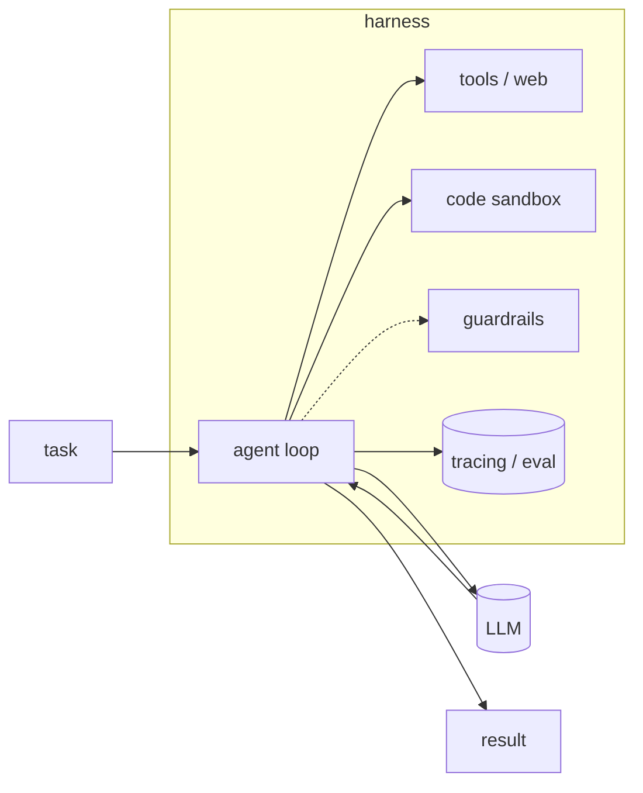
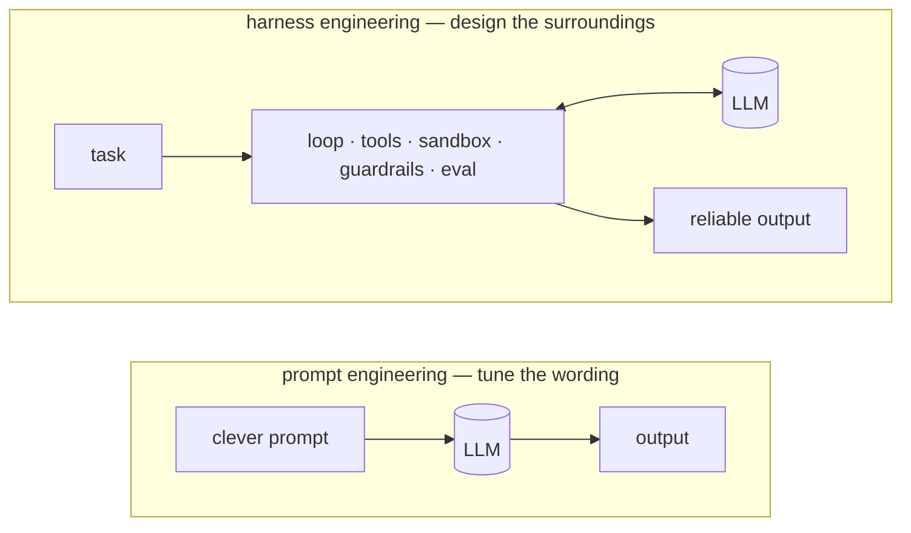

import Tools from '../../../components/ConceptTools.astro';

## What it is

A raw LLM call is capable but unreliable on its own. The same prompt passes yesterday and misses today, and a single bad output lands straight in front of a user.

**Harness engineering** is building the scaffolding *around* the model — the control loop, the tools it can reach, a code sandbox, checks on its I/O, and the measurement that proves it works. The model is one part; the harness is everything else that makes it dependable.

Over the past few years the center of gravity has shifted from *prompt* engineering to *harness* engineering. Finding a cleverer sentence matters less than designing the system around a model that can be wrong — that is what decides reliability.

## Why it matters

Most of the demo-to-production gap is harness, not model. A demo only has to succeed once; production has to behave safely across thousands of calls, every time. A bigger model rarely fixes the problems below — they are structural.

| Common failure | Fixed by |
| --- | --- |
| **Silent wrong answers** — plausible-but-false facts, invented citations and numbers | **Evaluation · tracing** — score for faithfulness and accuracy, then trace each step to find where it broke |
| **Runaway loops** — calling the same tool forever, retries that never exit | **A bounded agent loop** — caps on steps, time, and cost, stopping when there's no progress |
| **Unsafe / off-topic output** — leaked sensitive data, answers off the topic | **Guardrails** — an enforced output schema, blocking unsafe content at runtime before it reaches a user |
| **Risky side effects** — deleting files, making arbitrary network calls | **A code sandbox** — execution in an isolated, disposable environment, away from your machine and data |
| **"Worked yesterday"** — silent quality drops after a change, cost spikes | **Observability** — traces of every step, token, and cost that surface regressions before users |

Each row is solved by a layer *outside* the model, not by a smarter one. Growing the harness is how you grow reliability.

## The roles — and the tools that fill them

A harness isn't one tool but a set of roles. Each is swappable on its own, and you don't need them all up front — add a layer only where there's a risk to cover.

### Agent loop

Orchestrates the reason→act cycle, manages state, and decides when to call a tool versus stop. The loop *is* your control flow: make step counts, retries, and branches explicit, and a wandering model stops at a set limit instead of spinning forever.

<Tools slugs={["langgraph", "openai-agents-sdk", "crewai", "agno"]} />

### Model

The reasoning engine. Keep it swappable across cost, latency, and capability so you never hard-wire your code to a single provider.

**Direct APIs**

<Tools slugs={["anthropic-claude", "openai", "gemini"]} />

**Gateway** — fallbacks and cost routing across providers. When one model is down or slow, route to another, and keep every call behind one interface.

<Tools slugs={["litellm", "openrouter"]} />

### Tools & web access

What the agent can actually *do* — call apps, search, pull fresh data, and drive a browser. A model's knowledge stops at its training cutoff, so anything current and real has to arrive through tools.

<Tools slugs={["composio", "tavily", "firecrawl", "exa", "browser-use"]} />

### Code sandbox

Runs model-written code in isolation, so a bad command can't touch your machine or your data. Disposable runtimes spin up and tear down fast, which is what makes them the safety net behind a code-running agent.

<Tools slugs={["e2b"]} />

### Guardrails

Validate and constrain input/output at runtime, before a bad result reaches a user. Enforce an output schema and block unsafe or off-topic content — checked while the agent runs, not after the fact.

<Tools slugs={["guardrails-ai", "nemo-guardrails"]} />

### Evaluation

Score quality with metrics and test suites, so you know a change actually helped. Run faithfulness, relevance, and correctness checks in CI instead of eyeballing, and the pipeline catches regressions before a person does.

<Tools slugs={["deepeval", "ragas", "opik"]} />

### Observability

Trace every step, token, and cost in production to catch regressions early. If you can't see what was called, where it slowed down, and where the cost went, you can't fix it.

<Tools slugs={["langfuse", "langsmith", "arize-phoenix", "helicone"]} />

## How to approach it

Don't build it all at once. The trick is to add one layer at a time, in the order the risks show up.

1. Start with the **loop + model** — the simplest reason→act loop.
2. Add a **sandbox** once the agent runs code — isolate the side effects.
3. Add **guardrails** once output reaches users — validate before it lands.
4. Add **evaluation + tracing** the moment you iterate — you can't improve what you can't measure.

Each step answers a risk the previous one created. Don't stack layers before you need them; add one where a problem actually shows.

## Principles to keep in mind

- **Start small, grow by measuring** — without evaluation and tracing you can't even tell what to add next.
- **When in doubt, block** — guardrails and sandboxes should default to stopping, not passing, on the ambiguous case.
- **Keep the model swappable** — a gateway frees you from one provider and makes moving to a cheaper or faster model easy.
- **Bound the loop** — caps on steps, cost, and time are what stop a runaway agent.
