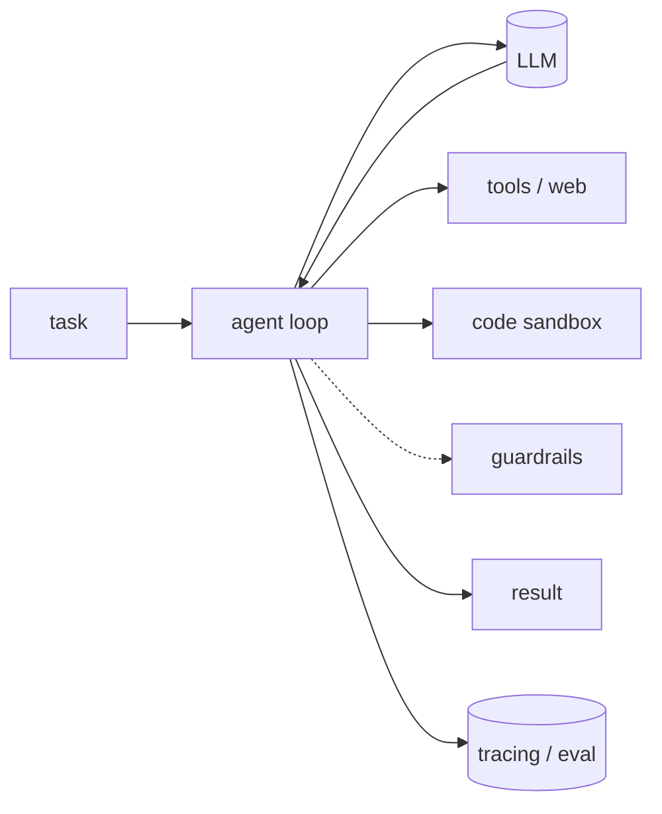

## What it is

A raw LLM call is capable but unreliable on its own. **Harness engineering** is
the work of building the scaffolding *around* the model: the control loop that
decides what to do next, the tools it can reach for, a sandbox to run code, the
checks on its input and output, and the tracing and evaluation that tell you
whether it's actually working. The model is one part — the harness is everything
that turns it into a dependable system.

## Why it matters

Most of the gap between a flashy demo and a production agent is harness, not
model. A better prompt or a bigger model rarely fixes silent failures, runaway
loops, unsafe output, or "it worked yesterday." Those are solved by the parts
around the model — bounding the loop, validating output, sandboxing side
effects, and measuring quality on every change.

## The pieces

- **Agent loop** — orchestrates the reason→act cycle, manages state, and decides
  when to call a tool versus stop. This is the backbone you build everything else
  onto.
- **Model** — the reasoning engine. Kept swappable so you can trade cost,
  latency, and capability without rewriting the harness.
- **Tools & web access** — what the agent can *do*: call APIs, search, and pull
  fresh data from the open web.
- **Code sandbox** — runs model-written code in isolation, so a bad command
  can't touch your machine.
- **Guardrails** — validate and constrain input and output at runtime, before a
  bad result reaches a user or another step.
- **Evaluation** — score quality with metrics and test suites so you can tell
  whether a change actually helped, instead of guessing.
- **Observability** — trace every step, token, and cost in production to catch
  regressions before your users do.

## How to approach it

Start with the loop and the model, then add the pieces your failures demand:
sandbox once the agent runs code, guardrails once output reaches users, and
evaluation plus tracing as soon as you iterate — you can't improve what you
can't measure. The tools below fill each role in the catalog.
