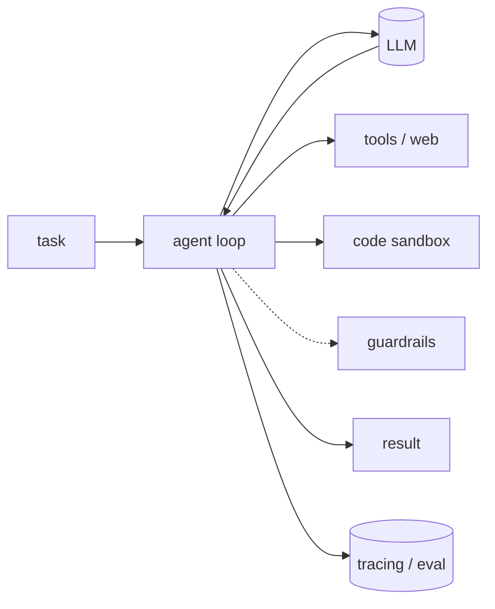

import Tools from '../../../components/ConceptTools.astro';

## What it is

- A raw LLM call is capable but unreliable on its own.
- **Harness engineering** is building the scaffolding *around* the model — the control loop, the tools it can reach, a sandbox, checks on its I/O, and the measurement that proves it works.
- The model is one part; the harness is everything that makes it dependable.

## Why it matters

Most of the demo-to-production gap is harness, not model — a bigger model rarely fixes these:

| Common failure | Fixed by |
| --- | --- |
| Silent wrong answers | Evaluation · tracing |
| Runaway loops | A bounded agent loop |
| Unsafe / off-topic output | Guardrails |
| Risky side effects | A code sandbox |
| "Worked yesterday" | Observability |

## The roles — and the tools that fill them

### Agent loop

Orchestrates the reason→act cycle, manages state, and decides when to call a tool versus stop.

<Tools slugs={["langgraph", "openai-agents-sdk", "crewai", "agno"]} />

### Model

The reasoning engine — keep it swappable across cost, latency, and capability.

**Direct APIs**

<Tools slugs={["anthropic-claude", "openai", "gemini"]} />

**Gateway** — fallbacks and cost routing across providers.

<Tools slugs={["litellm", "openrouter"]} />

### Tools & web access

What the agent can actually *do* — call apps, search, and pull fresh data.

<Tools slugs={["composio", "tavily", "firecrawl", "exa", "browser-use"]} />

### Code sandbox

Runs model-written code in isolation, so a bad command can't touch your machine.

<Tools slugs={["e2b"]} />

### Guardrails

Validate and constrain input/output at runtime, before a bad result reaches a user.

<Tools slugs={["guardrails-ai", "nemo-guardrails"]} />

### Evaluation

Score quality with metrics and test suites, so you know a change actually helped.

<Tools slugs={["deepeval", "ragas", "opik"]} />

### Observability

Trace every step, token, and cost in production to catch regressions early.

<Tools slugs={["langfuse", "langsmith", "arize-phoenix", "helicone"]} />

## How to approach it

- Start with the **loop + model**.
- Add a **sandbox** once the agent runs code.
- Add **guardrails** once output reaches users.
- Add **evaluation + tracing** the moment you iterate — you can't improve what you can't measure.
