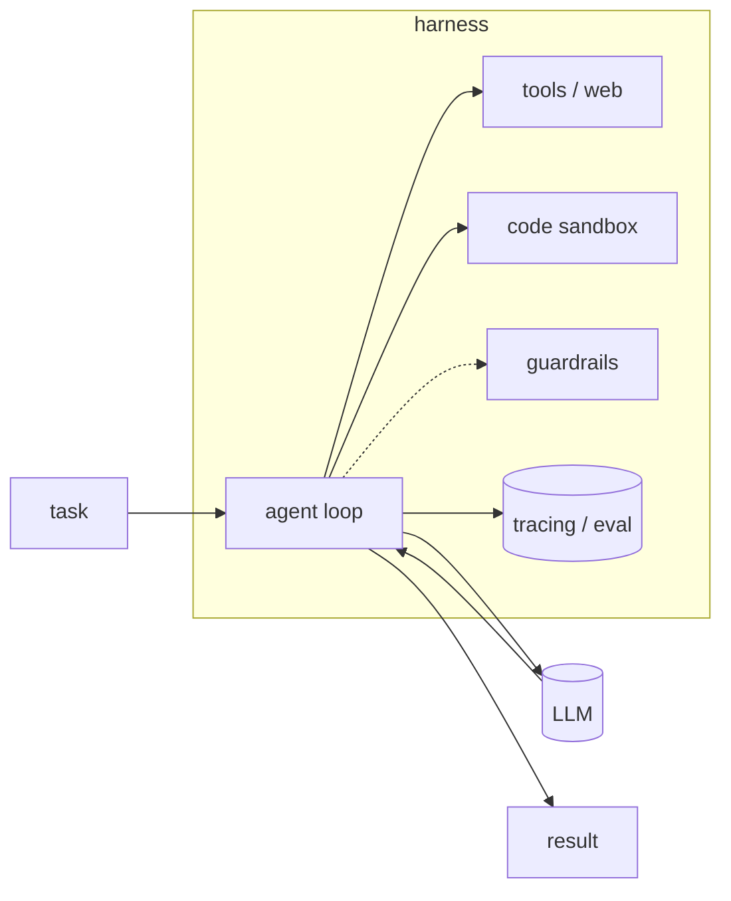
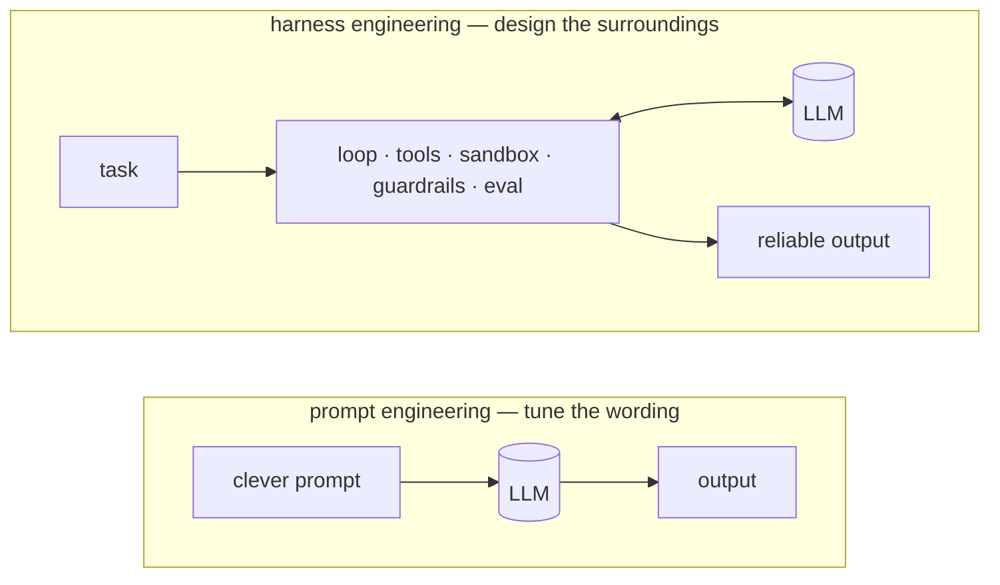
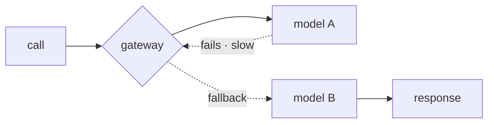
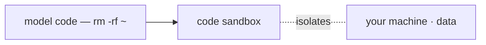
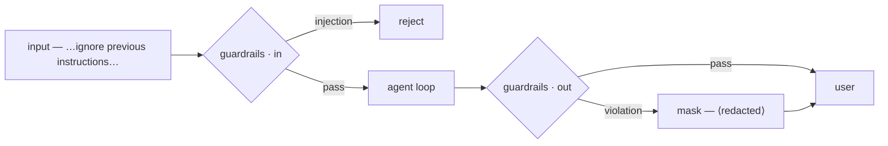
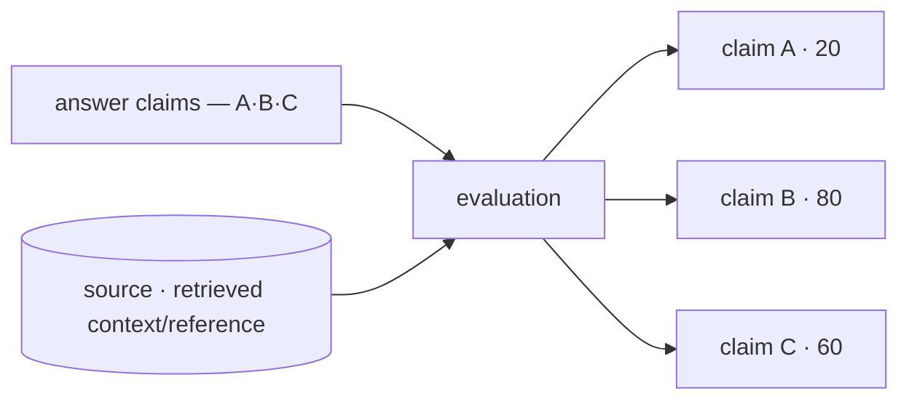
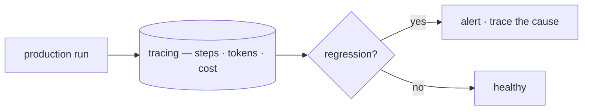
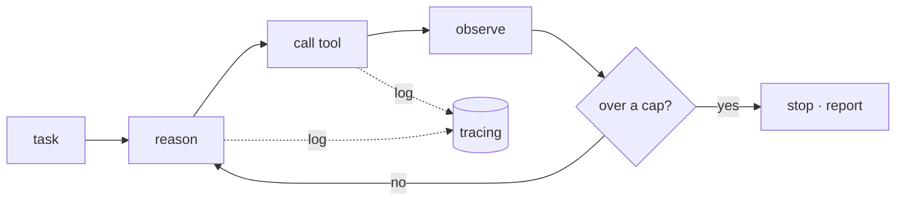
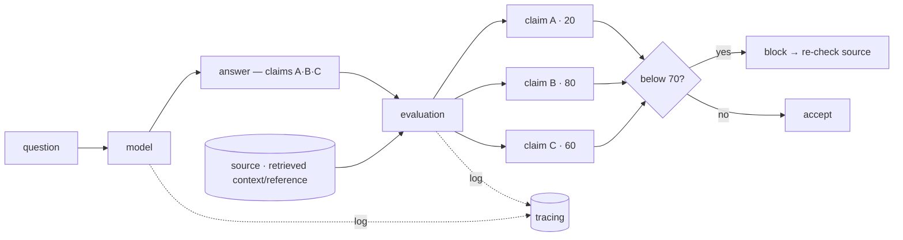
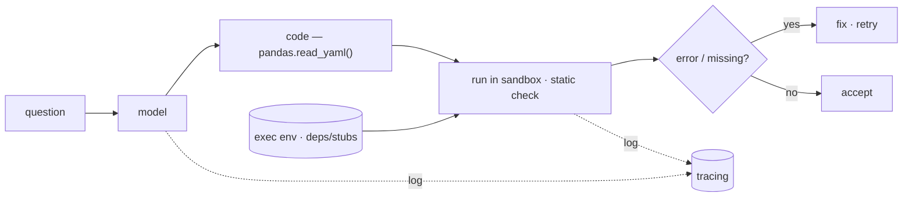

import Tools from '../../../components/ConceptTools.astro';
import ConceptLink from '../../../components/ConceptLink.astro';

## What it is \{#what-it-is}

A raw LLM call is capable but unreliable on its own. 
The same prompt passes yesterday and misses today, and a single bad output lands straight in front of a user.

**Harness engineering** is building the scaffolding *around* the model — the control loop, the tools it can reach, a code sandbox, checks on its I/O, and the measurement that proves it works. 
The model is one part; the harness is everything else that makes it dependable.

Over the past few years the center of gravity has shifted from *prompt* engineering to *harness* engineering. 
Finding a cleverer sentence matters less than designing the system around a model that can be wrong — that is what decides reliability.

## Why it matters \{#why-it-matters}

Most of the demo-to-production gap is harness, not model. 
A demo only has to succeed once; production has to behave safely across thousands of calls, every time. 
A bigger model rarely fixes the problems below — they are structural.

| Common failure | Fixed by |
| --- | --- |
| **Runaway loops** — circling or retrying without end | [A bounded agent loop](#agent-loop) |
| **Risky side effects** — deleted files, arbitrary network calls | [A code sandbox](#code-sandbox) |
| **Unsafe / off-topic output** — leaked data, off-topic detours | [Guardrails](#guardrails) |
| **Silent wrong answers** — confident, plausible falsehoods | [Evaluation · tracing](#evaluation) |
| **"Worked yesterday"** — quiet quality drops or cost spikes after a change | [Observability](#observability) |

Each row is solved by a layer *outside* the model, not by a smarter one — how each one works is covered in *the safety layers* below.

## Capabilities — reasoning and acting \{#capabilities-reasoning-and-acting}

A harness isn't one tool but a set of roles. 
The innermost is the substrate the agent reasons and acts with: *the model* does the reasoning, and *tools & web access* do the acting that touches the world. 
They decide what the agent *can* do — the layers that make it reliable come next.

### Model \{#model}

The reasoning engine. 
Keep it swappable across cost, latency, and capability so you never hard-wire your code to a single provider.

**Direct APIs**

<Tools slugs={["anthropic-claude", "openai", "gemini"]} />

**Gateway**

Fallbacks and cost routing across providers. 
When one model is down or slow, route to another, and keep every call behind one interface.

<Tools slugs={["litellm", "openrouter"]} />

#### Example. Gateway fallback \{#example-gateway-fallback}

When one provider goes down or slows, the gateway routes to another model automatically.

- A primary model times out or 5xxes → fall back to a backup
- Route by cost or latency
- Caller code stays the same; only the model swaps

### Tools & web access \{#tools-web-access}

What the agent can actually *do* — call apps, search, pull fresh data, and drive a browser. 
A model's knowledge stops at its training cutoff, so anything current and real has to arrive through tools.

<ConceptLink slug="agent-tools" />

## Safety layers — guarding against failure \{#safety-layers-guarding-against-failure}

Capability alone doesn't make it reliable. 
Each layer below guards against one of the failure modes in [[#why-it-matters]] above — you don't need them all up front, only where a risk shows.

### Code sandbox \{#code-sandbox}

Runs model-written code in isolation, so a bad command can't touch your machine or your data. 
Disposable runtimes spin up and tear down fast, which is what makes them the safety net behind a code-running agent.
It isolates **risky side effects** like deleted files or arbitrary network calls. 
The same isolated runtime is also a verification tool: *evaluation* runs the model's code here to catch errors like a call to a nonexistent API.

#### Example. Isolating side effects \{#example-isolating-side-effects}

Model-written code runs in a disposable, isolated environment, so a bad command can't reach the host. 
For example, even if the model emits `rm -rf ~`, it only runs inside the sandbox and then disappears.

- Accidentally deleting files or directories
- Arbitrary outbound network requests
- Corrupting system config or dependencies

<Tools slugs={["e2b"]} />

### Guardrails \{#guardrails}

Validate and constrain both input and output at runtime, before anything bad flows. 
On the way in, catch prompt injection and jailbreaks; on the way out, enforce an output schema and block unsafe or off-topic content. 
Checked while the agent runs, not after the fact — stopping **unsafe / off-topic output** before it reaches a user.

#### Example. Stopping it before it lands \{#example-stopping-it-before-it-lands}

Both input and output are checked at runtime, and a violation is blocked or rewritten. 
On the way in, an injection hidden in retrieved data — "ignore previous instructions…" — is dropped; on the way out, `my email is abc@test.com` becomes `my email is [redacted email]`.

- A prompt injection or jailbreak hidden in input or retrieved data — "ignore previous instructions…"
- Personal data or secret keys leaked verbatim
- Profanity, hate, or other unsafe language
- Drifting into a topic nobody asked about

<Tools slugs={["guardrails-ai", "nemo-guardrails"]} />

### Evaluation \{#evaluation}

Score quality with metrics and test suites, so you know a change actually helped. 
Run faithfulness, relevance, and correctness checks in CI instead of eyeballing, and the pipeline catches regressions before a person does.
It filters out the **silent wrong answers** a model hands you with confidence. 
It doesn't take a claim at face value but picks the check that fits, and each step is logged to *observability* (tracing).

#### Example. Scoring claims against a source \{#example-scoring-claims-against-a-source}

A factual claim is scored by **evaluation** against a **source** — the retrieved context or a reference. 
In RAG, the very context the model retrieved is what it grades against. 
A code claim like `pandas.read_yaml` is checked for real existence by a static check or by running it in the *code sandbox*. 
How those scores are then thresholded to block or retry is covered under [orchestration](#orchestration-the-spine-that-drives-the-cycle) below.

- **Unsourced numbers** — asserting "this job used 20 GPUs" with no basis
- **Subtly wrong facts** — "supported since Python 3.9" when it's really 3.11
- **Nonexistent APIs** — calling a function that doesn't exist, like `pandas.read_yaml()`

<Tools slugs={["deepeval", "ragas", "opik"]} />

### Observability \{#observability}

Trace every step, token, and cost in production to catch regressions early. 
If you can't see what was called, where it slowed down, and where the cost went, you can't fix it.
It catches the **"worked yesterday"** regressions that quietly appear after a change, before your users do.

#### Example. Catching regressions early \{#example-catching-regressions-early}

Tracing every step, token, and cost surfaces a regression after a change before your users hit it.

- A subtle accuracy drop after swapping models
- More tokens and cost after a prompt edit
- A flow broken by an external tool change

<Tools slugs={["langfuse", "langsmith", "arize-phoenix", "helicone"]} />

## Orchestration — the spine that drives the cycle \{#orchestration-the-spine-that-drives-the-cycle}

Now the pieces come together. 
The loop calls reason→act→observe in turn — the spine — deciding at each gate whether to stop, retry, or pass, and logging every step to *observability* (tracing). 
The model, tools, evaluation, and sandbox above fill each of its steps.

### Agent loop \{#agent-loop}

Orchestrates the reason→act cycle, manages state, and decides when to call a tool versus stop. 
The loop *is* your control flow: make step counts, retries, and branches explicit, and a wandering model stops at a set limit instead of spinning forever.
It guards against a **runaway loop** that circles or retries without end.

#### Example 1. Stopping at a step cap \{#example-1-stopping-at-a-step-cap}

The loop runs reason→call-tool→observe, then stops and reports once it passes a cap.

- An infinite loop repeating the same search
- Endless retries of a failing tool call
- Reasoning that circles without nearing an answer

#### Example 2. Gating on evaluation scores \{#example-2-gating-on-evaluation-scores}

The loop thresholds the scores *evaluation* assigns: below the bar it blocks and re-checks the source, above it accepts.

#### Example 3. Verifying code, then retrying \{#example-3-verifying-code-then-retrying}

Model-written code runs through the *code sandbox* or a static check; on an error it's fixed and retried, otherwise accepted. 
A nonexistent function like `pandas.read_yaml()` surfaces as an `AttributeError`.

<Tools slugs={["langgraph", "openai-agents-sdk", "crewai", "agno"]} />

## How to approach it \{#how-to-approach-it}

Don't build it all at once. 
The trick is to add one layer at a time, in the order the risks show up.

1. Start with the **loop + model** — the simplest reason→act loop.
2. Add a **sandbox** once the agent runs code — isolate the side effects.
3. Add **guardrails** once output reaches users — validate before it lands.
4. Add **evaluation + tracing** the moment you iterate — you can't improve what you can't measure.

Each step answers a risk the previous one created. 
Don't stack layers before you need them; add one where a problem actually shows.

## Principles to keep in mind \{#principles-to-keep-in-mind}

- **Start small, grow by measuring** — without evaluation and tracing you can't even tell what to add next.
- **When in doubt, block** — guardrails and sandboxes should default to stopping, not passing, on the ambiguous case.
- **Keep the model swappable** — a gateway frees you from one provider and makes moving to a cheaper or faster model easy.
- **Bound the loop** — caps on steps, cost, and time are what stop a runaway agent.
