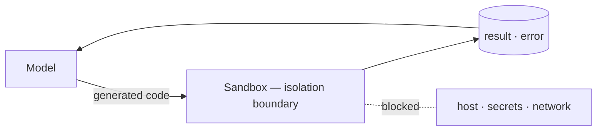
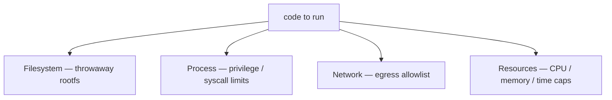

import ConceptLink from "../../../components/ConceptLink.astro";
import Tools from "../../../components/ConceptTools.astro";

## What it is \{#what-it-is}

A sandbox is an isolating wall that runs untrusted code in a throwaway environment cut off from everything around it. An agent runs things you *can't know in advance* — code the model just wrote, third-party tools, MCP servers. Sandboxing pens that in so it can't reach the host's files, secrets, or network, and only acts inside the box.

This zooms in on the *code sandbox* role from <ConceptLink slug="harness-engineering" />. Of all the scaffolding a harness wraps around a model, this is the one axis that confines *execution*.

## Why it matters \{#why-it-matters}

A model's output is *outside* the trust boundary. The more an agent runs code and calls tools on its own, "what breaks when it goes wrong" comes down not to how smart the model is but to how you designed isolation. The risks below don't disappear with a bigger model — they're structural.

| Without isolation                                       | What the sandbox stops                              |
| ------------------------------------------------------- | --------------------------------------------------- |
| **Destructive commands** — `rm -rf`, `DROP TABLE` just run | A throwaway environment never touches the host or real data |
| **Secret leaks** — reading env vars / keys and sending them out | No secrets injected, and no path out                |
| **Runaway resources** — infinite loops, memory blowups | Caps on CPU, memory, and wall-clock time            |
| **Arbitrary network** — exfiltration, internal probing (SSRF) | Network off by default; only allowed domains open   |
| **Injection that spreads** — prompt injection reaching tools / a shell | Least privilege shrinks the blast radius            |

Each row is solved by a layer that confines execution, not by a smarter model. If input-side defense is the guardrail's job, sandboxing is the last wall on the *execution* side.

## What to isolate \{#what-to-isolate}

Isolation isn't one switch but several layers. Seal one and leave the rest open, and things leak through the gap.

- **Filesystem** — a throwaway rootfs, no host directories mounted
- **Process / kernel** — drop privileges, restrict dangerous syscalls
- **Network** — off by default, only the domains you need on an allowlist (egress allowlist)
- **Resources** — caps on CPU, memory, and run time to cut off runaways
- **Secrets** — keys and tokens never live inside the sandbox

## How isolation is implemented \{#how-isolation-is-implemented}

The same goal, reached by approaches that trade isolation strength against operational overhead. Lighter toward the top, stronger confinement toward the bottom.

| Approach                          | Isolation | Startup | Where it fits                            |
| --------------------------------- | --------- | ------- | ---------------------------------------- |
| **Containers** (Docker, etc.)     | Medium    | Fast    | Most code execution, self-hosted         |
| **microVMs / sandbox kernels** (Firecracker, gVisor) | Strong | Fast | Low-trust code, multi-tenant execution |
| **Managed sandboxes** (E2B, Modal, Daytona) | Strong | Instant | Agents spinning a box up and throwing it away |

Containers share the host kernel, so isolation is medium — but they're light and run anywhere, enough for most code execution. To run many lower-trust workloads, *microVMs* (Firecracker) or *sandbox kernels* (gVisor) split off the kernel too and raise the bar. To shed the burden of running any of it yourself, *managed sandboxes* hide all of the above behind one API call — the agent spins up a fresh environment on demand and discards it when done.

<Tools slugs={["e2b", "modal", "daytona", "docker"]} />

## Where it shows up in agents \{#where-it-shows-up}

Sandboxing isn't only about code execution. Almost every point where an agent touches the outside world wants the same isolation.

- **Code execution tools** — run model-written code to compute and verify. The same tool as *code execution* in <ConceptLink slug="agent-tools" />: it blocks side effects while also confirming the code actually runs
- **Computer / browser use** — run screen-driving agents inside an isolated VM
- **Tool / MCP server isolation** — run third-party tools and MCP servers apart, so one tool's mishap doesn't spread
- **Agent runtime** — package the agent itself in a container and give each instance a boundary

## Principles to keep in mind \{#principles-to-keep-in-mind}

- **Least privilege** — default to nothing allowed, open only what's needed.
- **Keep secrets out of the sandbox** — don't inject keys; delegate any call that needs them to an outside proxy.
- **Allowlist egress** — block outbound network by default and the exfiltration path closes.
- **Ephemeral and time-bound** — spin up a fresh environment per run and don't let it linger.
- **Assume it leaks** — design as if the sandbox can be escaped, and shrink the blast radius itself.
