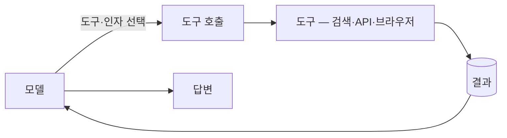
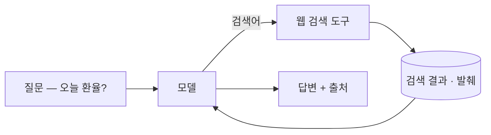
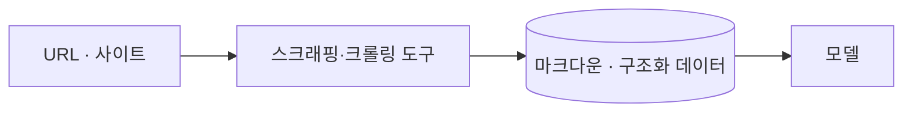
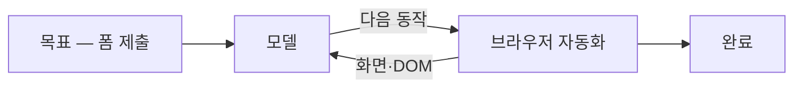
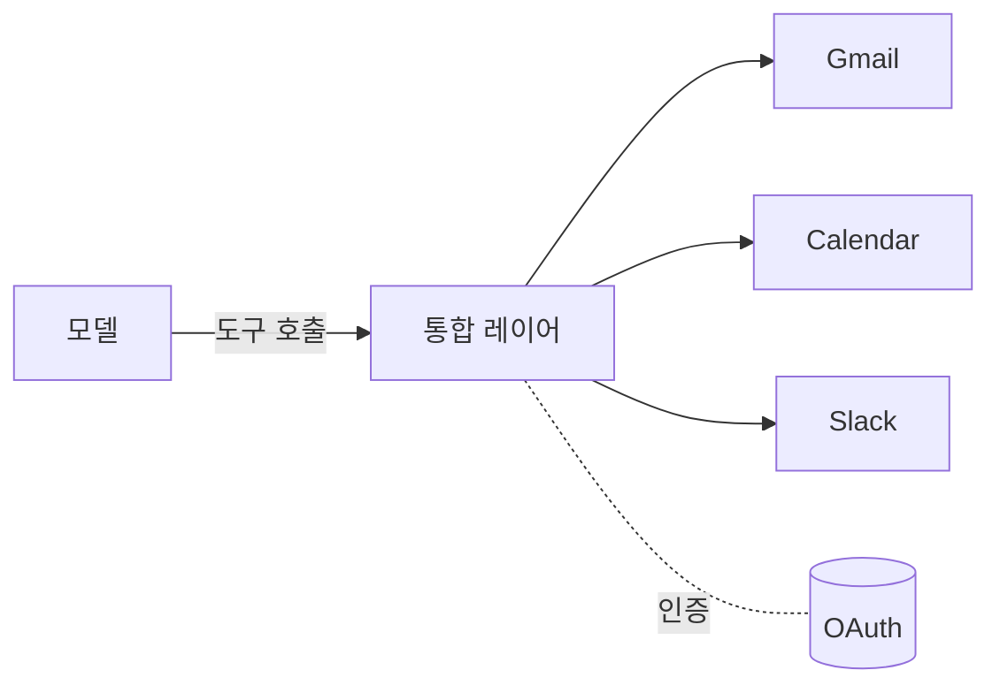
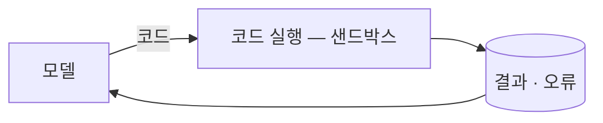

import Tools from "../../../components/ConceptTools.astro";

## 무엇인가

도구는 모델이 외부 세계와 상호작용하도록 연결하는 함수입니다. 모델 혼자서는 텍스트를 생성할 뿐이고, 검색하거나 페이지를 읽거나 일정을 잡는 일은 모두 도구를 통해서만 일어납니다.

흐름은 단순합니다. 모델은 쓸 수 있는 도구 목록과 각 도구의 입력 스키마를 받고, 필요할 때 도구 하나를 골라 인자를 채워 호출하고, 그 결과를 다시 추론에 넣어 다음 단계를 정합니다. 이 "도구를 고르고 인자를 채운다"가 흔히 말하는 **function calling**(도구 호출)입니다.

## 왜 중요한가

모델의 지식은 학습 시점에 멈춰 있고, 모델은 스스로 무언가를 *실행*하지도 못합니다. 도구는 그 둘을 메웁니다 — 지금의 데이터를 들여오고, 실제 행동을 대신 수행합니다.

| 도구가 없으면                                       | 도구로 메우는 것                                     |
| --------------------------------------------------- | ---------------------------------------------------- |
| **낡은 지식** — 학습 컷오프 이후를 모름             | [웹 검색](#웹-검색)으로 최신 사실·시세를 조회        |
| **읽지 못하는 페이지** — 링크 너머의 내용을 모름    | [스크래핑·크롤링](#스크래핑크롤링)으로 본문을 가져옴 |
| **클릭하지 못하는 UI** — API 없는 화면은 손 못 댐   | [브라우저 자동화](#브라우저-자동화)로 사람처럼 조작  |
| **닿지 못하는 앱** — 메일·캘린더·SaaS에 접근 불가   | [앱·API 통합](#앱api-통합)으로 인증·호출을 위임      |
| **돌려보지 못하는 코드** — 정확한 계산·검증을 못 함 | [코드 실행](#코드-실행)으로 샌드박스에서 실행        |

각 행은 더 똑똑한 모델이 아니라 바깥으로 연결되는 한 줄로 풀립니다 — 어떤 도구가 그 자리를 채우는지는 아래에서 다룹니다.

## 도구의 종류 — 그리고 그 자리를 채우는 도구

도구는 무엇과 연결되느냐로 갈립니다. 아래는 자주 쓰는 갈래와 각 자리를 채우는 카탈로그 도구입니다.

### 웹 검색

질문에 맞는 웹 결과를 찾아, 링크가 아니라 바로 쓸 수 있는 발췌·근거로 돌려줍니다. 모델이 모르는 최신 사실이나 시세를 추론에 곧장 넣을 수 있습니다.

#### 예시. 오늘의 환율 묻기

모델 지식에 없는 지금의 정보를 검색으로 들여옵니다.

- 학습 컷오프 이후의 사실·뉴스
- 시세·가격처럼 자주 바뀌는 값
- RAG의 외부 출처 보강

<Tools slugs={["tavily", "exa"]} />

### 스크래핑·크롤링

특정 페이지나 사이트를 통째로 가져와, 모델이 바로 읽을 수 있는 형식(마크다운 등)으로 변환합니다. 검색이 "어디를 볼지" 찾는 일이라면, 스크래핑은 "그 페이지를 읽어 오는" 일입니다.

#### 예시. 문서 페이지를 마크다운으로

검색으로 찾은 페이지의 본문을 모델이 읽을 형식으로 바꿉니다.

- 검색으로 찾은 페이지의 본문 추출
- JS로 렌더되는 동적 페이지 수집
- 사이트 전체를 돌며 문서화

<Tools slugs={["firecrawl"]} />

### 브라우저 자동화

API가 없는 화면을, 사람처럼 클릭·입력·이동하며 조작합니다. 로그인 뒤의 페이지나 폼 제출처럼 검색·스크래핑으로는 닿지 못하는 작업을 수행합니다.

#### 예시. 로그인 뒤 폼 제출

화면을 보고 다음 동작을 정하며, API 없는 웹앱을 직접 다룹니다.

- API 없는 웹앱에서 작업 수행
- 로그인·세션이 필요한 흐름
- 화면을 보고 다음 동작을 결정

<Tools slugs={["browser-use", "stagehand"]} />

### 앱·API 통합

메일·캘린더·SaaS 같은 외부 앱을, 인증과 호출을 대신 처리하는 한 겹을 통해 도구로 노출합니다. 수백 개 앱의 OAuth와 API를 매번 직접 붙이는 대신, 통합 레이어가 표준화된 도구 묶음으로 제공합니다.

#### 예시. 캘린더에 일정 추가

여러 앱을 하나의 통합 레이어 뒤에서 도구로 부릅니다.

- 메일 보내기·읽기
- 캘린더·CRM·이슈 트래커 조작
- OAuth 인증을 위임

<Tools slugs={["composio"]} />

### 코드 실행

모델이 짠 코드를 격리된 환경에서 돌려, 정확한 계산·데이터 처리·검증을 수행합니다. 이 격리 실행은 *하네스 엔지니어링*의 코드 샌드박스 역할과 같은 도구라, 부작용을 막으면서 코드가 실제로 동작하는지도 확인합니다.

#### 예시. 계산을 코드로

모델이 짠 코드를 샌드박스에서 돌려 결과를 받습니다.

- 정확한 수치 계산·데이터 변환
- 모델이 짠 코드의 동작 검증
- 차트·파일 생성

<Tools slugs={["e2b"]} />

## 도구 호출은 어떻게 동작하나

도구를 안정적으로 부르려면 모델에게 "무엇을, 어떤 모양으로" 부를 수 있는지 알려 줘야 합니다.

1. **스키마** — 각 도구의 이름·설명·입력 형식을 모델에 전달. 모델은 이 명세를 보고 어떤 도구가 맞는지 판단
2. **인자 채우기** — 모델이 도구를 고르고 입력 인자를 JSON으로 생성. 잘못된 형식은 검증으로 거르고 다시 시도
3. **결과 반영** — 호출 결과를 추론에 넣어 다음 동작을 결정. 한 번에 끝나기도, 여러 도구를 이어 부르기도

도구 명세를 표준 프로토콜로 주고받는 방식도 자리 잡고 있습니다 — **MCP(Model Context Protocol)**가 그 예로, 도구와 데이터 소스를 모델에 붙이는 방식을 규격화합니다.

## 기억할 원칙

- **적은 도구로 시작한다** — 도구가 많을수록 모델이 잘못 고를 여지도 커지니, 꼭 필요한 것만 노출합니다.
- **스키마가 곧 설명서다** — 이름과 설명이 모델의 사용 설명서라, 모호하면 오용이 늘어납니다.
- **결과를 믿지 말고 검증한다** — 도구 출력도 가드레일과 평가의 검사 대상입니다.
- **부작용은 격리한다** — 쓰기·실행 도구는 *코드 샌드박스*에서 돌려 사고를 막습니다.
