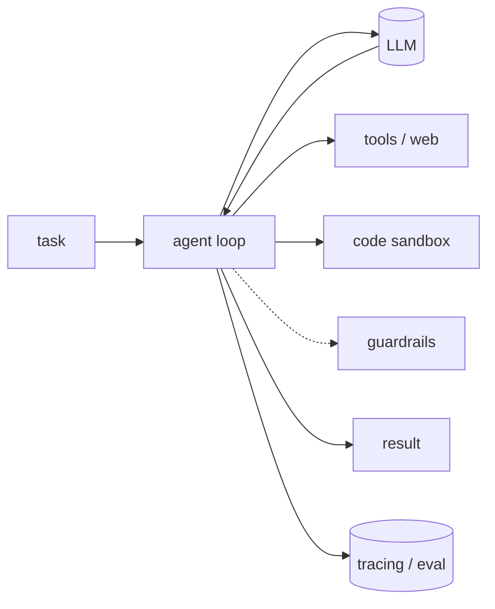

## 무엇인가

단일 LLM 호출은 똑똑하지만 그 자체로는 불안정합니다. **하네스 엔지니어링**은 모델
*주위에* 스캐폴딩을 짜는 일입니다 — 다음 행동을 정하는 제어 루프, 호출할 수 있는 도구,
코드를 돌리는 샌드박스, 입출력 검증, 그리고 실제로 동작하는지 알려주는 트레이싱과 평가.
모델은 한 부품일 뿐이고, 하네스는 그 모델을 믿을 수 있는 시스템으로 만드는 나머지 전부입니다.

## 왜 중요한가

화려한 데모와 프로덕션 에이전트 사이의 간극은 대부분 모델이 아니라 하네스에서 옵니다.
조용한 실패, 멈추지 않는 루프, 위험한 출력, "어제는 됐는데" 같은 문제는 더 좋은 프롬프트나
더 큰 모델로는 거의 해결되지 않습니다. 루프를 제한하고, 출력을 검증하고, 부작용을
샌드박스에 가두고, 변경마다 품질을 측정하는 — 모델을 둘러싼 부품들이 해결합니다.

## 구성 요소

- **에이전트 루프** — 추론→행동 사이클을 조율하고 상태를 관리하며, 언제 도구를 부르고
  언제 멈출지 정합니다. 나머지를 얹는 중심축입니다.
- **모델** — 추론 엔진. 교체 가능하게 두어 하네스를 다시 짜지 않고 비용·지연·성능을
  바꿉니다.
- **도구·웹 접근** — 에이전트가 *할 수 있는* 일. API 호출, 검색, 열린 웹에서 최신 데이터
  가져오기.
- **코드 샌드박스** — 모델이 짠 코드를 격리해 실행하므로, 잘못된 명령이 내 머신을 건드릴
  수 없습니다.
- **가드레일** — 잘못된 결과가 사용자나 다음 단계에 닿기 전에, 런타임에 입출력을 검증·제약합니다.
- **평가** — 지표와 테스트로 품질을 채점해, 변경이 실제로 도움이 됐는지 추측 없이 판단합니다.
- **관측** — 프로덕션에서 모든 단계·토큰·비용을 트레이싱해, 사용자보다 먼저 회귀를 잡습니다.

## 어떻게 접근하나

루프와 모델로 시작해, 실패가 요구하는 부품을 더해 갑니다 — 에이전트가 코드를 돌리기
시작하면 샌드박스를, 출력이 사용자에게 닿으면 가드레일을, 반복을 시작하면 곧바로 평가와
트레이싱을 더하세요. 측정할 수 없는 것은 개선할 수 없으니까요. 아래 도구들이 카탈로그에서
각 역할을 채웁니다.
