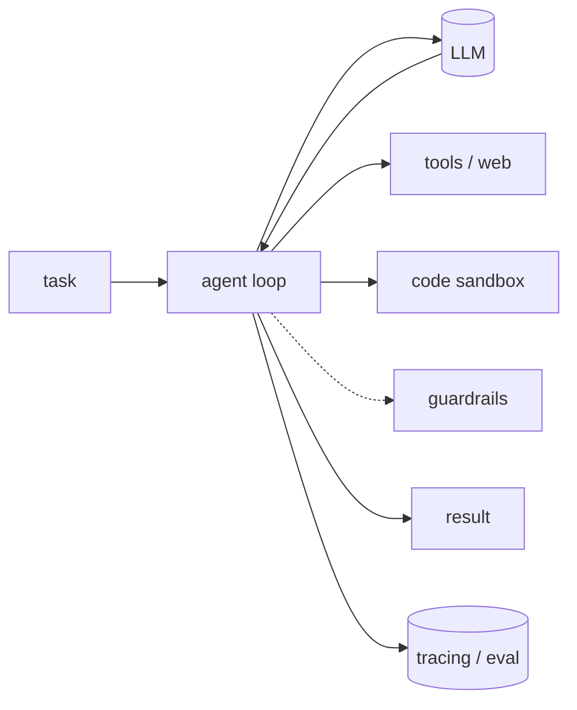

import Tools from '../../../components/ConceptTools.astro';

## 무엇인가

- 단일 LLM 호출은 똑똑하지만 그 자체로는 불안정합니다.
- **하네스 엔지니어링**은 모델 *주위에* 스캐폴딩을 짜는 일입니다 — 제어 루프, 호출할 도구, 샌드박스, 입출력 검증, 그리고 동작을 증명하는 측정.
- 모델은 한 부품일 뿐이고, 하네스는 그 모델을 믿을 수 있게 만드는 나머지 전부입니다.

## 왜 중요한가

데모와 프로덕션 사이 간극은 대부분 모델이 아니라 하네스입니다 — 더 큰 모델로는 이런 게 잘 안 풀립니다:

| 흔한 실패 | 하네스로 해결 |
| --- | --- |
| 조용한 오답 | 평가·트레이싱 |
| 멈추지 않는 루프 | 제한된 에이전트 루프 |
| 위험·주제 이탈 출력 | 가드레일 |
| 위험한 부작용 | 코드 샌드박스 |
| "어제는 됐는데" | 관측 |

## 역할 — 그리고 그 역할을 채우는 도구

### 에이전트 루프

추론→행동 사이클을 조율하고 상태를 관리하며, 도구를 부를지 멈출지 정합니다.

<Tools slugs={["langgraph", "openai-agents-sdk", "crewai", "agno"]} />

### 모델

추론 엔진 — 비용·지연·성능에 따라 교체 가능하게 둡니다.

**직접 호출**

<Tools slugs={["anthropic-claude", "openai", "gemini"]} />

**게이트웨이** — 여러 제공자에 걸친 폴백·비용 라우팅.

<Tools slugs={["litellm", "openrouter"]} />

### 도구·웹 접근

에이전트가 *실제로* 할 수 있는 일 — 앱 호출, 검색, 최신 데이터 수집.

<Tools slugs={["composio", "tavily", "firecrawl", "exa", "browser-use"]} />

### 코드 샌드박스

모델이 짠 코드를 격리해 실행하므로, 잘못된 명령이 머신을 건드릴 수 없습니다.

<Tools slugs={["e2b"]} />

### 가드레일

잘못된 결과가 사용자에게 닿기 전에, 런타임에 입출력을 검증·제약합니다.

<Tools slugs={["guardrails-ai", "nemo-guardrails"]} />

### 평가

지표와 테스트로 품질을 채점해, 변경이 실제로 도움이 됐는지 압니다.

<Tools slugs={["deepeval", "ragas", "opik"]} />

### 관측

프로덕션에서 모든 단계·토큰·비용을 트레이싱해 회귀를 일찍 잡습니다.

<Tools slugs={["langfuse", "langsmith", "arize-phoenix", "helicone"]} />

## 어떻게 접근하나

- **루프 + 모델**로 시작.
- 에이전트가 코드를 돌리면 **샌드박스**.
- 출력이 사용자에게 닿으면 **가드레일**.
- 반복을 시작하면 **평가 + 트레이싱** — 측정할 수 없는 건 개선할 수 없으니까요.
