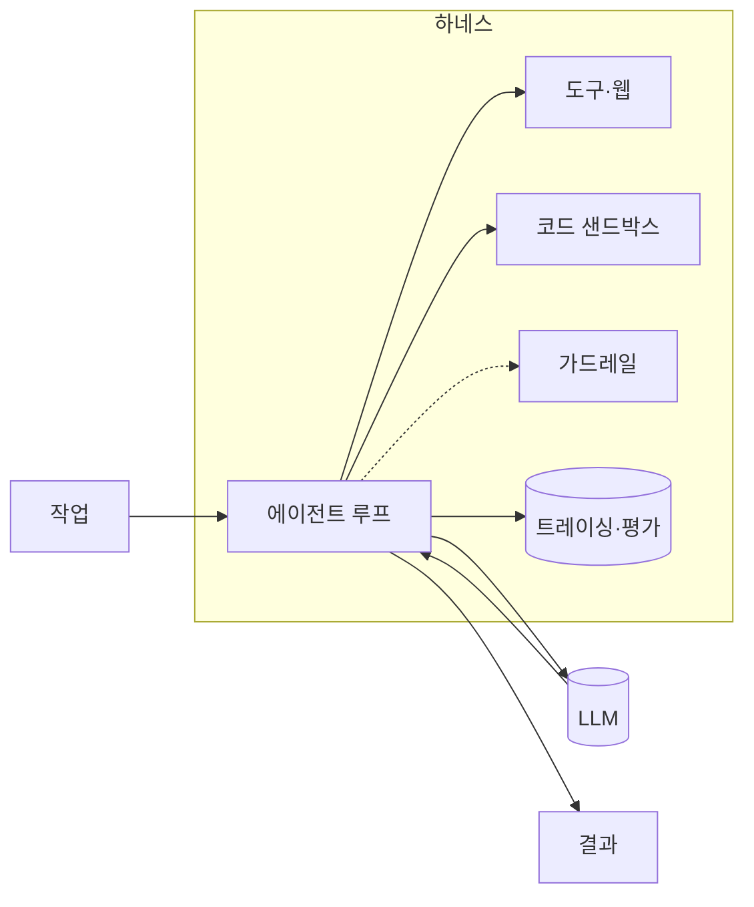
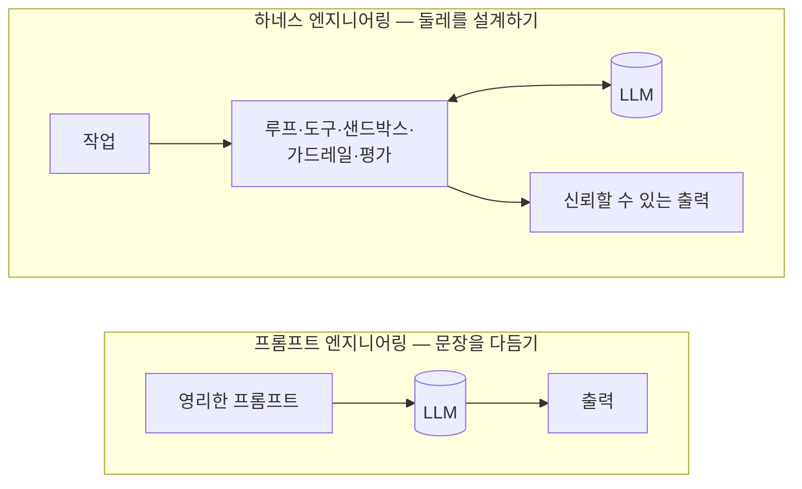
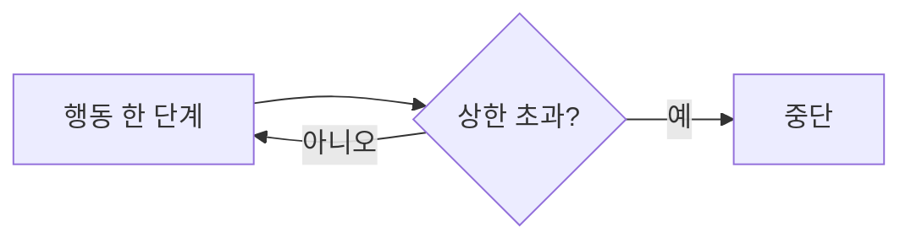
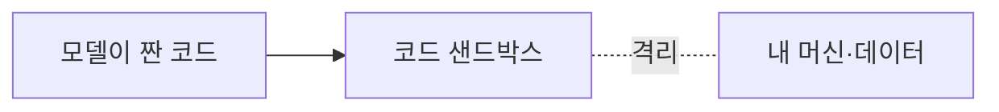
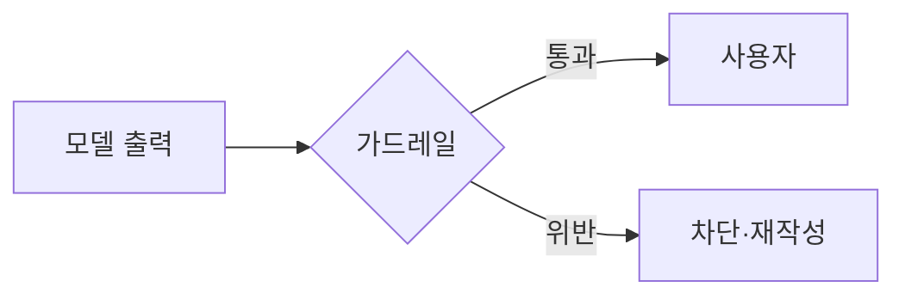
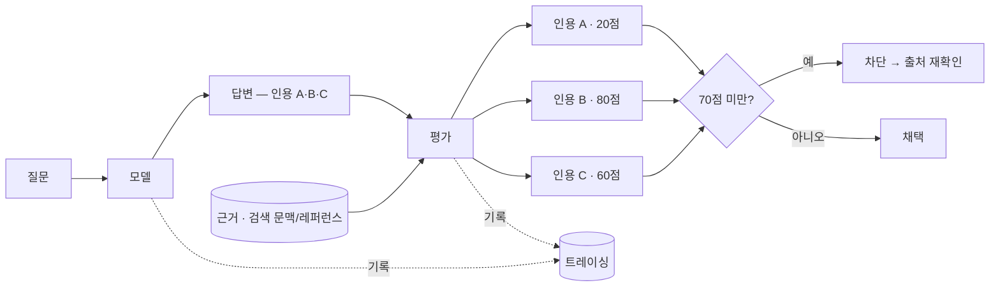
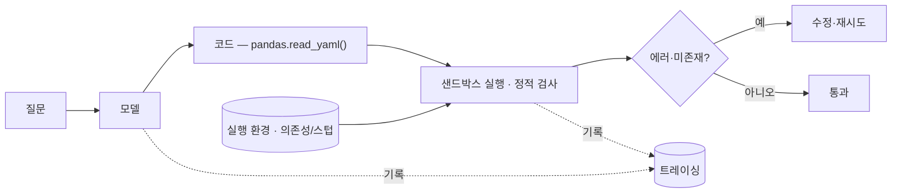

import Tools from "../../../components/ConceptTools.astro";

## 무엇인가

단일 LLM 호출은 똑똑하지만 그 자체로는 불안정합니다. 같은 프롬프트가 어제는 통과하고 오늘은 빗나가며, 한 번의 잘못된 출력이 곧장 사용자에게 닿습니다.

**하네스 엔지니어링**은 모델 _주위에_ 스캐폴딩(제어 루프, 호출할 도구, 코드 샌드박스, 입출력 검증, 그리고 동작을 증명하는 측정)을 짜는 일입니다. 모델은 한 부품일 뿐이고, 하네스는 그 모델을 믿을 수 있게 만드는 나머지 전부입니다.

지난 몇 년 사이 무게중심은 _프롬프트_ 엔지니어링에서 _하네스_ 엔지니어링으로 옮겨 갔습니다. 더 영리한 문장을 찾는 일보다, 모델이 틀릴 수 있다는 전제 위에서 그 둘레를 설계하는 일이 신뢰성을 좌우합니다.

## 왜 중요한가

데모와 프로덕션 사이의 간극은 대부분 모델이 아니라 하네스입니다. 데모는 한 번만 성공하면 되지만, 프로덕션은 수천 번의 호출에서 매번 안전하게 동작해야 합니다. 아래 문제들은 더 큰 모델로 잘 풀리지 않습니다 — 구조의 문제이기 때문입니다.

| 흔한 실패 | 하네스로 해결 |
| --- | --- |
| **조용한 오답** — 그럴듯한 거짓을 자신 있게 단언 | [평가·트레이싱](#평가) |
| **멈추지 않는 루프** — 같은 자리를 맴돌거나 끝없는 재시도 | [제한된 에이전트 루프](#에이전트-루프) |
| **위험·주제 이탈 출력** — 민감정보 노출·부적절·주제 이탈 | [가드레일](#가드레일) |
| **위험한 부작용** — 파일 삭제·임의 네트워크 요청 | [코드 샌드박스](#코드-샌드박스) |
| **"어제는 됐는데"** — 변경 뒤 조용한 품질 저하·비용 급증 | [관측](#관측) |

각 행은 더 똑똑한 모델이 아니라 모델 바깥의 한 겹으로 해결됩니다 — 각 해결책이 어떻게 동작하는지는 아래 _역할_에서 다룹니다.

## 역할 — 그리고 그 역할을 채우는 도구

하네스는 하나의 도구가 아니라 역할들의 묶음입니다. 각 역할은 따로 교체할 수 있고, 처음부터 전부 필요하지도 않습니다 — 위험이 있는 곳에만 한 겹씩 더합니다.

### 에이전트 루프

추론→행동 사이클을 조율하고 상태를 관리하며, 도구를 부를지 멈출지 정합니다. 루프가 곧 제어 흐름이라, 단계 수·재시도·분기를 명시적으로 두면 모델이 헤맬 때 무한히 도는 대신 정해진 한도에서 멈춥니다 — 같은 자리를 맴돌거나 끝없이 재시도하는 **멈추지 않는 루프**를 막는 장치입니다.

구체적인 예시 — 멈추지 않는 루프

- 같은 검색을 반복하는 무한 루프
- 실패한 도구 호출을 끝없이 재시도
- 답에 다가가지 못하고 맴도는 추론

<Tools slugs={["langgraph", "openai-agents-sdk", "crewai", "agno"]} />

### 모델

추론 엔진입니다. 비용·지연·성능의 균형에 따라 갈아끼울 수 있게 두는 것이 핵심이라, 처음부터 한 제공자에 코드를 묶지 않습니다.

**직접 호출**

<Tools slugs={["anthropic-claude", "openai", "gemini"]} />

**게이트웨이** — 여러 제공자에 걸친 폴백·비용 라우팅. 한 모델이 죽거나 느려질 때 다른 모델로 넘기고, 모든 호출을 하나의 인터페이스 뒤에 모읍니다.

<Tools slugs={["litellm", "openrouter"]} />

### 도구·웹 접근

에이전트가 _실제로_ 할 수 있는 일을 정합니다 — 앱 호출, 검색, 최신 데이터 수집, 브라우저 조작. 모델의 지식은 학습 시점에 멈춰 있으니, 지금의 실제 데이터는 도구를 통해 들어옵니다.

<Tools slugs={["composio", "tavily", "firecrawl", "exa", "browser-use"]} />

### 코드 샌드박스

모델이 짠 코드를 격리해 실행하므로, 잘못된 명령이 내 머신이나 데이터를 건드릴 수 없습니다. 일회용 런타임이 빠르게 떴다 사라지는 구조라, 코드를 직접 실행하는 에이전트의 안전장치가 됩니다 — 파일 삭제나 임의 네트워크 요청 같은 **위험한 부작용**을 격리합니다. 또 이 격리 환경은 검증 도구이기도 해서, *평가*가 모델 코드를 여기서 돌려 없는 API 호출 같은 오류를 잡아냅니다.

구체적인 예시 — 위험한 부작용

- 실수로 파일·디렉터리 삭제
- 외부로 나가는 임의 네트워크 요청
- 시스템 설정·의존성 훼손

<Tools slugs={["e2b"]} />

### 가드레일

잘못된 결과가 사용자에게 닿기 전에, 런타임에 입출력을 검증·제약합니다. 출력 스키마를 강제하고 안전하지 않거나 주제를 벗어난 내용을 막되, 사후가 아니라 에이전트가 도는 동안 검사합니다 — 민감정보 노출이나 주제 이탈 같은 **위험·주제 이탈 출력**을 사용자에게 닿기 전에 막습니다.

구체적인 예시 — 위험·주제 이탈 출력

- 개인정보·비밀키가 그대로 노출
- 욕설·혐오 등 부적절한 표현
- 묻지도 않은 주제로 벗어난 답변

<Tools slugs={["guardrails-ai", "nemo-guardrails"]} />

### 평가

지표와 테스트로 품질을 채점해, 변경이 실제로 도움이 됐는지 압니다. 눈대중 대신 충실도·관련성·정확성 같은 지표를 CI에서 돌리면, 회귀를 사람보다 파이프라인이 먼저 잡습니다 — 그럴듯한 거짓을 자신 있게 내놓는 **조용한 오답**을 걸러내는 일입니다. 주장을 곧이곧대로 믿지 않고 종류에 맞는 검사로 거르며, 그 과정은 _관측_(트레이싱)에 남습니다.

#### 예시1. 출처 및 레퍼런스 체크

답변의 사실 주장을 **평가**가 **근거**(검색 문맥이나 레퍼런스)와 대조해 채점하고, 임계값 미만은 걸러냅니다. RAG라면 모델이 참고한 바로 그 검색 문맥이 곧 채점 기준입니다.

- **출처 없는 수치** — "이 작업은 GPU를 20개 썼다"처럼 근거 없이 단언
- **미묘하게 틀린 사실** — "Python 3.9부터 지원"이라지만 실제로는 3.11

#### 예시2. 코드

모델이 짠 코드가 쓰는 API·함수가 실제로 존재하는지 검증합니다 — 외부 서비스로의 API 요청이 아니라, `pandas.read_yaml` 같은 함수가 진짜 있는지를 봅니다. **정적 검사**는 실행 없이 설치된 패키지·타입 스텁을 근거로 심볼·타입의 존재를 확인합니다. **샌드박스**는 위 *코드 샌드박스*와 같은 격리 환경으로, 의존성을 갖춰 돌리면 `AttributeError` 같은 오류로 잡힙니다.

- **없는 API·함수** — `pandas.read_yaml()`처럼 코드가 존재하지 않는 함수를 호출

<Tools slugs={["deepeval", "ragas", "opik"]} />

### 관측

프로덕션에서 모든 단계·토큰·비용을 트레이싱해 회귀를 일찍 잡습니다. 무엇이 호출됐고 어디서 느려졌으며 비용이 어디로 새는지 보이지 않으면 고칠 수도 없습니다 — 변경 뒤 조용히 무너지는 **"어제는 됐는데"** 류의 회귀를 사용자보다 먼저 포착합니다.

구체적인 예시 — "어제는 됐는데"

- 모델 교체 뒤 미묘하게 떨어진 정확도
- 프롬프트 수정 뒤 늘어난 토큰·비용
- 외부 도구 변경으로 깨진 흐름

<Tools slugs={["langfuse", "langsmith", "arize-phoenix", "helicone"]} />

## 어떻게 접근하나

한꺼번에 다 만들지 않습니다. 위험이 나타나는 순서대로 한 겹씩 더하는 게 핵심입니다.

1. **루프 + 모델**로 시작 — 가장 단순한 추론→행동 루프 하나
2. 에이전트가 코드를 돌리면 **샌드박스** — 부작용을 격리
3. 출력이 사용자에게 닿으면 **가드레일** — 닿기 전에 검증
4. 반복을 시작하면 **평가 + 트레이싱** — 측정할 수 없는 건 개선할 수 없으니까요.

각 단계는 앞 단계가 만든 위험에 대응합니다. 필요하기 전에 미리 쌓지 말고, 문제가 보일 때 그 자리에 한 겹을 더하세요.

## 기억할 원칙

- **작게 시작해 측정으로 키운다** — 평가·트레이싱이 없으면 무엇을 더해야 할지조차 알 수 없습니다.
- **의심스러우면 막는다** — 가드레일과 샌드박스는 애매할 때 통과가 아니라 차단을 기본값으로 둡니다.
- **모델은 갈아끼울 수 있게 둔다** — 게이트웨이를 두면 한 제공자에 묶이지 않고, 더 싸거나 빠른 모델로 옮기기 쉽습니다.
- **루프에는 한도를 둔다** — 단계·비용·시간 상한이 폭주하는 에이전트를 멈춥니다.
